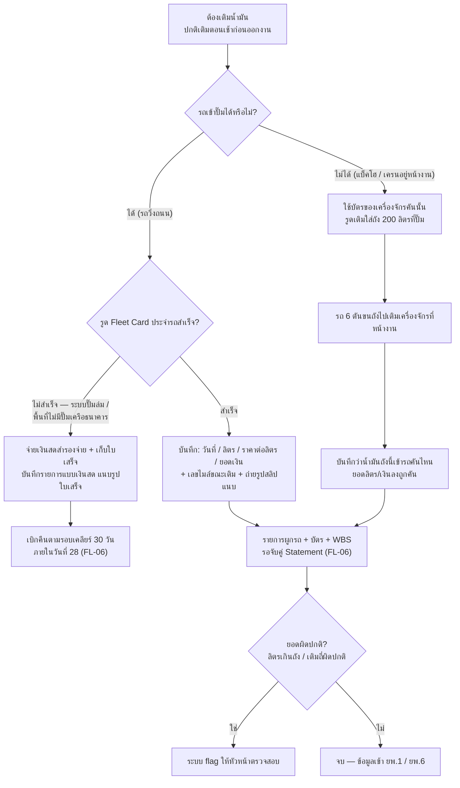

# FL-03 — การเติมน้ำมัน (F09)

> ที่มา: `VMS-Plus-รถก่อสร้าง-Flowcharts.md` · แยกมาเพื่อดูเป็นภาพง่าย (GitHub render mermaid ให้อัตโนมัติ)

```mermaid
flowchart TD
    A["ต้องเติมน้ำมัน<br/>ปกติเติมตอนเช้าก่อนออกงาน"] --> B{"รถเข้าปั๊มได้หรือไม่?"}
    B -->|"ได้ (รถวิ่งถนน)"| C{"รูด Fleet Card ประจำรถสำเร็จ?"}
    C -->|สำเร็จ| D["บันทึก: วันที่ / ลิตร / ราคาต่อลิตร / ยอดเงิน<br/>+ เลขไมล์ขณะเติม + ถ่ายรูปสลิปแนบ"]
    C -->|"ไม่สำเร็จ — ระบบปั๊มล่ม /<br/>พื้นที่ไม่มีปั๊มเครือธนาคาร"| E["จ่ายเงินสดสำรองจ่าย + เก็บใบเสร็จ<br/>บันทึกรายการแบบเงินสด แนบรูปใบเสร็จ"]
    E --> F["เบิกคืนตามรอบเคลียร์ 30 วัน<br/>ภายในวันที่ 28 (FL-06)"]
    B -->|"ไม่ได้ (แบ็คโฮ / เครนอยู่หน้างาน)"| G["ใช้บัตรของเครื่องจักรคันนั้น<br/>รูดเติมใส่ถัง 200 ลิตรที่ปั๊ม"]
    G --> H["รถ 6 ตันขนถังไปเติมเครื่องจักรที่หน้างาน"]
    H --> I["บันทึกว่าน้ำมันถังนี้เข้ารถคันไหน<br/>ยอดลิตร/เงินลงถูกคัน"]
    D --> J["รายการผูกรถ + บัตร + WBS<br/>รอจับคู่ Statement (FL-06)"]
    I --> J
    J --> K{"ยอดผิดปกติ?<br/>ลิตรเกินถัง / เติมถี่ผิดปกติ"}
    K -->|ใช่| L["ระบบ flag ให้หัวหน้าตรวจสอบ"]
    K -->|ไม่| M["จบ — ข้อมูลเข้า ยพ.1 / ยพ.6"]
```
