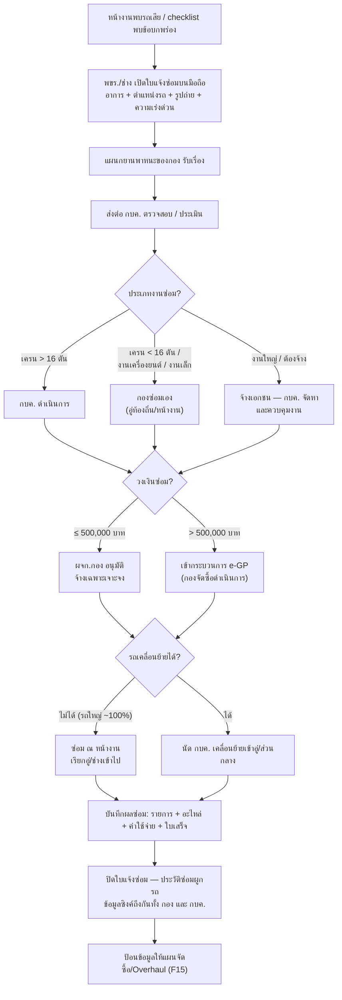

# FL-04 — แจ้งซ่อมและบริหารงานซ่อม (F10)

> ที่มา: `VMS-Plus-รถก่อสร้าง-Flowcharts.md` · แยกมาเพื่อดูเป็นภาพง่าย (GitHub render mermaid ให้อัตโนมัติ)

```mermaid
flowchart TD
    A["หน้างานพบรถเสีย / checklist พบข้อบกพร่อง"] --> B["พขร./ช่าง เปิดใบแจ้งซ่อมบนมือถือ<br/>อาการ + ตำแหน่งรถ + รูปถ่าย + ความเร่งด่วน"]
    B --> C["แผนกยานพาหนะของกอง รับเรื่อง"]
    C --> D["ส่งต่อ กบค. ตรวจสอบ / ประเมิน"]
    D --> E{"ประเภทงานซ่อม?"}
    E -->|"เครน > 16 ตัน"| F["กบค. ดำเนินการ"]
    E -->|"เครน < 16 ตัน /<br/>งานเครื่องยนต์ / งานเล็ก"| G["กองซ่อมเอง<br/>(อู่ท้องถิ่น/หน้างาน)"]
    E -->|งานใหญ่ / ต้องจ้าง| H["จ้างเอกชน — กบค. จัดหา<br/>และควบคุมงาน"]
    F --> I{"วงเงินซ่อม?"}
    G --> I
    H --> I
    I -->|"≤ 500,000 บาท"| J["ผจก.กอง อนุมัติ<br/>จ้างเฉพาะเจาะจง"]
    I -->|"> 500,000 บาท"| K["เข้ากระบวนการ e-GP<br/>(กองจัดซื้อดำเนินการ)"]
    J --> L{"รถเคลื่อนย้ายได้?"}
    K --> L
    L -->|"ไม่ได้ (รถใหญ่ ~100%)"| M["ซ่อม ณ หน้างาน<br/>เรียกอู่/ช่างเข้าไป"]
    L -->|ได้| N["นัด กบค. เคลื่อนย้ายเข้าอู่/ส่วนกลาง"]
    M --> O["บันทึกผลซ่อม: รายการ + อะไหล่ + ค่าใช้จ่าย + ใบเสร็จ"]
    N --> O
    O --> P["ปิดใบแจ้งซ่อม — ประวัติซ่อมผูกรถ<br/>ข้อมูลซิงค์ถึงกันทั้ง กอง และ กบค."]
    P --> Q["ป้อนข้อมูลให้แผนจัดซื้อ/Overhaul (F15)"]
```
