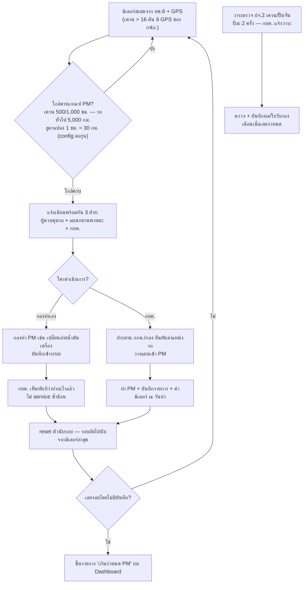

# FL-05 — บำรุงรักษาตามวาระ PM + ปจ.2 (F11)

> ที่มา: `VMS-Plus-รถก่อสร้าง-Flowcharts.md` · แยกมาเพื่อดูเป็นภาพง่าย (GitHub render mermaid ให้อัตโนมัติ)

```mermaid
flowchart TD
    A["มิเตอร์สะสมจาก ยพ.6 + GPS<br/>(เครน > 16 ตัน มี GPS ของ กฟภ.)"] --> B{"ใกล้ครบเกณฑ์ PM?<br/>เครน 500/1,000 ชม. — รถทั่วไป 5,000 กม.<br/>สูตรแปลง 1 ชม. ≈ 30 กม. (config ต่อรุ่น)"}
    B -->|ยัง| A
    B -->|ใกล้ครบ| C["แจ้งเตือนพร้อมกัน 3 ฝ่าย:<br/>ผู้ควบคุมรถ + แผนกยานพาหนะ + กบค."]
    C --> D{"ใครดำเนินการ?"}
    D -->|กองทำเอง| E["กองทำ PM เช่น เปลี่ยนถ่ายน้ำมันเครื่อง<br/>บันทึกเข้าระบบ"]
    E --> F["กบค. เห็นทันทีว่าทำอะไรแล้ว<br/>ไม่ service ซ้ำซ้อน"]
    D -->|กบค.| G["ประสาน กกค./กอง ยืนยันตำแหน่งรถ<br/>วางแผนเข้า PM"]
    G --> H["ทำ PM + บันทึกรายการ + ค่ามิเตอร์ ณ วันทำ"]
    F --> I["reset ตัวนับรอบ — รอบถัดไปนับจากมิเตอร์ล่าสุด"]
    H --> I
    I --> J{"เลยรอบโดยไม่มีบันทึก?"}
    J -->|ใช่| K["ขึ้นรายการ 'เกินกำหนด PM' บน Dashboard"]
    J -->|ไม่| A
    L["วาระตรวจ ปจ.2 เครน/ปั้นจั่น<br/>ปีละ 2 ครั้ง — กบค. แจ้งวาระ"] --> M["ตรวจ + บันทึกผล/ใบรับรอง<br/>เตือนเมื่อเลยกำหนด"]
```
