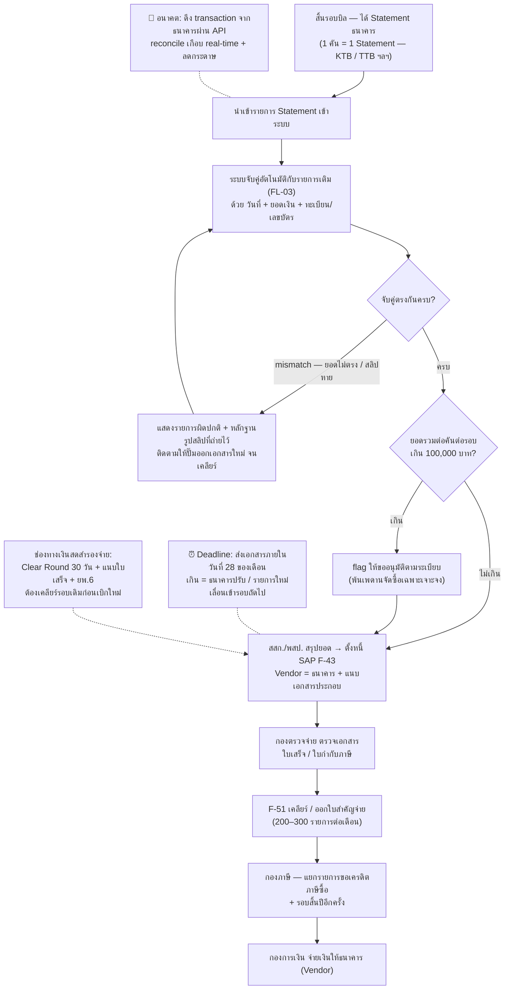

# FL-06 — เบิกจ่ายค่าน้ำมัน: Reconcile + SAP (F12)

> ที่มา: `VMS-Plus-รถก่อสร้าง-Flowcharts.md` · แยกมาเพื่อดูเป็นภาพง่าย (GitHub render mermaid ให้อัตโนมัติ)

```mermaid
flowchart TD
    A["สิ้นรอบบิล — ได้ Statement ธนาคาร<br/>(1 คัน = 1 Statement — KTB / TTB ฯลฯ)"] --> B["นำเข้ารายการ Statement เข้าระบบ"]
    B --> C["ระบบจับคู่อัตโนมัติกับรายการเติม (FL-03)<br/>ด้วย วันที่ + ยอดเงิน + ทะเบียน/เลขบัตร"]
    C --> D{"จับคู่ตรงกันครบ?"}
    D -->|"mismatch — ยอดไม่ตรง / สลิปหาย"| E["แสดงรายการผิดปกติ + หลักฐานรูปสลิปที่ถ่ายไว้<br/>ติดตามให้ปั๊มออกเอกสารใหม่ จนเคลียร์"]
    E --> C
    D -->|ครบ| F{"ยอดรวมต่อคันต่อรอบ<br/>เกิน 100,000 บาท?"}
    F -->|เกิน| G["flag ให้ขออนุมัติตามระเบียบ<br/>(พ้นเพดานจัดซื้อเฉพาะเจาะจง)"]
    F -->|ไม่เกิน| H["สสก./พสป. สรุปยอด → ตั้งหนี้ SAP F-43<br/>Vendor = ธนาคาร + แนบเอกสารประกอบ"]
    G --> H
    H --> I["กองตรวจจ่าย ตรวจเอกสาร<br/>ใบเสร็จ / ใบกำกับภาษี"]
    I --> J["F-51 เคลียร์ / ออกใบสำคัญจ่าย<br/>(200–300 รายการต่อเดือน)"]
    J --> K["กองภาษี — แยกรายการขอเครดิตภาษีซื้อ<br/>+ รอบสิ้นปีอีกครั้ง"]
    K --> L["กองการเงิน จ่ายเงินให้ธนาคาร (Vendor)"]
    M["⏰ Deadline: ส่งเอกสารภายในวันที่ 28 ของเดือน<br/>เกิน = ธนาคารปรับ / รายการใหม่เลื่อนเข้ารอบถัดไป"] -.- H
    N["ช่องทางเงินสดสำรองจ่าย:<br/>Clear Round 30 วัน + แนบใบเสร็จ + ยพ.6<br/>ต้องเคลียร์รอบเดิมก่อนเบิกใหม่"] -.-> H
    O["🔮 อนาคต: ดึง transaction จากธนาคารผ่าน API<br/>reconcile เกือบ real-time + ลดกระดาษ"] -.- B
```
