# 01 — เปลี่ยนสังกัดยานพาหนะ (โอนถาวร)

> **ร่างแรก 21 ก.ย. 2569** — เขียนจาก **หลักเกณฑ์ยานพาหนะ พ.ศ. 2569** + DB จริง + Figma จริง
> ที่มาฉบับเต็ม: [`หลักเกณฑ์ยานพาหนะ-2569-สรุป.md`](../../../หลักเกณฑ์ยานพาหนะ-2569-สรุป.md) (นอกรีโป อยู่ข้างไฟล์ PDF)
>
> ✅ **เคาะ 22 ก.ย. 2569 — ต้นทางเป็นผู้เปิดเรื่องเสมอ** (T0/T1)
> เคส "หน่วยงานอื่นอยากได้รถ" เข้าทาง **T0a แจ้งความต้องการ** ซึ่ง**ยังไม่สร้าง record ในตารางโอน**
> ต้นทางรับเรื่องแล้วค่อยเปิดใบจริง — กันไม่ให้มี state machine 2 ชุดบนตารางเดียว
>
> 🔴 **ส่วนที่เหลือยังไม่ผ่านการยืนยัน** — **กล่องเส้นประ** คือขั้นที่ยังไม่ยืนยัน
> (❓ ระเบียบไม่ได้เขียนไว้เลย ผมเติมเองเพื่อให้เส้นต่อกัน · ⚠ มี requirement แล้วแต่ยังไม่มีที่เก็บใน DB)
>
> **สีพื้นกล่อง = actor** ใช้ชุดเดียวกันทั้ง 2 ผังของโฟลเดอร์นี้ (เคาะ 22 ก.ย. 2569) — สีเดียวกัน = คนเดียวกันเสมอ
> 🟦 เจ้าของรถ (ต้นทาง/ต้นสังกัด) · 🟩 อีกฝั่ง (ปลายทาง/ผู้ขอ) · 🟨 ผู้มีอำนาจอนุมัติ · 🟧 หน่วยงานกลาง (กจย. · บัญชีทรัพย์สิน/SAP)
>
> คู่กัน: [02-ยืมใช้ชั่วคราว](02-ยืมใช้ชั่วคราว.md) · [03-scenario](03-scenario-เปลี่ยนสังกัด-ยืมใช้.csv) · [04-usecase](04-usecase-เปลี่ยนสังกัด-ยืมใช้.csv)

- ต้นฉบับ: [`plantuml/01-เปลี่ยนสังกัดถาวร.puml`](plantuml/01-เปลี่ยนสังกัดถาวร.puml) · เรนเดอร์ใหม่ `./plantuml/render.sh`
- **ผังเป็นแนวนอน (22 ก.ย. 2569)** — เดิมเป็น activity swimlane แนวตั้ง 4 เลน
  แต่ PlantUML ทำ swimlane แนวนอนไม่ได้ (`left to right direction` error) ⇒ เปลี่ยนเป็น **state diagram + `!pragma layout smetana`**
  (engine ในตัว ไม่ต้องลง graphviz ตามกติกาเดิม) · **ตัดกล่องเลนออก** เพราะโฟลว์วิ่งสลับหน่วยงานไปมา
  พอบังคับเป็นเลนแนวนอนแล้วเส้นไขว้กันจนอ่านไม่ออก ⇒ ใส่ชื่อผู้รับผิดชอบไว้ในกล่องแทน
- ผังนี้ยาว ~4,550px สูงแค่ ~300px (อัตราส่วน 15:1) — เปิดดูต้องเลื่อนแนวนอน
- SVG เห็นภาษาไทยถูกเฉพาะเครื่องที่มีฟอนต์ Thonburi — **ส่งให้คนอื่นดูใช้ PNG**

## สิ่งที่ยืนยันได้ vs สิ่งที่ต้องถาม

| ช่วง | สถานะ | ที่มา |
|---|---|---|
| T8–T10 ขอรหัส → ออกรหัส → ประทับตรา | ✅ **ระเบียบเขียนชัด** | ข้อ 8.3 · ข้อ 8.1 |
| T11 ปรับทะเบียนทรัพย์สิน | 🟡 รู้ว่าใครถือ ไม่รู้ว่าแอปเขียนกลับไหม | ข้อ 10 |
| T12 บันทึกลง DB | ✅ ตารางพร้อมอยู่แล้ว | `vms_trn_vehicle_transfer` |
| T5–T7 ตรวจรายการค้าง + ตรวจรับสภาพ | 🟡 มี requirement แต่ DB ไม่มีที่เก็บ | SC-F13-02 · SC-F13-03 |
| T0–T1 จุดชนวน → ต้นทางเปิดใบ | ✅ **เคาะ 22 ก.ย. 2569** | เจ้าของงาน + SC-F13-01 + ข้อ 24 (ผู้ครอบครองตั้งเรื่อง) |
| T2–T4 ตอบรับ → ปฏิเสธ → สายอนุมัติ | 🔴 **ระเบียบไม่ได้เขียนไว้เลย** | — |

**ทำไมต้นทางถึงเป็นคนเปิด** — ข้อ 8.3 ที่ให้ปลายทางแจ้ง กจย. เป็นขั้น*หลัง*ตกลงโอนแล้ว ไม่ใช่ขั้นเปิดเรื่อง · ถอดเสียงประชุม 4 ระบุว่าต้นทางเป็นคนสำรวจความต้องการเอง · ข้อ 24 วางหลักว่า**ผู้ครอบครองทรัพย์สิน**เป็นคนตั้งเรื่อง · และเหตุผลที่แข็งสุด — **T5 ตรวจรายการค้าง (ใบซ่อม/Fleet card/ใบนำตัว) มีแต่ต้นทางที่เห็นและเคลียร์ได้**

**3 ข้อที่ระเบียบตอบให้แล้ว และเปลี่ยนสมมติฐานเดิม**

1. **ปลายทางเป็นคนเดินเรื่องขั้นรหัส ไม่ใช่ต้นทาง** — ข้อ 8.3 เขียนว่า *"ให้หน่วยงานที่รับโอนแจ้งกองวางแผนและจัดการยานพาหนะ"*
2. **กจย. เป็นเจ้าของทะเบียนรหัสสังกัด** (ข้อ 8.1) ⇒ ระบบต้องมีคิวงานฝั่ง กจย. ไม่ใช่ให้หน่วยงานแก้รหัสเอง
3. **มีนาฬิกา 2 ตัว** ตัวละ 7 วันทำการ — ขั้นแจ้ง และขั้นประทับตรา (นับถัดจากวันได้รับรหัส) ⇒ นับแยกกัน

**ผลพ่วงที่ระเบียบบังคับตามมา** — ผู้ชำระภาษีประจำปีเปลี่ยน (ข้อ 23) · ผู้ต่อ พ.ร.บ. ปีถัดไปเปลี่ยน (ข้อ 30.1.2) · ทำประกัน ป.3 แล้วต้องแจ้ง กจย. (ข้อ 30.3.5)

## ฉบับ Mermaid

```mermaid
flowchart LR
    subgraph LT["หน่วยงานต้นทาง (เจ้าของเรื่อง)"]
        direction TB
        T0a["T0a หน่วยงานอื่นแจ้งความต้องการ<br/>ยังไม่สร้าง record"]
        T0["T0 ต้นทางตัดสินใจโอน<br/>เคาะ 22 ก.ย. 2569"]
        T1["T1 เปิดใบ + เสนอรายการรถ"]
        T4["T4 ขออนุมัติตามระเบียบพัสดุ<br/>ไม่รู้ว่าใครเซ็น"]
        T5["T5 ตรวจรายการค้าง<br/>ใบซ่อม · Fleet card · ใบนำตัว"]
        T6["T6 ปิดก่อน หรือบันทึกข้อตกลง"]
    end
    subgraph LP["หน่วยงานปลายทาง (ผู้รับโอน)"]
        direction TB
        T2{"T2 ตอบรับไหม"}
        T3["T3 จบเรื่อง"]
        T7["T7 ตรวจรับสภาพ ณ วันโอน"]
        T8["T8 แจ้ง กจย. ขอรหัสใหม่<br/>ภายใน 7 วันทำการ · ข้อ 8.3"]
        T10["T10 ประทับตรารหัสใหม่<br/>ภายใน 7 วันทำการ"]
        T12["T12 บันทึก vms_trn_vehicle_transfer<br/>2 วันที่แยกกัน"]
        T13["T13 รถอยู่สังกัดใหม่"]
    end
    subgraph LK["กจย."]
        T9["T9 ออกรหัสสังกัดใหม่<br/>ข้อ 8.1"]
    end
    subgraph LB["บัญชีทรัพย์สิน / SAP AA"]
        T11["T11 ปรับทะเบียนทรัพย์สิน + cost center<br/>เขียนกลับ SAP หรืออ่านอย่างเดียว"]
    end
    T0a --> T0 --> T1 --> T2
    T2 -->|"ไม่รับ"| T3
    T2 -->|"ตอบรับ"| T4 --> T5 --> T6 --> T7 --> T8 --> T9 --> T10 --> T11 --> T12 --> T13
    %% สีพื้น = actor · ชุดเดียวกันทั้ง 2 ผังของโฟลเดอร์นี้ (เคาะ 22 ก.ย. 2569)
    classDef acOwner fill:#EEF4FF,stroke:#98A2B3,color:#101828
    classDef acOther fill:#ECFDF3,stroke:#98A2B3,color:#101828
    classDef acAppr  fill:#FFFAEB,stroke:#98A2B3,color:#101828
    classDef acCentral fill:#FFF6ED,stroke:#98A2B3,color:#101828
    class T0,T1,T5,T6 acOwner
    class T0a,T2,T3,T7,T8,T10,T12,T13 acOther
    class T4 acAppr
    class T9,T11 acCentral
    %% เส้นประ = ยังไม่ยืนยัน (ระเบียบไม่ได้เขียน หรือ DB ยังไม่มีที่เก็บ)
    style T2 stroke-dasharray: 5 4
    style T3 stroke-dasharray: 5 4
    style T4 stroke-dasharray: 5 4
    style T5 stroke-dasharray: 5 4
    style T6 stroke-dasharray: 5 4
    style T7 stroke-dasharray: 5 4
    style T11 stroke-dasharray: 5 4
```

