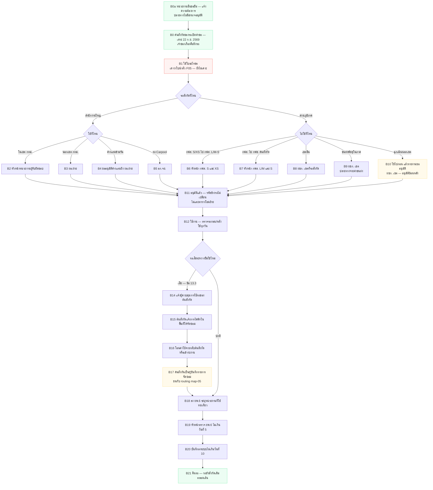

# 02 — ยืมใช้ชั่วคราว = การใช้ยานพาหนะข้ามหน่วยงาน

> **ร่างแรก 21 ก.ย. 2569**
>
> 🔴 **ข้อสรุปสำคัญ: "ยืมใช้ชั่วคราว" ไม่ใช่การเปลี่ยนสังกัด**
> หลักเกณฑ์ยานพาหนะ 2569 จัดเรื่องนี้ไว้ที่ **ข้อ 11.2.5 (ภูมิภาค) / ข้อ 11.1.3–11.1.5 (สนญ.)**
> ซึ่งเป็นหมวด *การใช้งาน* คนละหมวดกับ *การควบคุมยานพาหนะ* ที่มีเรื่องรหัสสังกัด (ข้อ 8)
> ⇒ **รหัสข้างรถไม่เปลี่ยน · ไม่แจ้ง กจย. · ไม่แตะ SAP AA · ไม่แตะ `vms_trn_vehicle_transfer`**
>
> ⚠️ ดังนั้น dropdown ใน `design-mock/transfer-request.html` ที่ใส่ "ยืมใช้ชั่วคราว" ปนกับ "โอนถาวร" **ผิดโครงระเบียบ** ต้องแยกเป็นคนละฟีเจอร์
>
> ✅ **เคาะ 22 ก.ย. 2569 — เส้นนี้ต้นสังกัดของรถเป็นเจ้าของเรื่องเหมือนเส้นโอนถาวร**
> ข้อ 11.2.5 **ทั้ง 4 อนุข้อ ผู้อนุมัติอยู่ฝั่งรถทั้งหมด** — 11.2.5.3 เขียนตรงตัวว่า *"ผชก. เขต**ที่ยานพาหนะนั้นสังกัด**"*
> ⇒ **หน่วยงานปลายทางไม่มีอำนาจอนุมัติในเส้นนี้เลย** · หน่วยงานที่อยากยืมเข้าทาง **B0a แจ้งความต้องการ** แล้วต้นสังกัดเป็นคนเปิดคำขอ
>
> คู่กัน: [01-เปลี่ยนสังกัดถาวร](01-เปลี่ยนสังกัดถาวร.md) · [03-scenario](03-scenario-เปลี่ยนสังกัด-ยืมใช้.csv) · [04-usecase](04-usecase-เปลี่ยนสังกัด-ยืมใช้.csv)

- ต้นฉบับ: [`plantuml/02-ยืมใช้ชั่วคราว.puml`](plantuml/02-ยืมใช้ชั่วคราว.puml) · เรนเดอร์ใหม่ `./plantuml/render.sh`

## ตารางผู้อนุมัติ — เส้นนี้ระเบียบเขียนไว้ครบ ไม่ต้องเดา

| เคส | ผู้อนุมัติ | ข้อ |
|---|---|---|
| รถ กฟส. ขนาด S/XS → ไปทำงานที่ กฟส. L/M และ S ต้นสังกัด | หัวหน้าหน่วยงาน **กฟส. ขนาด S และ XS** | 11.2.5.1 |
| รถ กฟส. L/M/S/XS → ไปทำงานที่ กฟข. ต้นสังกัด | หัวหน้าหน่วยงาน **กฟส. ขนาด L/M และ S ต้นสังกัด** | 11.2.5.2 |
| ไปปฏิบัติงาน **เขตอื่น** | **ผชก. เขตที่รถสังกัด** หรือผู้รับมอบหมาย | 11.2.5.3 |
| ขนส่งพัสดุในภาคเดียวกัน | **ผชก. เขต** — ค่าขนส่งลงที่ กฟภ. ปลายทางที่รับโอนพัสดุ | 11.2.5.4 |
| **ฉุกเฉินออกนอกเขตจำหน่ายไฟฟ้า** | ใช้ไปก่อน แล้ว**รายงานขออนุมัติ ผชก. เขตทุกครั้ง** ⇒ **อนุมัติย้อนหลัง** | 11.2.4 |
| สนญ. ในเขต กทม. | หัวหน้าหน่วยงานผู้รับผิดชอบ | 11.1.3 |
| สนญ. นอกเขต กทม. | **ผอ.ฝ่าย** | 11.1.3 |
| สนญ. ค้างแรมข้ามวัน | ขออนุมัติค้างแรมเพิ่มผ่านผู้บังคับบัญชา **ถึง ผอ.ฝ่าย** | 11.1.4 |
| รถในระบบ **Carpool สนญ.** | **อก.จย.** | 11.1.5 |

## 3 อย่างที่ต้องไม่ลืมในเส้นนี้

1. **ยพ.6 รองรับอยู่แล้ว** — ฟอร์ม ยพ.6-ป.46 (ผนวก ง) มีคอลัมน์ **"หน่วยงานที่ใช้ยานพาหนะ"** รายเที่ยว ⇒ ไม่ต้องออกแบบใหม่ เล่มยังเป็นของรถ/ต้นสังกัด
2. **รถเสียต่างพื้นที่มีเส้นของตัวเอง (ข้อ 13.3)** — พขร. แจ้ง**ต้นสังกัด**ก่อน → ต้นสังกัดแจ้งการไฟฟ้าในพื้นที่ให้ซ่อม → **โอนค่าใช้จ่ายกลับต้นสังกัด** → **ต้นสังกัดเป็นผู้บันทึก** ⇒ ชนกับ routing ใบแจ้งซ่อมที่ [`map-05`](../../../../db-schema/map-05-routing-ใบแจ้งซ่อม-ตามประเภทรถและภาค.md) ยังไม่เคาะว่าใบเข้าแผนกของต้นสังกัดหรือของพื้นที่ที่ซ่อม
3. **เร่งด่วนฉุกเฉินต้องรองรับอนุมัติย้อนหลัง** (ข้อ 11.2.4) — ไม่ใช่ flow ปกติที่อนุมัติก่อนแล้วค่อยใช้

## ฉบับ Mermaid

