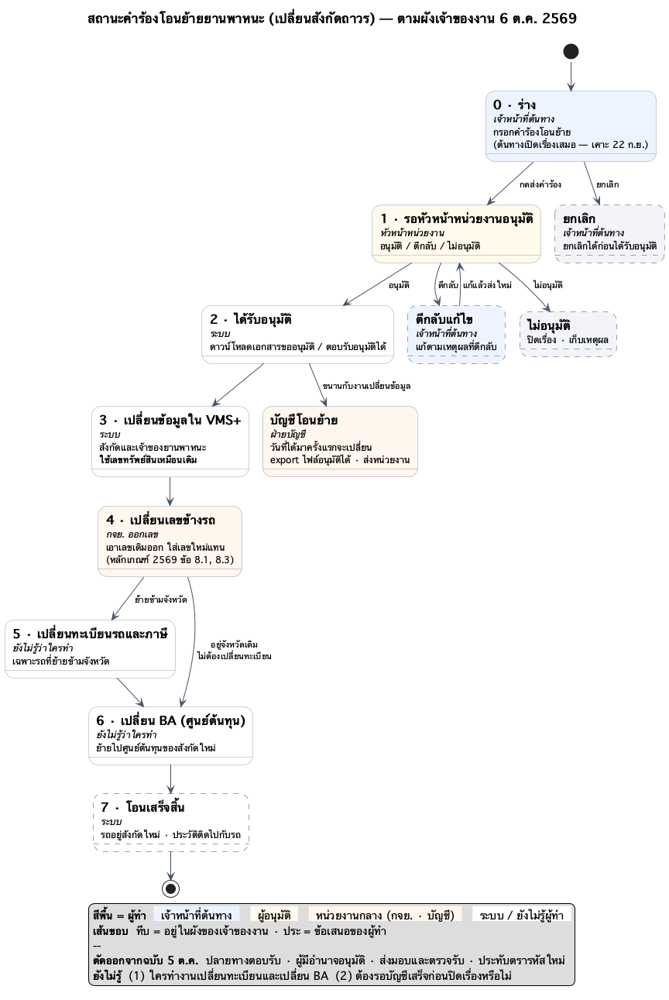

# 05 — สถานะคำร้องโอนย้ายยานพาหนะ (เปลี่ยนสังกัดถาวร)

> **ฉบับ 6 ต.ค. 2569 — ปรับตามผังโอนย้ายที่เจ้าของงานส่งมา** (แทนข้อเสนอ 8 ขั้นของ 5 ต.ค. 2569 — ดูฉบับเดิมได้ที่คอมมิต `b01726f`)
> ผังนี้คือ **สถานะของคำร้อง** (กล่อง = สถานะ) · ผัง [01-เปลี่ยนสังกัดถาวร](01-เปลี่ยนสังกัดถาวร.md) เป็นผัง**ขั้นงาน** T0–T13 ฉบับ 21 ก.ย. ซึ่ง**ยังไม่ได้ปรับตาม** — ถ้าขัดกันให้ยึดผังนี้
>
> ผังของเจ้าของงาน: โอนย้าย → ขออนุมัติหัวหน้าหน่วยงาน → ได้รับอนุมัติ → เปลี่ยนข้อมูล VMS+ (ใช้เลขทรัพย์สินเหมือนเดิม) →
> เปลี่ยนรหัสประจำรถ → เปลี่ยนทะเบียนรถ → เปลี่ยน BA (ศูนย์ต้นทุน) · แขนงจาก "ได้รับอนุมัติ": บัญชีโอนย้าย
> (วันที่ได้มาครั้งแรกจะเปลี่ยน · export ไฟล์อนุมัติได้ · ส่งหน่วยงาน)

- ต้นฉบับ: [`plantuml/05-สถานะคำร้องโอนย้าย.puml`](plantuml/05-สถานะคำร้องโอนย้าย.puml) — **แนวตั้ง** (ผัง 01/02 เป็นแนวนอน)
- **สีพื้น = ผู้ทำ** · **เส้นขอบทึบ** = อยู่ในผังของเจ้าของงาน · **เส้นประ** = ข้อเสนอของผู้ทำ ไม่อยู่ในผังของเจ้าของงาน

## ตารางสถานะ

| # | สถานะ | ผู้ทำ | ทำอะไร | ไปสถานะ | ที่มา | หน้าต้นแบบ |
|---|---|---|---|---|---|---|
| 0 | ร่าง | เจ้าหน้าที่ต้นทาง | กรอกคำร้องโอนย้าย | 1 เมื่อกดส่ง · ยกเลิก | ผังเจ้าของงาน · ต้นทางเปิดเรื่องเสมอ (เคาะ 22 ก.ย. 2569) | `transfer-request.html` |
| 1 | รอหัวหน้าหน่วยงานอนุมัติ | หัวหน้าหน่วยงาน | อนุมัติ / ตีกลับ / ไม่อนุมัติ | 2 · ตีกลับแก้ไข · ไม่อนุมัติ | ผังเจ้าของงาน | `transfer-request.html` (ป้ายสถานะ) |
| 2 | ได้รับอนุมัติ | ระบบ | ดาวน์โหลดเอกสารขออนุมัติ / ตอบรับอนุมัติได้ | 3 และแขนงบัญชี (ขนานกัน) | ผังเจ้าของงาน | `transfer-approved.html` |
| 3 | เปลี่ยนข้อมูลใน VMS+ | ระบบ | เปลี่ยนสังกัดและเจ้าของยานพาหนะ · **ใช้เลขทรัพย์สินเหมือนเดิม** | 4 | ผังเจ้าของงาน | `transfer-approved.html` งานที่ 1 |
| 4 | เปลี่ยนเลขข้างรถ | กจย. ออกเลข | เอาเลขเดิมออก ใส่เลขใหม่แทน (เลขข้างรถ = เลขที่แสดงหน่วยงานสังกัด) | 5 ถ้าย้ายข้ามจังหวัด · 6 ถ้าอยู่จังหวัดเดิม | ผังเจ้าของงาน · หลักเกณฑ์ 2569 ข้อ 8.1, 8.3 | `transfer-approved.html` งานที่ 2 · `transfer-04-code.html` |
| 5 | เปลี่ยนทะเบียนรถและภาษี | ❓ ยังไม่รู้ว่าใคร | เฉพาะรถที่ย้ายข้ามจังหวัด | 6 | ผังเจ้าของงาน | `transfer-approved.html` งานที่ 3 |
| 6 | เปลี่ยน BA (ศูนย์ต้นทุน) | ❓ ยังไม่รู้ว่าใคร | ย้ายไปศูนย์ต้นทุนของสังกัดใหม่ | 7 | ผังเจ้าของงาน | `transfer-approved.html` งานที่ 4 |
| 7 | โอนเสร็จสิ้น | ระบบ | รถอยู่สังกัดใหม่ · ประวัติติดไปกับรถ | จบ | ข้อเสนอของผู้ทำ | — |
| – | บัญชีโอนย้าย | ฝ่ายบัญชี | วันที่ได้มาครั้งแรกจะเปลี่ยน · export ไฟล์อนุมัติได้ · ส่งหน่วยงาน | ❓ | ผังเจ้าของงาน | `transfer-approved.html` ส่วนบัญชีโอนย้าย |
| – | ตีกลับแก้ไข | เจ้าหน้าที่ต้นทาง | แก้ตามเหตุผลที่ตีกลับ แล้วส่งใหม่ | 1 | ข้อเสนอของผู้ทำ | — |
| – | ไม่อนุมัติ | – | ปิดเรื่อง · เก็บเหตุผล | จบ | ข้อเสนอของผู้ทำ | — |
| – | ยกเลิก | เจ้าหน้าที่ต้นทาง | ยกเลิกได้ก่อนได้รับอนุมัติ | จบ | ข้อเสนอของผู้ทำ | — |

## ที่เจ้าของงานตอบไว้ (6 ต.ค. 2569)

- **ODT** ในกล่องแรกของผัง = บริษัทเรา
- **ปลายทางตอบรับ / ตรวจรับรถ** — ยังไม่ต้องทำ ทำเท่าที่มีในผัง ⇒ หน้า `design-mock/transfer-03-receive.html` พักไว้ ไม่อยู่ในโฟลว์
- **เลขข้างรถ** = เลขที่แสดงหน่วยงานสังกัด · การเปลี่ยน = เอาของเดิมออกแล้วใส่ของใหม่ทดแทน
- **เปลี่ยนทะเบียน** — ถ้ารถย้ายข้ามจังหวัด ต้องเปลี่ยนทะเบียนและภาษี (เจ้าของงานพิมพ์ "ภาษา" — อ่านเป็น "ภาษี" ยังไม่ได้ยืนยันคำนี้)
- **export ไฟล์** = เอกสารขออนุมัติ หรือเอกสารตอบรับอนุมัติ — ให้มีปุ่มดาวน์โหลด ยังไม่ต้องโหลดได้จริง
- **แจ้งหยุดใช้รถ** — ไม่ทำในเรื่องโอนย้าย เป็นเรื่องของการจำหน่าย

## ตัดออกจากฉบับ 5 ต.ค. 2569

รอปลายทางตอบรับ · รอผู้มีอำนาจอนุมัติโอน · รอส่งมอบและตรวจรับ · รอประทับตรารหัสใหม่ · สถานะแขนง "ปลายทางไม่รับ" และ "ตรวจรับไม่ผ่าน"
— กำหนดเวลา 7 วันทำการของข้อ 8.3 ยังอยู่ในหน้า `transfer-04-code.html` ตามเดิม ไม่ได้แก้หน้านั้น

## ยังอยู่ในต้นแบบ แม้ไม่อยู่ในผังของเจ้าของงาน

- ส่วน "รายการค้างของรถคันนี้" และตัวเลือกประเภทการโอน ในหน้า `transfer-request.html` (เจ้าของงานรับทราบว่าคงไว้)

## ยังไม่รู้

1. ใครเป็นผู้ทำงานเปลี่ยนทะเบียนและเปลี่ยน BA ในระบบ
2. ต้องรองานบัญชีเสร็จก่อนปิดเรื่องหรือไม่ และ "ส่งหน่วยงาน" คือส่งอะไร ให้หน่วยงานไหน
3. รูปแบบรหัส BA และศูนย์ต้นทุนจริง (ต้นแบบใช้ค่าตัวอย่าง)
4. วันที่ได้มาครั้งแรกหลังโอนเปลี่ยนเป็นวันไหน (ผังบอกแค่ว่า "จะเปลี่ยน")
