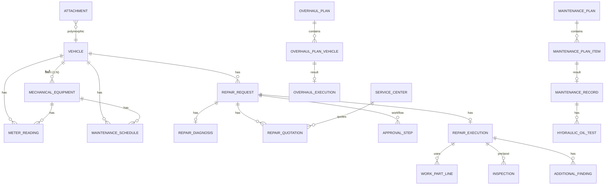

# VMS Plus / SMSM — สรุปเชิงเทคนิคและรายละเอียดข้อมูล (Column Spec)

> อ้างอิง: ใบสั่งงาน (Job Order) จ.136/2569_สง.1 — PEA Work D Super App ระยะที่ 4 (Operate D)
> ขอบเขต: งานแจ้งซ่อม ซ่อมแซม บำรุงรักษาเชิงป้องกัน และ Overhaul ยานพาหนะ/เครื่องมือกล
> สถานะเอกสาร: Draft สำหรับใช้ตั้งต้น Database Design (ER Diagram / Data Dictionary ตาม ส่วนที่ 3 ข้อ 3.1.4–3.1.5)

**วิธีอ่านตาราง**

- คอลัมน์ `ที่มา` = ข้อใน TOR ที่ระบุฟิลด์นั้นไว้ตรง ๆ
- `เสนอเพิ่ม` = ฟิลด์ที่ TOR ไม่ได้เขียนไว้ แต่จำเป็นทางเทคนิค (PK/FK, audit, status, workflow) — ต้องยืนยันกับ กฟภ.
- Type เป็นข้อเสนอสำหรับ PostgreSQL 17 (ยังไม่ใช่ข้อกำหนด)
- ทุกตารางหลักควรมี audit columns มาตรฐาน: `created_at`, `created_by`, `updated_at`, `updated_by`, `deleted_at` (soft delete) — ไม่ได้เขียนซ้ำในแต่ละตาราง

---

## 1. Technology Stack (ข้อกำหนดบังคับ — ส่วนที่ 2 ข้อ 4–6, 7.9)

| Layer                  | ข้อกำหนดใน TOR                                      | หมายเหตุเชิงเทคนิค                                               |
| ---------------------- | --------------------------------------------------- | ---------------------------------------------------------------- |
| Frontend               | Next.js **v16+** หรือ Latest Stable                 | App Router                                                       |
| CSS                    | Tailwind CSS **v3.4+** หรือ Latest Stable           | ใช้ Design System/Component ที่ กฟภ. เตรียมไว้ (ข้อ 2)           |
| Backend                | **Go** Latest Stable                                |                                                                  |
| Database               | **PostgreSQL v17+** (Hybrid: Relational + Document) | ใช้ JSONB สำหรับข้อมูลยืดหยุ่น เช่น spec เครื่องมือกล, checklist |
| ORM                    | บังคับใช้ ORM                                       | TOR ไม่ระบุตัว — ตัวเลือกใน Go เช่น GORM, ent, Bun (ต้องตกลง)    |
| File Storage           | Object Storage ของ กฟภ.                             | เก็บเอกสาร รูป เสียง วิดีโอ — DB เก็บแค่ metadata/object key     |
| App Type               | **PWA** รองรับทุกอุปกรณ์ + Push Notification        | Offline cache ใน Service Worker ให้ผู้รับจ้างพิจารณา             |
| Notification           | PEA Life, PEA Work-D, SMS (กฟภ.), Web Push (PWA)    | ส่งตามขั้นตอนที่ กฟภ. กำหนด                                      |
| Auth (พนักงาน/ลูกจ้าง) | PEA SSO (Keycloak) + ThaID                          | ตามมาตรฐาน กฟภ.                                                  |
| Auth (บุคคลภายนอก)     | เบอร์โทรศัพท์ + ThaID                               | น่าจะเป็น OTP — ต้องยืนยัน                                       |
| Integration            | HR Data Platform, PEA Life, Smart Inventory (ถ้ามี) |                                                                  |
| Data Migration         | ย้ายข้อมูลจากระบบเดิม ร่วมกับทีม กฟภ.               |                                                                  |
| Delivery Model         | Hybrid Co-delivery กับทีม กฟภ.                      |                                                                  |

### Security & Testing (ส่วนที่ 4)

- STLC: Unit Test, SIT, UAT, Non-Functional (Load Test ฯลฯ)
- Fortify SCA (source code), Black Duck (software composition / dependency), Fortify WebInspect (web app)

---

## 2. ภาพรวม Entity

---

## 3. Master Data: ยานพาหนะและเครื่องมือกล (ข้อ 7.1)

### 3.1 `vehicles` — ข้อมูลยานพาหนะ

| Column                   | Type (เสนอ)                | คำอธิบาย                                             | ที่มา        |
| ------------------------ | -------------------------- | ---------------------------------------------------- | ------------ |
| id                       | uuid PK                    |                                                      | เสนอเพิ่ม    |
| license_plate            | varchar(20)                | เลขทะเบียน                                           | 7.1          |
| license_province         | varchar(50)                | จังหวัดของทะเบียน                                    | เสนอเพิ่ม    |
| vehicle_code             | varchar(30) UNIQUE         | รหัสยานพาหนะ                                         | 7.1          |
| brand_model              | varchar(100)               | ยี่ห้อ-รุ่น (อาจแยก brand / model)                   | 7.1          |
| org_unit_id              | FK → org_units             | สังกัดหน่วยงาน (sync จาก HR Data Platform)           | 7.1          |
| vehicle_type_id          | FK → vehicle_types         | ประเภทยานพาหนะ                                       | 7.1          |
| fuel_type                | enum/FK                    | ประเภทเชื้อเพลิง                                     | 7.1          |
| chassis_no               | varchar(50)                | หมายเลขตัวถัง                                        | 7.1          |
| engine_no                | varchar(50)                | หมายเลขเครื่องยนต์                                   | 7.1          |
| payload_weight_kg        | numeric(10,2)              | น้ำหนักบรรทุก                                        | 7.1          |
| registration_date        | date                       | วันที่จดทะเบียน                                      | 7.1          |
| vehicle_age              | computed                   | อายุยานพาหนะ — คำนวณจาก registration_date ไม่ควรเก็บ | 7.1          |
| usage_status             | enum                       | สถานะการใช้งาน (ใช้งาน/ซ่อม/รอจำหน่าย ฯลฯ)           | 7.1          |
| asset_code               | varchar(30)                | รหัสทรัพย์สิน                                        | 7.1          |
| sub_asset_code           | varchar(30)                | รหัสทรัพย์สินย่อย                                    | 7.1          |
| asset_type               | enum/FK                    | ประเภททรัพย์สิน                                      | 7.1          |
| acquisition_value        | numeric(14,2)              | มูลค่าที่ได้มา (ใช้คำนวณเกณฑ์ 30%)                   | 7.1, 7.2.3.1 |
| ownership_type           | enum(`LEASED`,`PURCHASED`) | เช่า / ซื้อ — กำหนดเส้นทาง workflow                  | 7.2.1        |
| lease_contract_id        | FK nullable                | สัญญาเช่า + บริษัทผู้ให้เช่า                         | 7.2.1        |
| has_mechanical_equipment | boolean (derived)          | ติดตั้งเครื่องมือกลหรือไม่                           | 7.2.1        |
| current_odometer_km      | numeric                    | เลขไมล์ล่าสุด (cache จาก meter_readings)             | เสนอเพิ่ม    |

### 3.2 `mechanical_equipment` — เครื่องมือกล/เครื่องจักรที่ติดตั้ง (1 รถ : N เครื่อง)

| Column               | Type (เสนอ)   | คำอธิบาย                                                             | ที่มา     |
| -------------------- | ------------- | -------------------------------------------------------------------- | --------- |
| id                   | uuid PK       |                                                                      | เสนอเพิ่ม |
| vehicle_id           | FK → vehicles | ยานพาหนะที่ติดตั้ง                                                   | 7.1       |
| equipment_type_id    | FK            | ประเภท เช่น เครน, กระเช้า, ปั้นจั่น, ขุดเจาะ, เครื่องฉีดน้ำแรงดันสูง | 7.1       |
| equipment_subtype_id | FK nullable   | ประเภทย่อย เช่น เครนพับ, เครนแข็ง                                    | 7.1       |
| brand_model          | varchar(100)  | ยี่ห้อ-รุ่น                                                          | 7.1       |
| serial_number        | varchar(50)   | Serial Number                                                        | 7.1       |
| equipment_no         | varchar(50)   | หมายเลขเครน/เครื่องมือกล                                             | 7.1       |
| installed_date       | date          | วันที่ติดตั้ง                                                        | 7.1       |
| condition_status     | enum          | สภาพ/สถานะการใช้งาน                                                  | 7.1       |
| asset_code           | varchar(30)   | รหัสทรัพย์สิน                                                        | 7.1       |
| sub_asset_code       | varchar(30)   | รหัสทรัพย์สินย่อย                                                    | 7.1       |
| asset_type           | enum/FK       | ประเภททรัพย์สิน                                                      | 7.1       |
| acquisition_value    | numeric(14,2) | มูลค่าที่ได้มา                                                       | 7.1       |
| technical_specs      | jsonb         | ข้อมูลเทคนิค (ดู 3.3)                                                | 7.1       |

### 3.3 `technical_specs` (JSONB) — ข้อมูลทางเทคนิค

TOR ยกตัวอย่าง ("เป็นต้น") จึงควรเก็บเป็น JSONB + มี schema ตาม equipment_type

| Key                  | Unit     | ที่มา                        |
| -------------------- | -------- | ---------------------------- |
| max_lifting_capacity | kg / ton | 7.1 น้ำหนักยกสูงสุด          |
| max_lifting_range    | m        | 7.1 ช่วงการยกสูงสุด          |
| max_hydraulic_reach  | m        | 7.1 ระยะเอื้อมไฮดรอลิกสูงสุด |
| equipment_weight     | kg       | 7.1 น้ำหนักเครื่องมือกล      |

### 3.4 `meter_readings` — บันทึกค่ามิเตอร์แยกส่วน

| Column                          | Type                                               | คำอธิบาย                             | ที่มา     |
| ------------------------------- | -------------------------------------------------- | ------------------------------------ | --------- |
| id                              | uuid PK                                            |                                      | เสนอเพิ่ม |
| vehicle_id                      | FK                                                 |                                      | 7.1       |
| equipment_id                    | FK nullable                                        | null = มิเตอร์ของตัวรถ               | 7.1       |
| meter_type                      | enum(`ODOMETER_KM`,`MACHINE_HOUR`,`CRANE_HOUR`, …) | ชั่วโมงเครื่องจักร / ชั่วโมงเครน ฯลฯ | 7.1       |
| reading_value                   | numeric(12,2)                                      | ค่าที่อ่าน                           | 7.1       |
| read_at                         | timestamptz                                        | เวลาบันทึก                           | เสนอเพิ่ม |
| source_ref_type / source_ref_id | varchar / uuid                                     | มาจากใบแจ้งซ่อม/งานซ่อม/PM           | เสนอเพิ่ม |

### 3.5 `maintenance_schedules` — ตารางวาระบำรุงรักษา

| Column                          | Type                                              | คำอธิบาย                         | ที่มา     |
| ------------------------------- | ------------------------------------------------- | -------------------------------- | --------- |
| id                              | uuid PK                                           |                                  |           |
| vehicle_id / equipment_id       | FK                                                | ครอบคลุมทั้งตัวรถและอุปกรณ์พิเศษ | 7.1       |
| basis                           | enum(`ODOMETER`,`HOUR_METER`,`TIME`,`EQUIVALENT`) | มาตรฐานวัดวาระ                   | 7.1       |
| interval_km                     | numeric nullable                                  | ทุก ๆ x กม.                      | 7.1       |
| interval_hours                  | numeric nullable                                  | ทุก ๆ x ชั่วโมงทำงาน             | 7.1       |
| interval_months / interval_days | int nullable                                      | ทุก ๆ x เดือน/วัน                | 7.1       |
| hour_to_km_factor               | numeric default **30**                            | เกณฑ์เทียบ 1 ชม. = 30 กม.        | 7.1       |
| last_done_at / last_done_meter  | timestamptz / numeric                             | ใช้คำนวณวาระถัดไป                | เสนอเพิ่ม |
| next_due_at / next_due_meter    | computed                                          | วาระถัดไป                        | เสนอเพิ่ม |

### 3.6 ความสามารถที่ใช้ข้อมูลกลุ่มนี้

- Bulk import ผ่าน Template ที่ กฟภ. กำหนด
- Dashboard ยานพาหนะที่ติดตั้งเครื่องมือกล
- Search/Filter: ทะเบียน, รหัสยานพาหนะ, รหัสทรัพย์สิน, ยี่ห้อ-รุ่น, ประเภทรถ, สังกัด, เลขตัวถัง, ประเภทเครื่องมือกล, ยี่ห้อ-รุ่นเครื่องมือกล (→ ต้องทำ index)
- Export Excel / PDF

---

## 4. งานซ่อมแซม (ข้อ 7.2)

### 4.1 Business Rule สำคัญ

| Rule                | รายละเอียด                                                                                                     | ที่มา   |
| ------------------- | -------------------------------------------------------------------------------------------------------------- | ------- |
| Routing ตามประเภทรถ | เช่า → บริษัทผู้ให้เช่า / ซื้อทั่วไป → หน่วยงานจ้างอู่ / ซื้อ+เครื่องมือกล → จ้างอู่ หรือแจ้ง ผยค. กรย. / กบค. | 7.2.1   |
| แยกส่วนที่เสีย      | ตัวรถ vs เครื่องมือกล — ขั้นตอนต่างกัน                                                                         | 7.2.3.2 |
| เกณฑ์ 30%           | ค่าซ่อมประเมิน > 30% ของมูลค่าสินทรัพย์ → แจ้งเตือนพิจารณาจำหน่าย                                              | 7.2.3.1 |
| ผู้อนุมัติ          | ผู้บังคับบัญชาของหน่วยงานผู้ขอใช้รถ หรือของหน่วยงานที่รถไปปฏิบัติงาน                                           | 7.2.3.1 |
| แก้ไข/ยกเลิก        | ทำได้เมื่อถูกตีกลับหรือไม่อนุมัติ                                                                              | 7.2.2   |
| ปิดงาน              | วันปิดงาน = วันที่เจ้าของรถกดยืนยันรับรถคืน                                                                    | 7.2.4   |

### 4.2 `repair_requests` — ใบแจ้งซ่อม

| Column                        | Type                                                             | คำอธิบาย                                                                                                              | ที่มา     |
| ----------------------------- | ---------------------------------------------------------------- | --------------------------------------------------------------------------------------------------------------------- | --------- |
| id                            | uuid PK                                                          |                                                                                                                       |           |
| request_no                    | varchar UNIQUE                                                   | หมายเลขงานซ่อม (running no.)                                                                                          | 7.2.2     |
| request_date                  | timestamptz                                                      | วันที่แจ้งซ่อม                                                                                                        | 7.2.2     |
| vehicle_id                    | FK                                                               | ทะเบียน / ประเภท / สังกัด อ้างจากรถ                                                                                   | 7.2.2     |
| org_unit_id                   | FK                                                               | สังกัดหน่วยงาน (snapshot ณ วันแจ้ง)                                                                                   | 7.2.2     |
| symptom                       | text                                                             | อาการชำรุด                                                                                                            | 7.2.2     |
| fault_part                    | enum(`VEHICLE`,`EQUIPMENT`)                                      | ส่วนที่เสีย                                                                                                           | 7.2.3.2   |
| equipment_id                  | FK nullable                                                      | เมื่อเสียที่เครื่องมือกล                                                                                              | 7.2.3.2   |
| reporter_id                   | FK → users                                                       | ผู้แจ้งซ่อม                                                                                                           | 7.2.2     |
| breakdown_location            | text                                                             | สถานที่ที่รถเสีย                                                                                                      | 7.2.2     |
| breakdown_lat / breakdown_lng | numeric(9,6)                                                     | พิกัด (หรือ PostGIS geography)                                                                                        | 7.2.2     |
| odometer_km                   | numeric                                                          | เลขไมล์                                                                                                               | 7.2.2     |
| machine_hours                 | numeric                                                          | ชั่วโมงสะสมเครื่องจักร                                                                                                | 7.2.2     |
| repair_route                  | enum(`LESSOR`,`OUTSOURCE`,`IN_HOUSE_KORYOR`,`IN_HOUSE_KORBOKOR`) | ผู้ดำเนินการซ่อม                                                                                                      | 7.2.1     |
| estimated_cost                | numeric(14,2)                                                    | ค่าซ่อมประเมิน                                                                                                        | 7.2.3.1   |
| exceeds_30pct_flag            | boolean (computed)                                               | เกิน 30% ของมูลค่าทรัพย์สิน                                                                                           | 7.2.3.1   |
| status                        | enum                                                             | DRAFT / SUBMITTED / VERIFIED / APPROVED / RETURNED / REJECTED / CANCELLED / ACCEPTED / IN_REPAIR / COMPLETED / CLOSED | เสนอเพิ่ม |
| accepted_at                   | timestamptz                                                      | วันรับงาน (ผยค. กรย./กบค. กดรับเรื่อง)                                                                                | 7.2.3.2   |
| closed_at                     | timestamptz                                                      | วันเสร็จ (ปิด) งาน                                                                                                    | 7.2.4     |
| cancel_reason / return_reason | text                                                             | เหตุผลยกเลิก/ตีกลับ                                                                                                   | 7.2.3.1   |

### 4.3 `repair_diagnoses` — วิเคราะห์อาการชำรุด

| Column                         | Type                              | คำอธิบาย                                  | ที่มา   |
| ------------------------------ | --------------------------------- | ----------------------------------------- | ------- |
| repair_request_id              | FK                                |                                           | 7.2.2   |
| problem_summary                | text                              | สรุปปัญหา                                 | 7.2.2   |
| recommended_parts              | jsonb / child table               | รายการอะไหล่แนะนำ (ถ้ามี)                 | 7.2.2   |
| recommended_service_center_ids | uuid[]                            | อู่/ศูนย์ใกล้เคียงที่แนะนำ                | 7.2.2   |
| diagnosed_by                   | FK                                | ผู้ดูแลรถประจำหน่วยงาน / ผยค. กรย. / กบค. | 7.2.3.2 |
| repair_mode                    | enum(`SELF`,`OUTSOURCE`)          | ซ่อมเอง หรือส่งอู่ (กรณีเครื่องมือกล)     | 7.2.3.2 |
| parts_source                   | enum(`KORBOKOR_STOCK`,`PURCHASE`) | เบิกคลัง กบค. หรือจัดซื้อ                 | 7.2.3.2 |

### 4.4 `repair_quotations` — ใบประเมิน/ใบเสนอราคา

| Column            | Type             | คำอธิบาย                | ที่มา   |
| ----------------- | ---------------- | ----------------------- | ------- |
| repair_request_id | FK               |                         | 7.2.3.1 |
| service_center_id | FK               | อู่/ศูนย์บริการ         | 7.2.3.1 |
| quoted_amount     | numeric(14,2)    | ราคาเสนอ                | 7.2.3.1 |
| attachment_id     | FK → attachments | เอกสารใบเสนอราคา        | 7.2.3.1 |
| is_selected       | boolean          | ใบที่เลือกจากการสืบราคา | 7.2.3.2 |

### 4.5 `approval_steps` — Workflow อนุมัติ (ใช้ร่วมกับ Plan/Overhaul ได้)

| Column                  | Type                                                         | คำอธิบาย                               | ที่มา     |
| ----------------------- | ------------------------------------------------------------ | -------------------------------------- | --------- |
| ref_type / ref_id       | varchar / uuid                                               | ผูกกับเอกสารใด                         | เสนอเพิ่ม |
| step_order              | int                                                          | ลำดับขั้น                              | 7.2.2     |
| role                    | enum                                                         | ผู้ดูแลรถ (ยืนยัน) / ผู้มีอำนาจอนุมัติ | 7.2.3.1   |
| approver_id             | FK → users                                                   | เลือก/เปลี่ยนผู้อนุมัติได้             | 7.2.3.1   |
| approver_internal_phone | varchar                                                      | เบอร์ภายใน (แก้ไขได้)                  | 7.2.3.1   |
| approver_mobile         | varchar                                                      | เบอร์โทรศัพท์ (แก้ไขได้)               | 7.2.3.1   |
| action                  | enum(`PENDING`,`APPROVED`,`RETURNED`,`REJECTED`,`CANCELLED`) |                                        | 7.2.3.1   |
| reason                  | text                                                         | เหตุผล                                 | 7.2.3.1   |
| acted_at                | timestamptz                                                  |                                        | เสนอเพิ่ม |

### 4.6 `repair_appointments` — นัดหมาย

| Column            | Type                                          | คำอธิบาย                                 | ที่มา          |
| ----------------- | --------------------------------------------- | ---------------------------------------- | -------------- |
| repair_request_id | FK                                            |                                          | 7.2.3.2        |
| appointment_type  | enum(`ONSITE`,`AT_WORKSHOP`,`VEHICLE_RETURN`) | ซ่อมหน้างาน / นำรถเข้าซ่อม / นัดรับรถคืน | 7.2.3.2, 7.2.4 |
| appointment_at    | timestamptz                                   |                                          | 7.2.3.2        |
| location          | text + lat/lng                                |                                          | 7.2.3.2        |

### 4.7 `inspections` — ใบตรวจสภาพ (ก่อน/หลังซ่อม, ใบรับรถ)

| Column                      | Type                                                        | คำอธิบาย                                                          | ที่มา     |
| --------------------------- | ----------------------------------------------------------- | ----------------------------------------------------------------- | --------- |
| ref_type / ref_id           |                                                             | งานซ่อม / PM / Overhaul                                           | เสนอเพิ่ม |
| inspection_type             | enum(`PRE_REPAIR`,`VEHICLE_RECEIPT`,`POST_REPAIR`,`SAFETY`) |                                                                   | 7.2.4     |
| checklist_template_id       | FK                                                          | template ตามประเภทรถ                                              | 7.3.2     |
| items                       | jsonb                                                       | ผลรายข้อ: ตัวถังและสี, ยาง, อุปกรณ์/เครื่องมือประจำรถ, ระบบไฟ ฯลฯ | 7.2.4     |
| damage_points               | jsonb                                                       | จุดชำรุด (ตำแหน่ง + รูป) เป็นหลักฐาน                              | 7.2.4     |
| inspected_by / inspected_at | FK / timestamptz                                            |                                                                   | เสนอเพิ่ม |

### 4.8 `repair_executions` — บันทึกการซ่อม

| Column                        | Type                   | คำอธิบาย                       | ที่มา     |
| ----------------------------- | ---------------------- | ------------------------------ | --------- |
| repair_request_id             | FK                     |                                | 7.2.4     |
| start_date / end_date         | date                   | วันที่เริ่ม-สิ้นสุดการซ่อม     | 7.2.4     |
| odometer_km                   | numeric                | เลขไมล์                        | 7.2.4     |
| machine_hours                 | numeric                | ชั่วโมงเครื่องจักร             | 7.2.4     |
| repair_detail                 | text                   | รายละเอียดการซ่อม              | 7.2.4     |
| performer_id / performer_name | FK / varchar           | ผู้ดำเนินการ (ภายใน/อู่)       | 7.2.4     |
| labor_cost                    | numeric(14,2)          | ค่าแรง                         | 7.2.4     |
| parts_cost                    | numeric(14,2)          | ค่าอะไหล่ (sum จาก part lines) | 7.2.4     |
| total_cost                    | numeric(14,2) computed | ยอดรวม                         | 7.2.4     |
| cost_center / job_no          | varchar                | ศูนย์ต้นทุน / หมายเลขงาน       | 7.2.4     |
| warranty_days                 | int nullable           | รับประกันงานซ่อม เช่น 180      | 7.2.4     |
| warranty_start / warranty_end | date                   |                                | 7.2.4     |
| quality_score                 | smallint               | ประเมิน/ให้คะแนนงานซ่อม        | 7.2.4     |
| quality_comment               | text                   |                                | เสนอเพิ่ม |

### 4.9 `work_part_lines` — รายการอะไหล่ (ใช้ร่วม ซ่อม/PM/Overhaul)

| Column             | Type                     | คำอธิบาย                                | ที่มา        |
| ------------------ | ------------------------ | --------------------------------------- | ------------ |
| ref_type / ref_id  |                          |                                         | เสนอเพิ่ม    |
| part_code          | varchar nullable         | รหัสพัสดุ (อะไหล่ไม่มีรหัส → คลังสำรอง) | 7.2.2, 7.3.3 |
| part_name          | varchar                  | ชื่อพัสดุ                               | 7.2.2        |
| qty_used           | numeric                  | จำนวนที่ใช้                             | 7.2.4        |
| qty_returned       | numeric                  | จำนวนส่งคืนคลัง                         | 7.2.4        |
| unit_cost / amount | numeric(14,2)            |                                         | 7.2.2        |
| source             | enum(`STOCK`,`PURCHASE`) |                                         | 7.2.3.2      |
| inventory_txn_ref  | varchar                  | อ้างอิงธุรกรรม Smart Inventory          | 7.2.3.2      |

### 4.10 `additional_findings` — พบอาการเสียเพิ่มระหว่างซ่อม

| Column              | Type                                  | คำอธิบาย                         | ที่มา |
| ------------------- | ------------------------------------- | -------------------------------- | ----- |
| repair_execution_id | FK                                    |                                  | 7.2.4 |
| description         | text                                  | อาการเพิ่มเติม                   | 7.2.4 |
| severity            | enum(`CRITICAL`,`NON_CRITICAL`)       | วิกฤต → ขอเบิกอะไหล่ซ่อมต่อทันที | 7.2.4 |
| action              | enum(`REPAIR_NOW`,`DEFER_NEXT_ROUND`) |                                  | 7.2.4 |
| owner_notified_at   | timestamptz                           | แจ้งเจ้าของรถก่อนดำเนินการ       | 7.2.4 |
| note                | text                                  | โน้ตรอซ่อมรอบถัดไป               | 7.2.4 |

---

## 5. บำรุงรักษาเชิงป้องกัน — PM (ข้อ 7.3)

### 5.1 `maintenance_plans` — แผนบำรุงรักษา (กบค. เป็นผู้วางแผน)

| Column                                    | Type                                           | คำอธิบาย                                 | ที่มา |
| ----------------------------------------- | ---------------------------------------------- | ---------------------------------------- | ----- |
| id                                        | uuid PK                                        |                                          |       |
| plan_name                                 | varchar                                        |                                          | 7.3.2 |
| period_start / period_end                 | date                                           | รองรับแผนล่วงหน้า **2 ปี**               | 7.3.2 |
| status                                    | enum(`DRAFT`,`REVIEW`,`CONFIRMED`,`CANCELLED`) | สร้าง/แก้ไข/ยกเลิก                       | 7.3.2 |
| confirmed_by_korbokor / confirmed_by_area | FK                                             | ยืนยันแผนระหว่าง กบค. กับหน่วยงานพื้นที่ | 7.3.2 |

### 5.2 `maintenance_plan_items` — รถในแต่ละรอบ

| Column                    | Type           | คำอธิบาย                             | ที่มา |
| ------------------------- | -------------- | ------------------------------------ | ----- |
| plan_id                   | FK             |                                      | 7.3.2 |
| vehicle_id / equipment_id | FK             |                                      | 7.3.2 |
| round_no                  | int            | รอบที่                               | 7.3.2 |
| due_date / due_meter      | date / numeric | กำหนดครบรอบ                          | 7.3.2 |
| tasks                     | jsonb          | สิ่งที่ต้องดำเนินการในรอบ            | 7.3.2 |
| checklist_template_id     | FK             | รายการตรวจตามประเภทรถ                | 7.3.2 |
| planned_parts             | child table    | อะไหล่/วัสดุตามรอบ (ใช้เตรียมอะไหล่) | 7.3.2 |
| review_status             | enum           | ทบทวนแผนก่อนครบกำหนด                 | 7.3.2 |

### 5.3 `maintenance_trips` — แผนเดินทางไปบำรุงรักษา

| Column               | Type                           | คำอธิบาย                  | ที่มา |
| -------------------- | ------------------------------ | ------------------------- | ----- |
| plan_id              | FK                             |                           | 7.3.2 |
| performer_type       | enum(`PEA_STAFF`,`CONTRACTOR`) | พนักงาน กฟภ. / ผู้รับจ้าง | 7.3.2 |
| performer_ids        | uuid[]                         |                           | 7.3.2 |
| date_from / date_to  | date                           | ช่วงวันที่                | 7.3.2 |
| vehicle_ids          | uuid[]                         | รถที่จะเข้าบำรุงรักษา     | 7.3.2 |
| location             | text + lat/lng                 | สถานที่                   | 7.3.2 |
| parts_withdrawal_ref | varchar                        | เบิกอะไหล่ก่อนเดินทาง     | 7.3.2 |
| parts_return_ref     | varchar                        | คืนอะไหล่หลังกลับ         | 7.3.3 |

### 5.4 `maintenance_records` — บันทึกผล PM

| Column                               | Type             | คำอธิบาย                                                     | ที่มา |
| ------------------------------------ | ---------------- | ------------------------------------------------------------ | ----- |
| plan_item_id                         | FK               |                                                              | 7.3.3 |
| inspection_date                      | date             | วันที่ตรวจสภาพ                                               | 7.3.3 |
| vehicle_id / equipment_id            | FK               | ทะเบียน, ประเภท, สังกัด, ยี่ห้อเครื่องจักร, หมายเลขเครน, S/N | 7.3.3 |
| odometer_km / machine_hours          | numeric          |                                                              | 7.3.3 |
| inspection_results                   | jsonb            | รายการตรวจ + ผล                                              | 7.3.3 |
| maintenance_date                     | date             | วันที่บำรุงรักษา                                             | 7.3.3 |
| labor_cost / parts_cost / total_cost | numeric(14,2)    |                                                              | 7.3.3 |
| performer                            | FK/varchar       | ผู้ดำเนินการ                                                 | 7.3.3 |
| additional_defects                   | text             | อาการชำรุดเพิ่มเติม                                          | 7.3.3 |
| owner_quality_score                  | smallint         | หน่วยงานเจ้าของรถประเมิน                                     | 7.3.3 |
| supervisor_verified_by / at          | FK / timestamptz | ผู้บังคับบัญชาตรวจความครบถ้วน                                | 7.3.3 |
| status                               | enum             | บันทึก / แก้ไข / ยกเลิก                                      | 7.3.3 |

### 5.5 `hydraulic_oil_tests` — ค่าความเป็นฉนวนน้ำมันไฮดรอลิก

| Column                  | Type                | คำอธิบาย                               | ที่มา |
| ----------------------- | ------------------- | -------------------------------------- | ----- |
| maintenance_record_id   | FK                  |                                        | 7.3.3 |
| equipment_id            | FK                  |                                        | 7.3.3 |
| result_value            | numeric             | ค่าที่วัดได้ (หน่วยต้องยืนยัน เช่น kV) | 7.3.3 |
| result                  | enum(`PASS`,`FAIL`) | ผลการตรวจ                              | 7.3.3 |
| recommendation          | text                | คำแนะนำกรณีไม่ผ่าน                     | 7.3.3 |
| tested_at / recorded_at | date                | วันที่ตรวจ / วันที่บันทึกผล            | 7.3.3 |

### 5.6 `safety_inspections` — ตรวจความปลอดภัยเครน/กระเช้า

| Column                    | Type                   | คำอธิบาย                                   | ที่มา     |
| ------------------------- | ---------------------- | ------------------------------------------ | --------- |
| equipment_id              | FK                     |                                            | 7.3.3     |
| inspection_cycle          | enum(`ANNUAL`,`LEGAL`) | ตามรอบปีหรือตามกฎหมาย (**ระบบต้องบังคับ**) | 7.3.3     |
| due_date / inspected_at   | date                   |                                            | 7.3.3     |
| result                    | enum                   |                                            | 7.3.3     |
| certificate_attachment_id | FK                     |                                            | เสนอเพิ่ม |

---

## 6. Overhaul (ข้อ 7.4)

### 6.1 `overhaul_plans`

| Column    | Type          | คำอธิบาย                      | ที่มา |
| --------- | ------------- | ----------------------------- | ----- |
| plan_name | varchar       | ชื่อแผนงาน                    | 7.4.1 |
| plan_year | int           | ปีแผนงาน (พ.ศ./ค.ศ. ต้องตกลง) | 7.4.1 |
| budget    | numeric(14,2) | งบประมาณ                      | 7.4.1 |
| status    | enum          | สร้าง/แก้ไข/ยกเลิก            | 7.4.1 |

### 6.2 `overhaul_plan_vehicles` — รถที่ผ่านคัดเลือก

| Column                    | Type  | คำอธิบาย                                                                                           | ที่มา |
| ------------------------- | ----- | -------------------------------------------------------------------------------------------------- | ----- |
| overhaul_plan_id          | FK    |                                                                                                    | 7.4.1 |
| vehicle_id / equipment_id | FK    | ข้อมูลแสดง: ทะเบียน, อายุ, ประเภท, สังกัด, ยี่ห้อเครื่องมือกล, หมายเลขเครน, S/N, ไมล์, ชั่วโมงสะสม | 7.4.1 |
| selection_criteria        | jsonb | โครงสร้างดี/ไม่ผุ-บิด, ยี่ห้อทนทาน, อายุใช้งานสูง, หาอะไหล่ง่าย                                    | 7.4.1 |
| task_checklist            | jsonb | รายการที่ต้องตรวจ/ดำเนินการ                                                                        | 7.4.1 |
| post_overhaul_tracking    | —     | ติดตามการใช้งานหลัง Overhaul (อ่านจาก meter_readings/repair history)                               | 7.4.1 |

### 6.3 `overhaul_executions`

| Column                            | Type             | คำอธิบาย                                                                                                                                                                  | ที่มา |
| --------------------------------- | ---------------- | ------------------------------------------------------------------------------------------------------------------------------------------------------------------------- | ----- |
| plan_vehicle_id                   | FK               |                                                                                                                                                                           | 7.4.2 |
| pre_assessment                    | jsonb            | ประเมินสภาพ/วิเคราะห์อาการก่อนดำเนินการ                                                                                                                                   | 7.4.2 |
| work_items                        | child table      | แยก `scope` = `EQUIPMENT` (เปลี่ยนชุดเครน/บูม, ซีลไฮดรอลิก) / `VEHICLE` (เครื่องยนต์, เกียร์, เบรก, ทำสี) พร้อม อะไหล่, ค่าแรง, ค่าอะไหล่, ผู้ดำเนินการ, วันเริ่ม-สิ้นสุด | 7.4.2 |
| post_inspection                   | jsonb            | ตรวจสภาพหลัง Overhaul / ทดสอบมาตรฐานความปลอดภัย                                                                                                                           | 7.4.2 |
| safety_certificate_no / issued_at | varchar / date   | ออกใบรับรองความปลอดภัย                                                                                                                                                    | 7.4.2 |
| warranty_start                    | date             | เริ่มนับรับประกัน **180 วัน**                                                                                                                                             | 7.4.2 |
| total_cost                        | numeric computed |                                                                                                                                                                           | 7.4.2 |
| cost_vs_vehicle_value_pct         | computed         | เปรียบเทียบกับราคารถ                                                                                                                                                      | 7.4.2 |

---

## 7. ศูนย์บริการ/อู่ (ข้อ 7.5)

### `service_centers`

| Column                                       | Type                  | คำอธิบาย                                      | ที่มา      |
| -------------------------------------------- | --------------------- | --------------------------------------------- | ---------- |
| id                                           | uuid PK               |                                               |            |
| name                                         | varchar               | ชื่อทางการค้า/ชื่อจดทะเบียน                   | 7.5        |
| supported_vehicle_types / brands             | jsonb / array         | ประเภท/ยี่ห้อรถที่รองรับ                      | 7.5        |
| supported_equipment_types / brands           | jsonb / array         | ประเภท/ยี่ห้อเครื่องมือกลที่รองรับ            | 7.5        |
| address_no, soi, road                        | varchar               | เลขที่, ซอย, ถนน                              | 7.5        |
| subdistrict, district, province, postal_code | varchar               | แขวง/ตำบล, เขต/อำเภอ, จังหวัด, รหัสไปรษณีย์   | 7.5        |
| latitude / longitude                         | numeric(9,6)          | ลิงก์ Google Maps นำทาง; ใช้หา "อู่ใกล้เคียง" | 7.5, 7.2.2 |
| phone                                        | varchar               | เบอร์หลัก                                     | 7.5        |
| email                                        | varchar               | รับส่งใบนัด/ผลประเมินราคา                     | 7.5        |
| avg_quality_score                            | numeric(3,2) computed | ค่าเฉลี่ยจากประวัติการให้คะแนน                | 7.5        |

---

## 8. ตารางกลาง (Cross-cutting)

### 8.1 `attachments` — metadata ไฟล์ใน Object Storage

| Column                             | Type           | คำอธิบาย                                                                                   |
| ---------------------------------- | -------------- | ------------------------------------------------------------------------------------------ |
| id                                 | uuid PK        |                                                                                            |
| ref_type / ref_id                  | varchar / uuid | ผูกกับ vehicle, equipment, repair, PM, overhaul ฯลฯ                                        |
| category                           | enum           | `VEHICLE_PHOTO`, `DAMAGE_PHOTO`, `QUOTATION`, `BEFORE`, `AFTER`, `CERTIFICATE`, `DOCUMENT` |
| object_key                         | varchar        | key ใน Object Storage ของ กฟภ.                                                             |
| file_name / mime_type / size_bytes |                | รองรับเอกสาร รูป เสียง วิดีโอ                                                              |
| uploaded_by / uploaded_at          |                |                                                                                            |

### 8.2 `notifications` / `notification_deliveries`

| Column                   | Type                                       | คำอธิบาย                                                                                    |
| ------------------------ | ------------------------------------------ | ------------------------------------------------------------------------------------------- |
| event_code               | varchar                                    | เหตุการณ์ในแต่ละขั้น (สร้างใบแจ้ง, ยืนยัน, อนุมัติ, ตีกลับ, ครบรอบ PM, ผลน้ำมันไม่ผ่าน ฯลฯ) |
| recipient_id             | FK                                         |                                                                                             |
| channel                  | enum(`PEA_LIFE`,`WORK_D`,`SMS`,`WEB_PUSH`) | ข้อ 6.1–6.4                                                                                 |
| payload                  | jsonb                                      |                                                                                             |
| status / sent_at / error |                                            | สำหรับ retry & audit                                                                        |

`push_subscriptions` (user_id, endpoint, p256dh, auth, device_info) — สำหรับ Web Push ของ PWA

### 8.3 Users, Roles & Auth (ข้อ 7.7, 7.9)

| ตาราง                                  | Columns หลัก                                                                                                                  |
| -------------------------------------- | ----------------------------------------------------------------------------------------------------------------------------- |
| `users`                                | id, user_type (`EMPLOYEE`,`EXTERNAL`), employee_id, keycloak_sub, thaid_sub, phone, name, org_unit_id, internal_phone, mobile |
| `roles` / `permissions` / `user_roles` | RBAC; scope ตามหน่วยงานได้ (org_unit_id บน user_roles)                                                                        |
| `org_units`                            | sync จาก HR Data Platform                                                                                                     |

บทบาทที่เห็นจาก TOR: ผู้แจ้งซ่อม, ผู้ดูแล/ผู้ควบคุมยานพาหนะประจำหน่วยงาน, ผู้มีอำนาจอนุมัติ/ผู้บังคับบัญชา, เจ้าหน้าที่ ผยค. กรย., เจ้าหน้าที่ กบค., ผู้วางแผน PM/Overhaul, บริษัทผู้ให้เช่า, อู่/ผู้รับจ้างภายนอก, ผู้ดูแลระบบ

### 8.4 Lookup / Master อื่น ๆ

`vehicle_types`, `equipment_types`, `equipment_subtypes`, `fuel_types`, `asset_types`, `checklist_templates` (ตามประเภทรถ), `lease_contracts`, `report_templates` (ข้อ 7.6)

---

## 9. Integration

| ระบบ                    | ทิศทาง        | ข้อมูล                             | ที่มา                        |
| ----------------------- | ------------- | ---------------------------------- | ---------------------------- |
| PEA SSO (Keycloak)      | In            | Authentication พนักงาน (OIDC)      | 7.9                          |
| ThaID                   | In            | Authentication พนักงาน/บุคคลภายนอก | 7.9                          |
| HR Data Platform        | In            | พนักงาน, หน่วยงาน, ผู้บังคับบัญชา  | 7.8                          |
| PEA Life                | Out           | Notification                       | 6.1, 7.8                     |
| PEA Work-D              | Out           | Notification                       | 6.2                          |
| SMS Gateway กฟภ.        | Out           | Notification / OTP                 | 6.3                          |
| Smart Inventory (ถ้ามี) | In/Out        | สต็อก, เบิก/คืนอะไหล่, คลังสำรอง   | 7.2.3.2, 7.3.2, 7.3.3, 7.4.2 |
| Google Maps             | Out (link)    | นำทางไปอู่                         | 7.5                          |
| ระบบเดิม                | In (one-time) | Data Migration                     | 4.4                          |

---

## 10. ประเด็นที่ต้องสอบถาม กฟภ.

| #   | ประเด็น                                                                                                         | ผลกระทบต่อ Data Model                        |
| --- | --------------------------------------------------------------------------------------------------------------- | -------------------------------------------- |
| 1   | เกณฑ์ 30% ใช้ "มูลค่าที่ได้มา" หรือ "มูลค่าตามบัญชี"                                                            | ต้องมี book_value เพิ่มหรือไม่               |
| 2   | ข้อ 7.2.2 ระบุ Dashboard/filter "รถที่ติดตั้งเครื่องมือกล" ซ้ำกับ 7.1 — ตั้งใจเป็น Dashboard งานแจ้งซ่อมหรือไม่ | ขอบเขต query/dashboard                       |
| 3   | เทียบ 1 ชม. = 30 กม. ใช้กับทุกประเภทเครื่องมือกล หรือตั้งค่าได้ต่อประเภท                                        | `hour_to_km_factor` ระดับ record หรือ config |
| 4   | Smart Inventory มีอยู่แล้วหรือไม่ มี API อะไร                                                                   | ถ้าไม่มี ต้องทำคลังภายในเอง (ขยาย scope)     |
| 5   | รหัสทรัพย์สิน/รหัสย่อย ต้อง sync กับระบบบัญชี/SAP หรือไม่                                                       | Integration เพิ่ม                            |
| 6   | Safety Inspection "ตามกฎหมาย" รอบเท่าใดต่อประเภท                                                                | ค่า config รอบตรวจ                           |
| 7   | หน่วยวัดค่าความเป็นฉนวนน้ำมันไฮดรอลิกและเกณฑ์ผ่าน                                                               | validation rule                              |
| 8   | ขั้นตอน approval ตายตัวหรือ configurable ต่อหน่วยงาน                                                            | workflow engine vs hard-coded                |
| 9   | บุคคลภายนอก (อู่/ผู้ให้เช่า) ใช้งานส่วนใดได้บ้าง                                                                | RBAC scope                                   |
| 10  | รูปแบบรายงาน/แบบฟอร์มที่ กฟภ. กำหนด (7.6) มีกี่ฉบับ                                                             | report_templates                             |
| 11  | Retention ของไฟล์สื่อใน Object Storage และขนาดไฟล์สูงสุด                                                        | storage policy                               |
