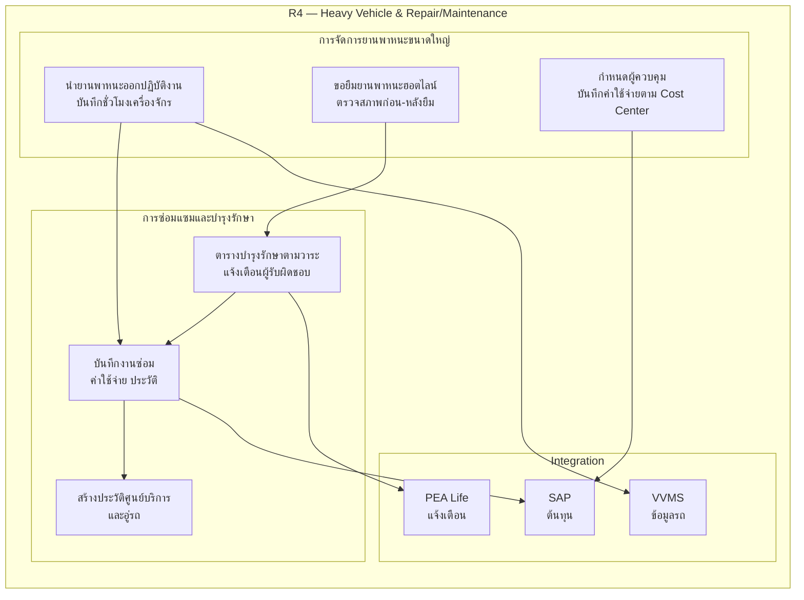
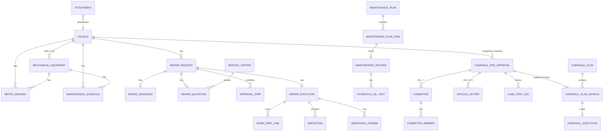
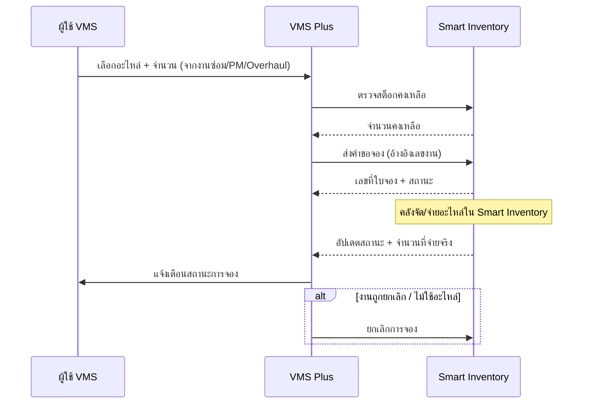

# VMS Plus / SMSM — สรุปงานตาม JO และรายละเอียดเชิงเทคนิค (Column Spec)

> อ้างอิง: ใบสั่งงาน (Job Order) จ.136/2569_สง.1 — PEA Work D Super App ระยะที่ 4 (Operate D)
> อ้างอิงเพิ่มเติม: VMS plus – Project Board (10) — ขั้นตอนก่อนดำเนินการ Overhaul (ดูหัวข้อ 6.0)
> ขอบเขต: งานแจ้งซ่อม ซ่อมแซม บำรุงรักษาเชิงป้องกัน และ Overhaul ยานพาหนะ/เครื่องมือกล
> สถานะเอกสาร: Draft สำหรับใช้ตั้งต้น Database Design (ER Diagram / Data Dictionary ตาม ส่วนที่ 3 ข้อ 3.1.4–3.1.5)

**วิธีอ่านตาราง**

- คอลัมน์ `ที่มา` = ข้อใน TOR ที่ระบุฟิลด์นั้นไว้ตรง ๆ
- `Board ขั้น n` = มาจากขั้นตอนใน Project Board (ไม่อยู่ใน TOR)
- `เสนอเพิ่ม` = ฟิลด์ที่ TOR ไม่ได้เขียนไว้ แต่จำเป็นทางเทคนิค (PK/FK, audit, status, workflow) — ต้องยืนยันกับ กฟภ.
- Type เป็นข้อเสนอสำหรับ PostgreSQL 17 (ยังไม่ใช่ข้อกำหนด)
- ทุกตารางหลักควรมี audit columns มาตรฐาน: `created_at`, `created_by`, `updated_at`, `updated_by`, `deleted_at` (soft delete) — ไม่ได้เขียนซ้ำในแต่ละตาราง

---

## ภาพรวม R4 — Heavy Vehicle & Repair/Maintenance

### การเทียบกล่องใน R4 กับข้อใน JO1

| กล่อง | เรื่อง                                       | ข้อ JO1 ที่เกี่ยวข้อง                   | ครอบคลุมใน JO1                                                    |
| ----- | -------------------------------------------- | --------------------------------------- | ----------------------------------------------------------------- |
| HV1   | นำรถออกปฏิบัติงาน / บันทึกชั่วโมงเครื่องจักร | 7.1-05 (บันทึกชั่วโมงแยกส่วน)           | บางส่วน — การบันทึกชั่วโมงอยู่ใน JO1 แต่การนำรถออกปฏิบัติงานไม่มี |
| HV2   | ขอยืมรถฮอตไลน์ / ตรวจสภาพก่อน-หลังยืม        | —                                       | ไม่มีใน JO1                                                       |
| HV3   | กำหนดผู้ควบคุม / ค่าใช้จ่ายตาม Cost Center   | 7.2.3.1-04, 7.2.4-03 (ศูนย์ต้นทุน)      | บางส่วน — มีผู้ควบคุมรถในขั้นซ่อม และศูนย์ต้นทุนในบันทึกงานซ่อม   |
| RM1   | ตารางบำรุงรักษาตามวาระ / แจ้งเตือน           | 7.1-08, 7.3.2, 7.3.2-10                 | ครอบคลุม                                                          |
| RM2   | บันทึกงานซ่อม ค่าใช้จ่าย ประวัติ             | 7.2.2-04, 7.2.4-03                      | ครอบคลุม                                                          |
| RM3   | ข้อมูลศูนย์บริการและอู่                      | 7.5                                     | ครอบคลุม                                                          |
| I1    | PEA Life แจ้งเตือน                           | ส่วนที่ 2 ข้อ 6.1, 7.8                  | ครอบคลุม                                                          |
| I2    | SAP ต้นทุน                                   | — (JO1 ระบุแค่ศูนย์ต้นทุน/หมายเลขงาน)   | ไม่ระบุใน JO1 — ต้องยืนยัน                                        |
| I3    | VVMS ข้อมูลรถ                                | — (อาจเกี่ยวกับ Data Migration ข้อ 4.4) | ไม่ระบุใน JO1 — ต้องยืนยัน                                        |

---

## 0. สรุปงานที่ต้องทำตาม Job Order

> แตกตามใบสั่งงาน ส่วนที่ 1–4 — ระบบต้องทำอะไรได้ ต้องบันทึก/แสดงข้อมูลอะไร ต้องส่งมอบอะไร และต้องผ่านการทดสอบอะไร
> หัวข้อ 1 เป็นต้นไปคือรายละเอียดเชิงเทคนิค

### 0.1 ข้อมูลใบสั่งงาน

| รายการ               | รายละเอียด                                                                                                        |
| -------------------- | ----------------------------------------------------------------------------------------------------------------- |
| โครงการ              | จ้างออกแบบและพัฒนาฟีเจอร์บน PEA Work D Super App ระยะที่ 4 ประเภทงาน Operate D (e-bidding)                        |
| เลขที่อ้างอิง        | จ.136/2569_สง.1                                                                                                   |
| ชื่องาน              | JO1 — ระบบบริหารจัดการงานแจ้งซ่อม ซ่อมแซม และบำรุงรักษายานพาหนะ (VMS Plus / SMSM)                                 |
| หน่วยงานเจ้าของงาน   | กองออกแบบและพัฒนาระบบดิจิทัล 1                                                                                    |
| คณะกรรมการพิจารณา JO | ประธาน: นายวิทยา สว่างวงษ์ / กรรมการ: นายศรัญยู บริรัตนฤทธิ์, นายธนพล วิจารณ์ปรีชา และอีก 2 ท่าน (ยังไม่ระบุชื่อ) |
| รูปแบบการทำงาน       | **Hybrid Co-delivery** — ทำงานร่วมกับบุคลากร/ทีมพัฒนาของ กฟภ.                                                     |

### 0.2 สิ่งที่บริษัทต้องกรอกในใบสั่งงาน (ส่วนที่ 1)

บริษัทกรอก **เฉพาะฝั่งบริษัท** ส่วนฝั่ง กฟภ. เป็นค่าที่อนุมัติ

| ช่องที่ต้องกรอก                                 | หมายเหตุ                                       |
| ----------------------------------------------- | ---------------------------------------------- |
| ราคาสุทธิที่ยื่นเสนอ (บาท)                      | กฟภ. อาจอนุมัติไม่เท่าที่เสนอ                  |
| จำนวน Man-Days ที่เสนอ                          | ต้องสอดคล้องกับ 3.1.8 (ตำแหน่ง จำนวนคน Manday) |
| วันที่เริ่ม / วันที่สิ้นสุด / รวมระยะเวลา (วัน) | วันจริงยึดตาม **วันที่ กฟภ. อนุมัติ**          |
| ผู้มีอำนาจลงนาม                                 | ลงนาม + ชื่อในวงเล็บ                           |

เงื่อนไข: **ห้ามเริ่มงานก่อน กฟภ. เห็นชอบ JO** ทุกครั้ง

### 0.3 ขอบเขตงานทั่วไป (ส่วนที่ 2 ข้อ 1–6)

| ข้อ JO | ต้องทำ                                                                                                                                         |
| ------ | ---------------------------------------------------------------------------------------------------------------------------------------------- |
| 1      | วิเคราะห์และออกแบบกระบวนงานของระบบ VMS Plus โดยค้นคว้า ค้นหา ออกแบบ และเก็บรวบรวมความต้องการจากผู้ใช้งาน (User Experience) ที่เป็นบุคลากร กฟภ. |
| 2      | วิเคราะห์และออกแบบ UX/UI โดยใช้ Design System และ Component ที่ กฟภ. จัดเตรียมไว้ ทำงานร่วมกับทีมพัฒนา กฟภ.                                    |
| 3      | ศึกษา วิเคราะห์ และออกแบบโครงสร้างฐานข้อมูลเพิ่มเติม (ER Diagram + Data Dictionary) ร่วมกับทีมพัฒนา กฟภ.                                       |
| 4      | พัฒนาระบบตาม Tech Stack ที่กำหนด (ดูหัวข้อ 1) และทำ Data Migration จากระบบเดิมร่วมกับทีม กฟภ.                                                  |
| 5      | ระบบเป็น PWA ใช้ได้ทุกอุปกรณ์ รับ-ส่ง Push Notification ได้ ส่วน Offline Cache ใน Service Worker ให้บริษัทพิจารณาความเหมาะสม                   |
| 6      | ส่งแจ้งเตือนในขั้นตอนที่ กฟภ. กำหนด ผ่าน 4 ช่องทาง: PEA Life, PEA Work-D, SMS ของ กฟภ., Push Notification (PWA)                                |

### 0.4 ฟังก์ชันที่ระบบต้องทำได้ และข้อมูลที่ต้องบันทึก/แสดง (ส่วนที่ 2 ข้อ 7)

> แตกตามข้อใน JO ทีละข้อ ใช้ถ้อยคำตาม JO ให้มากที่สุด คำว่า "เป็นต้น" ใน JO แปลว่ารายการฟิลด์ยังไม่ใช่รายการปิด
> ID ใช้รูปแบบ `ข้อ JO-ลำดับ` เพื่อใช้อ้างอิงใน Requirement Spec / Test Case / RTM

**ชุดตัวกรองมาตรฐาน (F)** — ใช้ทุกที่ที่ JO เขียนว่า "ค้นหาและกรอง (filter) ข้อมูลยานพาหนะได้ตามที่ กฟภ. กำหนด"
เลขทะเบียน, รหัสยานพาหนะ, รหัสทรัพย์สิน, ยี่ห้อ-รุ่น, ประเภทยานพาหนะ, สังกัดหน่วยงาน, หมายเลขตัวถัง, ประเภทเครื่องมือกล/เครื่องจักร, ยี่ห้อ-รุ่นเครื่องมือกล/เครื่องจักร (เป็นต้น)

---

#### 7.1 ทะเบียนเครื่องมือกล/เครื่องจักรที่ติดตั้งกับยานพาหนะ

| ID     | ระบบต้องทำได้                                                                                        | ข้อมูลที่ต้องบันทึก / แสดง                                                                                                                                                                                                                                                               |
| ------ | ---------------------------------------------------------------------------------------------------- | ---------------------------------------------------------------------------------------------------------------------------------------------------------------------------------------------------------------------------------------------------------------------------------------- |
| 7.1-01 | สร้าง / แก้ไข / แสดง ข้อมูลยานพาหนะที่ติดตั้ง                                                        | เลขทะเบียน, รหัสยานพาหนะ, ยี่ห้อ-รุ่น, สังกัดหน่วยงาน, ประเภทยานพาหนะ, ประเภทเชื้อเพลิง, หมายเลขตัวถัง, หมายเลขเครื่องยนต์, น้ำหนักบรรทุก, วันที่จดทะเบียน, อายุยานพาหนะ, สถานะการใช้งาน, รหัสทรัพย์สิน, รหัสทรัพย์สินย่อย, ประเภททรัพย์สิน, มูลค่าที่ได้มา                              |
| 7.1-02 | สร้าง / แก้ไข / แสดง ข้อมูลเครื่องมือกล                                                              | ประเภทเครื่องมือกล (เครน, กระเช้า, ปั้นจั่น, ขุดเจาะ, เครื่องฉีดน้ำแรงดันสูง ฯลฯ), ประเภทย่อย ถ้ามี (เครนพับ, เครนแข็ง ฯลฯ), ยี่ห้อ-รุ่น, Serial Number, หมายเลขเครน/เครื่องมือกล, วันที่ติดตั้ง, สภาพ/สถานะการใช้งาน, รหัสทรัพย์สิน, รหัสทรัพย์สินย่อย, ประเภททรัพย์สิน, มูลค่าที่ได้มา |
| 7.1-03 | บันทึก / แสดง ข้อมูลทางเทคนิค                                                                        | น้ำหนักยกสูงสุด, ช่วงการยกสูงสุด, ระยะเอื้อมไฮดรอลิกสูงสุด, น้ำหนักของเครื่องมือกล                                                                                                                                                                                                       |
| 7.1-04 | แนบ / แสดง ภาพและเอกสาร                                                                              | ภาพยานพาหนะ, ภาพเครื่องมือกล, เอกสารที่เกี่ยวข้อง                                                                                                                                                                                                                                        |
| 7.1-05 | บันทึกชั่วโมงการทำงาน แยกค่ามิเตอร์ตามส่วน                                                           | ชั่วโมงเครื่องจักร, ชั่วโมงเครน ฯลฯ                                                                                                                                                                                                                                                      |
| 7.1-06 | บันทึกเครื่องมือกล/เครื่องจักร **มากกว่า 1 รายการ** ต่อยานพาหนะ 1 คัน                                | รายการเครื่องมือกลทั้งหมดของรถคันนั้น                                                                                                                                                                                                                                                    |
| 7.1-07 | กำหนดรหัสทรัพย์สินและรหัสทรัพย์สินย่อยของเครื่องมือกล/เครื่องจักร (รถยนต์บรรทุกและเครื่องจักรกลหนัก) | รหัสทรัพย์สิน, รหัสทรัพย์สินย่อย                                                                                                                                                                                                                                                         |
| 7.1-08 | กำหนดตารางบำรุงรักษา ครอบคลุมทั้งตัวรถและอุปกรณ์พิเศษ และคำนวณวาระบำรุงรักษา                         | เกณฑ์วัดวาระ: Odometer (กม.) / Hour Meter (ชม.) / ระยะเวลา (เดือน, วัน) / เกณฑ์เทียบ **1 ชม. = 30 กม.**, ค่ารอบ, วาระถัดไป                                                                                                                                                               |
| 7.1-09 | สร้างข้อมูลปริมาณมากผ่าน Template หรือรูปแบบที่ กฟภ. กำหนด                                           | ไฟล์ Template, ผลนำเข้า (สำเร็จ/ผิดพลาด)                                                                                                                                                                                                                                                 |
| 7.1-10 | แสดงภาพรวม / Dashboard ยานพาหนะที่ติดตั้งเครื่องมือกล                                                | ตัวชี้วัดตามที่ กฟภ. กำหนด                                                                                                                                                                                                                                                               |
| 7.1-11 | ค้นหาและกรองข้อมูลยานพาหนะ                                                                           | ชุดตัวกรอง F                                                                                                                                                                                                                                                                             |
| 7.1-12 | Export ข้อมูล                                                                                        | ไฟล์ Excel, PDF                                                                                                                                                                                                                                                                          |

---

#### 7.2.1 การจัดประเภทยานพาหนะที่ซ่อมและผู้ดำเนินการซ่อม

| ID       | ระบบต้องทำได้                      | ข้อมูลที่ต้องบันทึก / แสดง                                                                                                          |
| -------- | ---------------------------------- | ----------------------------------------------------------------------------------------------------------------------------------- |
| 7.2.1-01 | แยกเส้นทางงานซ่อมตามประเภทยานพาหนะ | **รถเช่า** → บริษัทผู้ให้เช่าเป็นผู้ซ่อม ประสานหน่วยงานผู้บริหารสัญญา + หน่วยงานเจ้าของรถ                                           |
| 7.2.1-02 | 〃                                 | **รถซื้อ ทั่วไป (ไม่มีเครื่องมือกล)** → หน่วยงานเจ้าของจ้างศูนย์บริการ/อู่ภายนอก                                                    |
| 7.2.1-03 | 〃                                 | **รถซื้อ ติดตั้งเครื่องมือกล** → หน่วยงานเจ้าของจ้างอู่ หรือแจ้งซ่อมไปที่ ผยค. กรย. / กบค.; ถ้าซ่อมเองไม่ได้ จ้างอู่ที่เชี่ยวชาญได้ |

#### 7.2.2 การเปิดงานซ่อม / แจ้งซ่อม

| ID       | ระบบต้องทำได้                                                                                                  | ข้อมูลที่ต้องบันทึก / แสดง                                                                                                                                   |
| -------- | -------------------------------------------------------------------------------------------------------------- | ------------------------------------------------------------------------------------------------------------------------------------------------------------ |
| 7.2.2-01 | เปิดใบแจ้งซ่อม                                                                                                 | วันที่แจ้งซ่อม, ทะเบียนยานพาหนะ, ประเภทยานพาหนะ, สังกัดหน่วยงาน, อาการชำรุด, ผู้แจ้งซ่อม, สถานที่/พิกัดที่รถเสีย, เลขไมล์, ชั่วโมงสะสมการทำงานของเครื่องจักร |
| 7.2.2-02 | บันทึกการวิเคราะห์อาการชำรุด                                                                                   | สรุปปัญหาที่แจ้ง, รายการอะไหล่แนะนำ (ถ้ามี), ศูนย์บริการ/อู่ในพื้นที่ใกล้เคียงที่แนะนำ (ถ้ามี)                                                               |
| 7.2.2-03 | แนบภาพและเอกสาร                                                                                                | ภาพรถ/เครื่องมือกลที่ชำรุด, ใบประเมินหรือใบเสนอราคาซ่อม ฯลฯ                                                                                                  |
| 7.2.2-04 | แสดงประวัติการซ่อมย้อนหลัง — เพื่อตรวจอาการเสีย ความถี่ ป้องกันซ่อมซ้ำซ้อน และดูมูลค่าซ่อมเดิมประกอบการอนุมัติ | วันที่แจ้งซ่อม, หมายเลขงานซ่อม, วันซ่อมเสร็จ, อาการชำรุด, รายละเอียดงานซ่อม, อะไหล่ที่ใช้ (รหัส/ชื่อพัสดุ), จำนวนเงิน, ผู้ดำเนินการซ่อม                      |
| 7.2.2-05 | ส่งใบแจ้งซ่อมไปยังผู้เกี่ยวข้องตามขั้นตอนที่ กฟภ. กำหนด                                                        | ลำดับขั้น, ผู้รับในแต่ละขั้น                                                                                                                                 |
| 7.2.2-06 | แก้ไข / ยกเลิกใบแจ้งซ่อม กรณีถูกตีกลับหรือไม่อนุมัติ                                                           | สถานะ, เหตุผลที่ถูกตีกลับ/ไม่อนุมัติ                                                                                                                         |
| 7.2.2-07 | แสดงภาพรวม / Dashboard (JO เขียนว่า "ยานพาหนะที่ติดตั้งเครื่องมือกล")                                          | ตัวชี้วัดตามที่ กฟภ. กำหนด                                                                                                                                   |
| 7.2.2-08 | ค้นหาและกรอง                                                                                                   | ชุดตัวกรอง F                                                                                                                                                 |
| 7.2.2-09 | Export                                                                                                         | Excel, PDF                                                                                                                                                   |

#### 7.2.3.1 ส่งซ่อม — รถซื้อ ทั่วไป (ไม่มีเครื่องมือกล)

| ID         | ระบบต้องทำได้                                                                                          | ข้อมูลที่ต้องบันทึก / แสดง                                 |
| ---------- | ------------------------------------------------------------------------------------------------------ | ---------------------------------------------------------- |
| 7.2.3.1-01 | แนบใบประเมิน/ใบเสนอราคาซ่อมของอู่ เพื่อประเมินราคาที่เหมาะสม                                           | ไฟล์ใบเสนอราคา, ชื่ออู่, ราคาประเมิน                       |
| 7.2.3.1-02 | เลือกหรือเปลี่ยนผู้มีอำนาจอนุมัติงานซ่อม โดยผ่านความเห็นชอบจากผู้ดูแลยานพาหนะประจำหน่วยงาน             | ผู้ดูแลยานพาหนะ, ผู้มีอำนาจอนุมัติ                         |
| 7.2.3.1-03 | แก้ไขข้อมูลผู้มีอำนาจอนุมัติ **เฉพาะ** เบอร์ภายในและเบอร์โทรศัพท์                                      | เบอร์ภายใน, เบอร์โทรศัพท์ (ฟิลด์อื่นแก้ไม่ได้)             |
| 7.2.3.1-04 | หลังสร้างใบงานแจ้งซ่อม ส่งแจ้งเตือนไปยังผู้ดูแล/ผู้ควบคุมยานพาหนะ                                      | Notification                                               |
| 7.2.3.1-05 | **ค่าซ่อมประเมินเกิน 30% ของมูลค่าสินทรัพย์ → แจ้งเตือนให้พิจารณาจำหน่ายทรัพย์สิน** (ไม่คุ้มซ่อม)      | ค่าซ่อมประเมิน, มูลค่าสินทรัพย์, % เทียบ, ข้อความแจ้งเตือน |
| 7.2.3.1-06 | หลังผู้ดูแล/ผู้ควบคุมยานพาหนะยืนยัน ส่งแจ้งเตือนไปยังผู้มีอำนาจอนุมัติ                                 | Notification                                               |
| 7.2.3.1-07 | อนุมัติการขอซ่อม โดยผู้บังคับบัญชาของหน่วยงานผู้ขอใช้รถ **หรือ** ของหน่วยงานที่รถไปปฏิบัติงานในพื้นที่ | ผลอนุมัติ, ผู้อนุมัติ, วันที่                              |
| 7.2.3.1-08 | ผู้เกี่ยวข้องตรวจสอบข้อมูลการแจ้งซ่อม / ประวัติงานซ่อมบำรุงของรถ                                       | ข้อมูลตาม 7.2.2-01, 7.2.2-04                               |
| 7.2.3.1-09 | ผู้ดูแล/ผู้ควบคุมรถ/ผู้อนุมัติ ยกเลิกหรือตีกลับใบแจ้งซ่อมที่ตนรับผิดชอบ                                | เหตุผลการยกเลิก/ตีกลับ                                     |
| 7.2.3.1-10 | แจ้งเตือนผู้เกี่ยวข้องเพื่อดำเนินการต่อ                                                                | Notification                                               |

#### 7.2.3.2 ส่งซ่อม — รถซื้อ ติดตั้งเครื่องมือกล

| ID         | ระบบต้องทำได้                                                                        | ข้อมูลที่ต้องบันทึก / แสดง                                                              |
| ---------- | ------------------------------------------------------------------------------------ | --------------------------------------------------------------------------------------- |
| 7.2.3.2-01 | ระบุว่าอาการเสียเป็นของ **ตัวรถ** หรือ **เครื่องมือกล** (ขั้นตอนต่างกัน)             | ส่วนที่เสีย                                                                             |
| 7.2.3.2-02 | ผู้ดูแลรถประจำหน่วยงาน / ผยค. กรย. / กบค. วิเคราะห์อาการหลังได้รับแจ้ง               | ผลวิเคราะห์, อาการเสีย, อะไหล่ที่ต้องใช้เพิ่มเติม                                       |
| 7.2.3.2-03 | เสียที่ตัวรถ: หน่วยงานเจ้าของส่งอู่ซ่อมจากการสืบราคา                                 | อู่ที่เลือก, ราคาที่สืบ, เอกสารประกอบ                                                   |
| 7.2.3.2-04 | เสียที่เครื่องมือกล: ระบุว่าซ่อมเอง หรือส่งอู่                                       | วิธีซ่อม, เอกสารประกอบ                                                                  |
| 7.2.3.2-05 | เสียที่เครื่องมือกล: ผยค. กรย. / กบค. ระบุว่าเบิกอะไหล่จากคลัง กบค. หรือจัดซื้อเพิ่ม | แหล่งอะไหล่, รายการอะไหล่; กรณีเบิกคลัง → **ระบบส่งคำขอจองไป Smart Inventory** (ดู 8.5) |
| 7.2.3.2-06 | บันทึกวันรับงาน (วันที่ ผยค. กรย. / กบค. กดรับเรื่อง)                                | วันรับงาน, ผู้รับงาน                                                                    |
| 7.2.3.2-07 | เชื่อมกับระบบคลังอะไหล่อัจฉริยะ (Smart Inventory) (ถ้ามี)                            | สต็อกคงเหลือ, เลขที่ใบจอง, สถานะการจอง (ดู 8.5)                                         |
| 7.2.3.2-08 | นัดหมายซ่อมที่หน้างาน หรือให้นำรถมาซ่อมที่ ผยค. กรย. / กบค.                          | ประเภทนัด, วันเวลา, สถานที่                                                             |
| 7.2.3.2-09 | ผู้เกี่ยวข้องตรวจสอบข้อมูลแจ้งซ่อม / ประวัติซ่อมบำรุง                                | ข้อมูลตาม 7.2.2-01, 7.2.2-04                                                            |
| 7.2.3.2-10 | ยกเลิก / ตีกลับใบแจ้งซ่อม                                                            | เหตุผล                                                                                  |
| 7.2.3.2-11 | แจ้งเตือนผู้เกี่ยวข้อง                                                               | Notification                                                                            |

#### 7.2.4 การบันทึกงานซ่อม (Repair Execution)

| ID       | ระบบต้องทำได้                                                                                              | ข้อมูลที่ต้องบันทึก / แสดง                                                                                                                                                                                  |
| -------- | ---------------------------------------------------------------------------------------------------------- | ----------------------------------------------------------------------------------------------------------------------------------------------------------------------------------------------------------- |
| 7.2.4-01 | บันทึกใบตรวจสภาพก่อนซ่อม (กรณีซ่อมโดย ผยค. กรย. / กบค.)                                                    | รายการตรวจ, ผลตรวจ                                                                                                                                                                                          |
| 7.2.4-02 | บันทึกใบรับรถ (กรณีเข้าซ่อมที่สำนักงานใหญ่ กบค.) เป็นหลักฐานป้องกันทรัพย์สินสูญหาย/ข้อโต้แย้ง              | ทะเบียน, สภาพตัวถังและสี, ยาง, อุปกรณ์และเครื่องมือประจำรถ, ระบบไฟ, จุดที่ชำรุด                                                                                                                             |
| 7.2.4-03 | บันทึกข้อมูลการซ่อม                                                                                        | วันที่เริ่ม-สิ้นสุดการซ่อม, เลขไมล์, ชั่วโมงการทำงานเครื่องจักร, รายละเอียดการซ่อม, อะไหล่ที่ใช้, อะไหล่ที่ส่งคืนคลัง (ถ้ามี), ผู้ดำเนินการ, ค่าแรง, ค่าอะไหล่, ยอดรวมค่าใช้จ่าย, ศูนย์ต้นทุนหรือหมายเลขงาน |
| 7.2.4-04 | แนบภาพและเอกสาร                                                                                            | ภาพรถ/เครื่องมือกล, เอกสาร                                                                                                                                                                                  |
| 7.2.4-05 | พบอาการชำรุดเพิ่มระหว่างซ่อม → แจ้งหน่วยงานเจ้าของรถให้รับทราบ **ก่อน** ดำเนินการ                          | อาการเพิ่ม, วันที่แจ้ง                                                                                                                                                                                      |
| 7.2.4-06 | อาการวิกฤต → ขออนุมัติเบิกอะไหล่เพิ่มเพื่อซ่อมต่อทันที; ยังใช้งานได้และรออะไหล่ → บันทึกโน้ตรอซ่อมรอบถัดไป | ระดับความรุนแรง, คำขอเบิกอะไหล่ → **ระบบส่งคำขอจองไป Smart Inventory** (ดู 8.5), โน้ต                                                                                                                       |
| 7.2.4-07 | บันทึกใบตรวจสภาพหลังซ่อม (กรณีซ่อมโดย ผยค. กรย. / กบค.)                                                    | รายการตรวจ, ผลตรวจ                                                                                                                                                                                          |
| 7.2.4-08 | นัดหมายรับรถคืนหลังซ่อมเสร็จ (กรณี ผยค. กรย. / กบค. รับผิดชอบ)                                             | วันเวลานัด, สถานที่                                                                                                                                                                                         |
| 7.2.4-09 | ประเมิน / ให้คะแนนคุณภาพงานซ่อม                                                                            | คะแนน, ความเห็น                                                                                                                                                                                             |
| 7.2.4-10 | กำหนดการรับประกันงานซ่อม (ถ้ามี)                                                                           | ระยะเวลารับประกัน เช่น 180 วัน                                                                                                                                                                              |
| 7.2.4-11 | บันทึกวันเสร็จ (ปิด) งาน หลังเจ้าของรถกดยืนยันรับรถจาก ผยค. กรย. / กบค.                                    | วันปิดงาน, ผู้ยืนยัน                                                                                                                                                                                        |
| 7.2.4-12 | แจ้งเตือนผู้เกี่ยวข้อง                                                                                     | Notification                                                                                                                                                                                                |

---

#### 7.3.1 การจัดประเภทยานพาหนะที่บำรุงรักษาและผู้ดำเนินการ

| ID       | ระบบต้องทำได้                        | ข้อมูลที่ต้องบันทึก / แสดง                                                                                               |
| -------- | ------------------------------------ | ------------------------------------------------------------------------------------------------------------------------ |
| 7.3.1-01 | แยกผู้ดำเนินการบำรุงรักษาตามประเภทรถ | **รถเช่า** → บริษัทผู้ให้เช่า ประสานหน่วยงานผู้บริหารสัญญาและเจ้าของรถ                                                   |
| 7.3.1-02 | 〃                                   | **รถซื้อ ทั่วไป** → หน่วยงานเจ้าของนำรถไปอู่ตามรอบระยะทางหรือระยะเวลา                                                    |
| 7.3.1-03 | 〃                                   | **รถซื้อ ติดตั้งเครื่องมือกล** → ตัวรถเหมือนรถทั่วไป; เครื่องมือกล กบค. วางแผนและกำหนดรอบ ดำเนินการเองหรือจ้าง Outsource |

#### 7.3.2 การวางแผนบำรุงรักษา (โดย กบค.)

| ID       | ระบบต้องทำได้                                                                             | ข้อมูลที่ต้องบันทึก / แสดง                                              |
| -------- | ----------------------------------------------------------------------------------------- | ----------------------------------------------------------------------- |
| 7.3.2-01 | สร้าง / แก้ไข / ยกเลิก / แสดง แผนบำรุงรักษา                                               | ข้อมูลแผน                                                               |
| 7.3.2-02 | ระบุ / เพิ่ม / แก้ไข / ลบ / ตรวจสอบ รายการรถที่ต้องบำรุงรักษาในแต่ละรอบ                   | รายการรถต่อรอบ                                                          |
| 7.3.2-03 | แสดงหน้าจอรายละเอียดยานพาหนะ                                                              | ข้อมูลตาม 7.1                                                           |
| 7.3.2-04 | ระบุสิ่งที่ต้องดำเนินการตามรอบหรือตามต้องการของรถแต่ละคัน และแสดงประวัติซ่อมบำรุงก่อนหน้า | รายการงาน, ประวัติซ่อมบำรุง                                             |
| 7.3.2-05 | กำหนดรายการตรวจสอบ/ตรวจสภาพ แยกตามประเภทรถ                                                | Checklist ต่อประเภทรถ                                                   |
| 7.3.2-06 | กำหนดอะไหล่/วัสดุที่ต้องใช้ของรถแต่ละคันตามรอบ                                            | รายการอะไหล่/วัสดุ, จำนวน                                               |
| 7.3.2-07 | วางแผนล่วงหน้า **2 ปี** เพื่อเตรียมอะไหล่                                                 | ช่วงแผน 2 ปี                                                            |
| 7.3.2-08 | ทบทวนแผนก่อน/ใกล้ครบกำหนด พร้อมยืนยันแผนระหว่าง กบค. กับหน่วยงานพื้นที่                   | สถานะทบทวน, ผู้ยืนยันทั้งสองฝ่าย                                        |
| 7.3.2-09 | วางแผนการเดินทางไปบำรุงรักษา                                                              | ผู้ดำเนินการ (พนักงาน กฟภ. / ผู้รับจ้าง), ช่วงวันที่, ยานพาหนะ, สถานที่ |
| 7.3.2-10 | แจ้งเตือนผู้เกี่ยวข้องให้รับทราบ / ยืนยัน / ดำเนินการ                                     | Notification                                                            |
| 7.3.2-11 | เบิกอะไหล่จากคลังก่อนเดินทางไปบำรุงรักษา                                                  | รายการอะไหล่ตามแผน → **ระบบส่งคำขอจองไป Smart Inventory** (ดู 8.5)      |
| 7.3.2-12 | เชื่อมกับ Smart Inventory                                                                 | สต็อกคงเหลือ, เลขที่ใบจอง, สถานะการจอง (ดู 8.5)                         |

#### 7.3.3 การบันทึกงานบำรุงรักษา (รถติดตั้งเครื่องมือกล)

| ID       | ระบบต้องทำได้                                                                                | ข้อมูลที่ต้องบันทึก / แสดง                                                                                                                                              |
| -------- | -------------------------------------------------------------------------------------------- | ----------------------------------------------------------------------------------------------------------------------------------------------------------------------- |
| 7.3.3-01 | บันทึกการตรวจสภาพ                                                                            | วันที่ตรวจ, ทะเบียน, ประเภทรถ, สังกัด, ยี่ห้อเครื่องจักร, หมายเลขเครน/เครื่องมือกล, Serial Number, เลขไมล์, ชั่วโมงสะสมเครื่องจักร, รายการตรวจ, ผลการตรวจ, ผู้ดำเนินการ |
| 7.3.3-02 | บันทึกการบำรุงรักษา                                                                          | วันที่บำรุงรักษา, ข้อมูลรถ, สังกัด, อะไหล่ที่ใช้ (รหัส/ชื่อพัสดุ), ค่าแรง, ค่าอะไหล่, จำนวนเงินรวม, ผู้ดำเนินการซ่อม, อาการชำรุดเพิ่มเติม                               |
| 7.3.3-03 | แนบภาพและเอกสาร                                                                              | ภาพรถ/เครื่องมือกล **ก่อน/หลัง** บำรุงรักษา, เอกสาร                                                                                                                     |
| 7.3.3-04 | บันทึกการตรวจค่าความเป็นฉนวนของน้ำมันไฮดรอลิก                                                | ผลการตรวจ, คำแนะนำเพิ่มเติมกรณีไม่ผ่าน, วันที่ตรวจ, วันที่บันทึกผล                                                                                                      |
| 7.3.3-05 | แจ้งเตือนผลการบำรุงรักษา / ผลตรวจน้ำมันไฮดรอลิก ให้ผู้เกี่ยวข้องรับทราบ / ยืนยัน / ดำเนินการ | Notification                                                                                                                                                            |
| 7.3.3-06 | แก้ไข / ยกเลิก การบันทึกงานบำรุงรักษา                                                        | สถานะ, เหตุผล                                                                                                                                                           |
| 7.3.3-07 | คืนอะไหล่เข้าคลังหลังกลับจากบำรุงรักษา (อะไหล่ไม่มีรหัสพัสดุ → โอนเข้าคลังสำรอง)             | รายการคืน, คลังปลายทาง                                                                                                                                                  |
| 7.3.3-08 | เชื่อมกับ Smart Inventory                                                                    | รายการคืนอ้างอิงใบจองเดิม (วิธีคืนรอยืนยัน — ดู 8.5)                                                                                                                    |
| 7.3.3-09 | หน่วยงานเจ้าของรถตรวจสอบผลสภาพรถ ผลการบำรุงรักษา และประเมิน/ให้คะแนน                         | ผลตรวจ, ผล PM, คะแนน                                                                                                                                                    |
| 7.3.3-10 | ผู้บังคับบัญชาตรวจสอบความถูกต้องครบถ้วนของการบำรุงรักษาในแต่ละแผนงาน                         | ผลตรวจสอบ, ผู้ตรวจ, วันที่                                                                                                                                              |
| 7.3.3-11 | รายงานผลการบำรุงรักษาตามรูปแบบ/แบบฟอร์มที่ กฟภ. กำหนด                                        | รายงาน                                                                                                                                                                  |
| 7.3.3-12 | แสดงภาพรวม / Dashboard งานบำรุงรักษารถและเครื่องมือกล                                        | ตัวชี้วัดตามที่ กฟภ. กำหนด                                                                                                                                              |
| 7.3.3-13 | ค้นหาและกรอง                                                                                 | ชุดตัวกรอง F                                                                                                                                                            |
| 7.3.3-14 | Export                                                                                       | Excel, PDF                                                                                                                                                              |
| 7.3.3-15 | **Safety Inspection:** รถเครน/กระเช้า ระบบต้อง **บังคับ** ตรวจตามรอบปีหรือตามที่กฎหมายกำหนด  | รอบตรวจ, วันครบกำหนด, ผลตรวจ                                                                                                                                            |

---

#### 7.4.1 การวางแผน Overhaul (รถติดตั้งเครื่องมือกล)

| ID       | ระบบต้องทำได้                                                      | ข้อมูลที่ต้องบันทึก / แสดง                                                                                                     |
| -------- | ------------------------------------------------------------------ | ------------------------------------------------------------------------------------------------------------------------------ |
| 7.4.1-01 | สร้าง / แก้ไข / ยกเลิก / แสดง แผน Overhaul ตามรอบปีหรือรอบที่กำหนด | ชื่อแผนงาน, ปีแผนงาน, งบประมาณ                                                                                                 |
| 7.4.1-02 | สร้าง / แก้ไข / แสดง รายการรถในแผน โดยระบุรถที่ผ่านการคัดเลือก     | เกณฑ์คัดเลือก: โครงสร้างดี ไม่ผุหรือบิดเบี้ยวจนเสียรูปทรง, ยี่ห้อทนทาน นิยมใช้, อายุการใช้งานสูง, หาอะไหล่ได้ง่าย              |
| 7.4.1-03 | แสดงรายละเอียดรถ                                                   | ทะเบียน, อายุ, ประเภทรถ, สังกัด, ยี่ห้อเครื่องมือกล, หมายเลขเครน/เครื่องมือกล, Serial Number, เลขไมล์, ชั่วโมงสะสมเครื่องมือกล |
| 7.4.1-04 | แนบ / แสดง ภาพและเอกสาร                                            | ภาพรถและเครื่องมือกล, เอกสาร                                                                                                   |
| 7.4.1-05 | แสดงประวัติการซ่อมบำรุง                                            | ประวัติซ่อม + PM                                                                                                               |
| 7.4.1-06 | กำหนดรายการตรวจสอบ / สิ่งที่ต้องดำเนินการของรถแต่ละคัน             | Checklist / รายการงาน                                                                                                          |
| 7.4.1-07 | ติดตามการใช้งานของรถหลัง Overhaul เสร็จ                            | ข้อมูลการใช้งานหลัง Overhaul                                                                                                   |

#### 7.4.2 การดำเนินการ Overhaul

| ID       | ระบบต้องทำได้                                                                                                                                   | ข้อมูลที่ต้องบันทึก / แสดง                                                    |
| -------- | ----------------------------------------------------------------------------------------------------------------------------------------------- | ----------------------------------------------------------------------------- |
| 7.4.2-01 | บันทึกการประเมินสภาพและวิเคราะห์อาการ / รายการตรวจสภาพ **ก่อน** ดำเนินการ                                                                       | รายการตรวจ, ผลประเมิน, ผลวิเคราะห์                                            |
| 7.4.2-02 | บันทึกรายการซ่อมบำรุง **เครื่องมือกล** (เช่น เปลี่ยนชุดเครน/กระเช้า/บูม, เปลี่ยนซีลไฮดรอลิกทั้งหมด)                                             | รายการงาน, อะไหล่ที่ใช้, ค่าแรง, ค่าอะไหล่, ผู้ดำเนินการ, วันที่เริ่ม-สิ้นสุด |
| 7.4.2-03 | บันทึกรายการซ่อมบำรุง **ตัวรถ** (เช่น Overhaul เครื่องยนต์, ระบบส่งกำลัง/เกียร์, ระบบเบรก, ทำสีตัวถัง)                                          | รายการงาน, อะไหล่ที่ใช้, ค่าแรง, ค่าอะไหล่, ผู้ดำเนินการ, วันที่เริ่ม-สิ้นสุด |
| 7.4.2-04 | บันทึกการตรวจสภาพ **หลัง** Overhaul / ทดสอบมาตรฐานความปลอดภัย (ตามวิศวกรรม/กฎหมาย/กฟภ.) ออกใบรับรองความปลอดภัย และเริ่มนับรับประกัน **180 วัน** | ผลตรวจ, ใบรับรองความปลอดภัย, วันเริ่ม-สิ้นสุดรับประกัน                        |
| 7.4.2-05 | แนบภาพและเอกสาร                                                                                                                                 | ภาพรถ/เครื่องมือกล **ก่อน/หลัง** Overhaul, เอกสาร                             |
| 7.4.2-06 | แสดงค่าใช้จ่ายเปรียบเทียบกับราคาของรถแต่ละคัน                                                                                                   | ค่าใช้จ่ายรวม, ราคารถ, สัดส่วน                                                |
| 7.4.2-07 | แจ้งเตือนผู้เกี่ยวข้องให้รับทราบ / ยืนยัน / ดำเนินการ                                                                                           | Notification                                                                  |
| 7.4.2-08 | เบิก / คืนอะไหล่จากคลัง                                                                                                                         | รายการอะไหล่; ฝั่งเบิก → **ระบบส่งคำขอจองไป Smart Inventory** (ดู 8.5)        |
| 7.4.2-09 | เชื่อมกับ Smart Inventory                                                                                                                       | สต็อกคงเหลือ, เลขที่ใบจอง, สถานะการจอง/คืน (ดู 8.5)                           |
| 7.4.2-10 | รายงานผลตามรูปแบบ/แบบฟอร์มที่ กฟภ. กำหนด                                                                                                        | รายงาน                                                                        |
| 7.4.2-11 | แสดงภาพรวม / Dashboard งาน Overhaul                                                                                                             | ตัวชี้วัดตามที่ กฟภ. กำหนด                                                    |
| 7.4.2-12 | ค้นหาและกรอง                                                                                                                                    | ชุดตัวกรอง F                                                                  |
| 7.4.2-13 | Export                                                                                                                                          | Excel, PDF                                                                    |

---

#### 7.5 ข้อมูลศูนย์บริการ / อู่ (สำหรับรถติดตั้งเครื่องมือกล)

| ID     | ระบบต้องทำได้                                | ข้อมูลที่ต้องบันทึก / แสดง                                             |
| ------ | -------------------------------------------- | ---------------------------------------------------------------------- |
| 7.5-01 | สร้าง / แก้ไข / แสดง ข้อมูลอู่/ศูนย์บริการ   | ชื่อทางการค้าหรือชื่อจดทะเบียน                                         |
| 7.5-02 | 〃                                           | ประเภทการซ่อมที่รองรับ: ประเภท/ยี่ห้อรถ, ประเภท/ยี่ห้อเครื่องมือกล     |
| 7.5-03 | 〃                                           | ที่ตั้ง: เลขที่, ซอย, ถนน, แขวง/ตำบล, เขต/อำเภอ, จังหวัด, รหัสไปรษณีย์ |
| 7.5-04 | บันทึกพิกัด และกดนำทางผ่าน Google Maps       | Latitude, Longitude                                                    |
| 7.5-05 | 〃                                           | เบอร์โทรศัพท์หลัก                                                      |
| 7.5-06 | 〃                                           | อีเมล (รับส่งใบนัดหมาย / ผลประเมินราคาซ่อม)                            |
| 7.5-07 | คำนวณและแสดงคะแนนเฉลี่ยคุณภาพงานซ่อม (ถ้ามี) | คะแนนเฉลี่ยจากประวัติการประเมิน                                        |

#### 7.6 – 7.9 ส่วนระบบกลาง

| ID     | ระบบต้องทำได้                                                                  | ข้อมูลที่ต้องบันทึก / แสดง           |
| ------ | ------------------------------------------------------------------------------ | ------------------------------------ |
| 7.6-01 | บริหารจัดการรายงาน แบบฟอร์ม และเอกสารตามรูปแบบที่ กฟภ. กำหนด                   | รายการรายงาน/แบบฟอร์ม (รอ กฟภ. ระบุ) |
| 7.7-01 | จัดการสิทธิ์การเข้าถึง (User Roles & Permissions)                              | บทบาท, สิทธิ์, ผู้ใช้                |
| 7.8-01 | เชื่อมโยง / รับ-ส่งข้อมูลกับ HR Data Platform, PEA Life และระบบอื่นที่จำเป็น   | ข้อมูลพนักงาน/หน่วยงาน, การแจ้งเตือน |
| 7.9-01 | Login พนักงานและลูกจ้าง กฟภ. ด้วย PEA SSO (Keycloak) และ ThaID ตามมาตรฐาน กฟภ. | บัญชีผู้ใช้                          |
| 7.9-02 | Login บุคคลภายนอก ด้วยเบอร์โทรศัพท์และ ThaID                                   | บัญชีผู้ใช้ภายนอก                    |

### 0.5 สิ่งส่งมอบ (ส่วนที่ 3)

เอกสารทุกฉบับส่งเป็น **ไฟล์ต้นฉบับ + PDF**

| ID     | สิ่งส่งมอบ                                                                                                                                 | ช่วงงาน        |
| ------ | ------------------------------------------------------------------------------------------------------------------------------------------ | -------------- |
| D1     | Application พร้อม **Source Code** ที่พร้อมใช้งาน                                                                                           | Implementation |
| D2     | อบรมผู้พัฒนา อธิบาย Source Code (Knowledge Transfer)                                                                                       | Deployment     |
| D3.1.1 | Requirement Specification + จัดลำดับการพัฒนา                                                                                               | Discovery      |
| D3.1.2 | Business Flow ทั้งหมด                                                                                                                      | Discovery      |
| D3.1.3 | UI Hi-Fi (Figma file)                                                                                                                      | Discovery      |
| D3.1.4 | ER Diagram                                                                                                                                 | Discovery      |
| D3.1.5 | Data Dictionary                                                                                                                            | Discovery      |
| D3.1.6 | Timeline & Implementation Plan: (1) แผนงานตาม JO (2) แผนทดสอบ (3) Deployment / Full Launch–Phasing Plan (4) แผน Implementation รายฟังก์ชัน | Discovery      |
| D3.1.7 | Test Case Matrix                                                                                                                           | Discovery      |
| D3.1.8 | บุคลากร: ตำแหน่ง จำนวนคน Manday                                                                                                            | Discovery      |
| D3.2.1 | System Architecture                                                                                                                        | Implementation |
| D3.2.2 | API Specification                                                                                                                          | Implementation |
| D3.2.3 | รายงานทดสอบ Functional, Unit, SIT, UAT                                                                                                     | Implementation |
| D3.3.1 | Installation Plan                                                                                                                          | Deployment     |
| D3.3.2 | Installation Manual + เอกสาร Knowledge Transfer                                                                                            | Deployment     |
| D3.3.3 | User Manual                                                                                                                                | Deployment     |
| D3.4.1 | API Collection (เช่น Postman)                                                                                                              | อื่น ๆ         |
| D3.4.2 | Server Environment Configuration (ถ้ามี)                                                                                                   | อื่น ๆ         |
| D3.4.3 | เอกสาร Warranty **1 ปี (365 วัน) นับถัดจากวัน Go-Live on Production**                                                                      | อื่น ๆ         |

### 0.6 การทดสอบที่ต้องผ่าน (ส่วนที่ 4)

| ประเภท                             | รายละเอียด                                                                                 |
| ---------------------------------- | ------------------------------------------------------------------------------------------ |
| STLC                               | Unit Test, SIT, UAT, Non-Functional (Load Test ฯลฯ) — "รวมถึงแต่ไม่จำกัดเพียง"             |
| Security (ต้องผ่านตามมาตรฐาน กฟภ.) | Fortify SCA (Source Code), Black Duck (Software Composition), Fortify WebInspect (Web App) |

---

## 1. Technology Stack (ข้อกำหนดบังคับ — ส่วนที่ 2 ข้อ 4–6, 7.9)

| Layer                  | ข้อกำหนดใน TOR                                      | หมายเหตุเชิงเทคนิค                                                   |
| ---------------------- | --------------------------------------------------- | -------------------------------------------------------------------- |
| Frontend               | Next.js **v16+** หรือ Latest Stable                 | App Router                                                           |
| CSS                    | Tailwind CSS **v3.4+** หรือ Latest Stable           | ใช้ Design System/Component ที่ กฟภ. เตรียมไว้ (ข้อ 2)               |
| Backend                | **Go** Latest Stable                                |                                                                      |
| Database               | **PostgreSQL v17+** (Hybrid: Relational + Document) | ใช้ JSONB สำหรับข้อมูลยืดหยุ่น เช่น spec เครื่องมือกล, checklist     |
| ORM                    | บังคับใช้ ORM                                       | TOR ไม่ระบุตัว — ตัวเลือกใน Go เช่น GORM, ent, Bun (ต้องตกลง)        |
| File Storage           | Object Storage ของ กฟภ.                             | เก็บเอกสาร รูป เสียง วิดีโอ — DB เก็บแค่ metadata/object key         |
| App Type               | **PWA** รองรับทุกอุปกรณ์ + Push Notification        | Offline cache ใน Service Worker ให้ผู้รับจ้างพิจารณา                 |
| Notification           | PEA Life, PEA Work-D, SMS (กฟภ.), Web Push (PWA)    | ส่งตามขั้นตอนที่ กฟภ. กำหนด                                          |
| Auth (พนักงาน/ลูกจ้าง) | PEA SSO (Keycloak) + ThaID                          | ตามมาตรฐาน กฟภ.                                                      |
| Auth (บุคคลภายนอก)     | เบอร์โทรศัพท์ + ThaID                               | น่าจะเป็น OTP — ต้องยืนยัน                                           |
| Integration            | HR Data Platform, PEA Life, Smart Inventory (ถ้ามี) | Smart Inventory: VMS **ส่งคำขอจองอะไหล่** ไม่ได้ตัดสต็อกเอง (ดู 8.5) |
| Data Migration         | ย้ายข้อมูลจากระบบเดิม ร่วมกับทีม กฟภ.               |                                                                      |
| Delivery Model         | Hybrid Co-delivery กับทีม กฟภ.                      |                                                                      |

### Security & Testing (ส่วนที่ 4)

- STLC: Unit Test, SIT, UAT, Non-Functional (Load Test ฯลฯ)
- Fortify SCA (source code), Black Duck (software composition / dependency), Fortify WebInspect (web app)

---

## 2. ภาพรวม Entity

---

## 3. Master Data: ยานพาหนะและเครื่องมือกล (ข้อ 7.1)

### 3.1 `vehicles` — ข้อมูลยานพาหนะ

| Column                   | Type (เสนอ)                | คำอธิบาย                                             | ที่มา        |
| ------------------------ | -------------------------- | ---------------------------------------------------- | ------------ |
| id                       | uuid PK                    |                                                      | เสนอเพิ่ม    |
| license_plate            | varchar(20)                | เลขทะเบียน                                           | 7.1          |
| license_province         | varchar(50)                | จังหวัดของทะเบียน                                    | เสนอเพิ่ม    |
| vehicle_code             | varchar(30) UNIQUE         | รหัสยานพาหนะ                                         | 7.1          |
| brand_model              | varchar(100)               | ยี่ห้อ-รุ่น (อาจแยก brand / model)                   | 7.1          |
| org_unit_id              | FK → org_units             | สังกัดหน่วยงาน (sync จาก HR Data Platform)           | 7.1          |
| vehicle_type_id          | FK → vehicle_types         | ประเภทยานพาหนะ                                       | 7.1          |
| fuel_type                | enum/FK                    | ประเภทเชื้อเพลิง                                     | 7.1          |
| chassis_no               | varchar(50)                | หมายเลขตัวถัง                                        | 7.1          |
| engine_no                | varchar(50)                | หมายเลขเครื่องยนต์                                   | 7.1          |
| payload_weight_kg        | numeric(10,2)              | น้ำหนักบรรทุก                                        | 7.1          |
| registration_date        | date                       | วันที่จดทะเบียน                                      | 7.1          |
| vehicle_age              | computed                   | อายุยานพาหนะ — คำนวณจาก registration_date ไม่ควรเก็บ | 7.1          |
| usage_status             | enum                       | สถานะการใช้งาน (ใช้งาน/ซ่อม/รอจำหน่าย ฯลฯ)           | 7.1          |
| asset_code               | varchar(30)                | รหัสทรัพย์สิน                                        | 7.1          |
| sub_asset_code           | varchar(30)                | รหัสทรัพย์สินย่อย                                    | 7.1          |
| asset_type               | enum/FK                    | ประเภททรัพย์สิน                                      | 7.1          |
| acquisition_value        | numeric(14,2)              | มูลค่าที่ได้มา (ใช้คำนวณเกณฑ์ 30%)                   | 7.1, 7.2.3.1 |
| ownership_type           | enum(`LEASED`,`PURCHASED`) | เช่า / ซื้อ — กำหนดเส้นทาง workflow                  | 7.2.1        |
| lease_contract_id        | FK nullable                | สัญญาเช่า + บริษัทผู้ให้เช่า                         | 7.2.1        |
| has_mechanical_equipment | boolean (derived)          | ติดตั้งเครื่องมือกลหรือไม่                           | 7.2.1        |
| current_odometer_km      | numeric                    | เลขไมล์ล่าสุด (cache จาก meter_readings)             | เสนอเพิ่ม    |

### 3.2 `mechanical_equipment` — เครื่องมือกล/เครื่องจักรที่ติดตั้ง (1 รถ : N เครื่อง)

| Column               | Type (เสนอ)   | คำอธิบาย                                                             | ที่มา     |
| -------------------- | ------------- | -------------------------------------------------------------------- | --------- |
| id                   | uuid PK       |                                                                      | เสนอเพิ่ม |
| vehicle_id           | FK → vehicles | ยานพาหนะที่ติดตั้ง                                                   | 7.1       |
| equipment_type_id    | FK            | ประเภท เช่น เครน, กระเช้า, ปั้นจั่น, ขุดเจาะ, เครื่องฉีดน้ำแรงดันสูง | 7.1       |
| equipment_subtype_id | FK nullable   | ประเภทย่อย เช่น เครนพับ, เครนแข็ง                                    | 7.1       |
| brand_model          | varchar(100)  | ยี่ห้อ-รุ่น                                                          | 7.1       |
| serial_number        | varchar(50)   | Serial Number                                                        | 7.1       |
| equipment_no         | varchar(50)   | หมายเลขเครน/เครื่องมือกล                                             | 7.1       |
| installed_date       | date          | วันที่ติดตั้ง                                                        | 7.1       |
| condition_status     | enum          | สภาพ/สถานะการใช้งาน                                                  | 7.1       |
| asset_code           | varchar(30)   | รหัสทรัพย์สิน                                                        | 7.1       |
| sub_asset_code       | varchar(30)   | รหัสทรัพย์สินย่อย                                                    | 7.1       |
| asset_type           | enum/FK       | ประเภททรัพย์สิน                                                      | 7.1       |
| acquisition_value    | numeric(14,2) | มูลค่าที่ได้มา                                                       | 7.1       |
| technical_specs      | jsonb         | ข้อมูลเทคนิค (ดู 3.3)                                                | 7.1       |

### 3.3 `technical_specs` (JSONB) — ข้อมูลทางเทคนิค

TOR ยกตัวอย่าง ("เป็นต้น") จึงควรเก็บเป็น JSONB + มี schema ตาม equipment_type

| Key                  | Unit     | ที่มา                        |
| -------------------- | -------- | ---------------------------- |
| max_lifting_capacity | kg / ton | 7.1 น้ำหนักยกสูงสุด          |
| max_lifting_range    | m        | 7.1 ช่วงการยกสูงสุด          |
| max_hydraulic_reach  | m        | 7.1 ระยะเอื้อมไฮดรอลิกสูงสุด |
| equipment_weight     | kg       | 7.1 น้ำหนักเครื่องมือกล      |

### 3.4 `meter_readings` — บันทึกค่ามิเตอร์แยกส่วน

| Column                          | Type                                               | คำอธิบาย                             | ที่มา     |
| ------------------------------- | -------------------------------------------------- | ------------------------------------ | --------- |
| id                              | uuid PK                                            |                                      | เสนอเพิ่ม |
| vehicle_id                      | FK                                                 |                                      | 7.1       |
| equipment_id                    | FK nullable                                        | null = มิเตอร์ของตัวรถ               | 7.1       |
| meter_type                      | enum(`ODOMETER_KM`,`MACHINE_HOUR`,`CRANE_HOUR`, …) | ชั่วโมงเครื่องจักร / ชั่วโมงเครน ฯลฯ | 7.1       |
| reading_value                   | numeric(12,2)                                      | ค่าที่อ่าน                           | 7.1       |
| read_at                         | timestamptz                                        | เวลาบันทึก                           | เสนอเพิ่ม |
| source_ref_type / source_ref_id | varchar / uuid                                     | มาจากใบแจ้งซ่อม/งานซ่อม/PM           | เสนอเพิ่ม |

### 3.5 `maintenance_schedules` — ตารางวาระบำรุงรักษา

| Column                          | Type                                              | คำอธิบาย                         | ที่มา     |
| ------------------------------- | ------------------------------------------------- | -------------------------------- | --------- |
| id                              | uuid PK                                           |                                  |           |
| vehicle_id / equipment_id       | FK                                                | ครอบคลุมทั้งตัวรถและอุปกรณ์พิเศษ | 7.1       |
| basis                           | enum(`ODOMETER`,`HOUR_METER`,`TIME`,`EQUIVALENT`) | มาตรฐานวัดวาระ                   | 7.1       |
| interval_km                     | numeric nullable                                  | ทุก ๆ x กม.                      | 7.1       |
| interval_hours                  | numeric nullable                                  | ทุก ๆ x ชั่วโมงทำงาน             | 7.1       |
| interval_months / interval_days | int nullable                                      | ทุก ๆ x เดือน/วัน                | 7.1       |
| hour_to_km_factor               | numeric default **30**                            | เกณฑ์เทียบ 1 ชม. = 30 กม.        | 7.1       |
| last_done_at / last_done_meter  | timestamptz / numeric                             | ใช้คำนวณวาระถัดไป                | เสนอเพิ่ม |
| next_due_at / next_due_meter    | computed                                          | วาระถัดไป                        | เสนอเพิ่ม |

### 3.6 ความสามารถที่ใช้ข้อมูลกลุ่มนี้

- Bulk import ผ่าน Template ที่ กฟภ. กำหนด
- Dashboard ยานพาหนะที่ติดตั้งเครื่องมือกล
- Search/Filter: ทะเบียน, รหัสยานพาหนะ, รหัสทรัพย์สิน, ยี่ห้อ-รุ่น, ประเภทรถ, สังกัด, เลขตัวถัง, ประเภทเครื่องมือกล, ยี่ห้อ-รุ่นเครื่องมือกล (→ ต้องทำ index)
- Export Excel / PDF

---

## 4. งานซ่อมแซม (ข้อ 7.2)

### 4.1 Business Rule สำคัญ

| Rule                | รายละเอียด                                                                                                     | ที่มา   |
| ------------------- | -------------------------------------------------------------------------------------------------------------- | ------- |
| Routing ตามประเภทรถ | เช่า → บริษัทผู้ให้เช่า / ซื้อทั่วไป → หน่วยงานจ้างอู่ / ซื้อ+เครื่องมือกล → จ้างอู่ หรือแจ้ง ผยค. กรย. / กบค. | 7.2.1   |
| แยกส่วนที่เสีย      | ตัวรถ vs เครื่องมือกล — ขั้นตอนต่างกัน                                                                         | 7.2.3.2 |
| เกณฑ์ 30%           | ค่าซ่อมประเมิน > 30% ของมูลค่าสินทรัพย์ → แจ้งเตือนพิจารณาจำหน่าย                                              | 7.2.3.1 |
| ผู้อนุมัติ          | ผู้บังคับบัญชาของหน่วยงานผู้ขอใช้รถ หรือของหน่วยงานที่รถไปปฏิบัติงาน                                           | 7.2.3.1 |
| แก้ไข/ยกเลิก        | ทำได้เมื่อถูกตีกลับหรือไม่อนุมัติ                                                                              | 7.2.2   |
| ปิดงาน              | วันปิดงาน = วันที่เจ้าของรถกดยืนยันรับรถคืน                                                                    | 7.2.4   |

### 4.2 `repair_requests` — ใบแจ้งซ่อม

| Column                        | Type                                                             | คำอธิบาย                                                                                                              | ที่มา     |
| ----------------------------- | ---------------------------------------------------------------- | --------------------------------------------------------------------------------------------------------------------- | --------- |
| id                            | uuid PK                                                          |                                                                                                                       |           |
| request_no                    | varchar UNIQUE                                                   | หมายเลขงานซ่อม (running no.)                                                                                          | 7.2.2     |
| request_date                  | timestamptz                                                      | วันที่แจ้งซ่อม                                                                                                        | 7.2.2     |
| vehicle_id                    | FK                                                               | ทะเบียน / ประเภท / สังกัด อ้างจากรถ                                                                                   | 7.2.2     |
| org_unit_id                   | FK                                                               | สังกัดหน่วยงาน (snapshot ณ วันแจ้ง)                                                                                   | 7.2.2     |
| symptom                       | text                                                             | อาการชำรุด                                                                                                            | 7.2.2     |
| fault_part                    | enum(`VEHICLE`,`EQUIPMENT`)                                      | ส่วนที่เสีย                                                                                                           | 7.2.3.2   |
| equipment_id                  | FK nullable                                                      | เมื่อเสียที่เครื่องมือกล                                                                                              | 7.2.3.2   |
| reporter_id                   | FK → users                                                       | ผู้แจ้งซ่อม                                                                                                           | 7.2.2     |
| breakdown_location            | text                                                             | สถานที่ที่รถเสีย                                                                                                      | 7.2.2     |
| breakdown_lat / breakdown_lng | numeric(9,6)                                                     | พิกัด (หรือ PostGIS geography)                                                                                        | 7.2.2     |
| odometer_km                   | numeric                                                          | เลขไมล์                                                                                                               | 7.2.2     |
| machine_hours                 | numeric                                                          | ชั่วโมงสะสมเครื่องจักร                                                                                                | 7.2.2     |
| repair_route                  | enum(`LESSOR`,`OUTSOURCE`,`IN_HOUSE_KORYOR`,`IN_HOUSE_KORBOKOR`) | ผู้ดำเนินการซ่อม                                                                                                      | 7.2.1     |
| estimated_cost                | numeric(14,2)                                                    | ค่าซ่อมประเมิน                                                                                                        | 7.2.3.1   |
| exceeds_30pct_flag            | boolean (computed)                                               | เกิน 30% ของมูลค่าทรัพย์สิน                                                                                           | 7.2.3.1   |
| status                        | enum                                                             | DRAFT / SUBMITTED / VERIFIED / APPROVED / RETURNED / REJECTED / CANCELLED / ACCEPTED / IN_REPAIR / COMPLETED / CLOSED | เสนอเพิ่ม |
| accepted_at                   | timestamptz                                                      | วันรับงาน (ผยค. กรย./กบค. กดรับเรื่อง)                                                                                | 7.2.3.2   |
| closed_at                     | timestamptz                                                      | วันเสร็จ (ปิด) งาน                                                                                                    | 7.2.4     |
| cancel_reason / return_reason | text                                                             | เหตุผลยกเลิก/ตีกลับ                                                                                                   | 7.2.3.1   |

### 4.3 `repair_diagnoses` — วิเคราะห์อาการชำรุด

| Column                         | Type                              | คำอธิบาย                                  | ที่มา   |
| ------------------------------ | --------------------------------- | ----------------------------------------- | ------- |
| repair_request_id              | FK                                |                                           | 7.2.2   |
| problem_summary                | text                              | สรุปปัญหา                                 | 7.2.2   |
| recommended_parts              | jsonb / child table               | รายการอะไหล่แนะนำ (ถ้ามี)                 | 7.2.2   |
| recommended_service_center_ids | uuid[]                            | อู่/ศูนย์ใกล้เคียงที่แนะนำ                | 7.2.2   |
| diagnosed_by                   | FK                                | ผู้ดูแลรถประจำหน่วยงาน / ผยค. กรย. / กบค. | 7.2.3.2 |
| repair_mode                    | enum(`SELF`,`OUTSOURCE`)          | ซ่อมเอง หรือส่งอู่ (กรณีเครื่องมือกล)     | 7.2.3.2 |
| parts_source                   | enum(`KORBOKOR_STOCK`,`PURCHASE`) | เบิกคลัง กบค. หรือจัดซื้อ                 | 7.2.3.2 |

### 4.4 `repair_quotations` — ใบประเมิน/ใบเสนอราคา

| Column            | Type             | คำอธิบาย                | ที่มา   |
| ----------------- | ---------------- | ----------------------- | ------- |
| repair_request_id | FK               |                         | 7.2.3.1 |
| service_center_id | FK               | อู่/ศูนย์บริการ         | 7.2.3.1 |
| quoted_amount     | numeric(14,2)    | ราคาเสนอ                | 7.2.3.1 |
| attachment_id     | FK → attachments | เอกสารใบเสนอราคา        | 7.2.3.1 |
| is_selected       | boolean          | ใบที่เลือกจากการสืบราคา | 7.2.3.2 |

### 4.5 `approval_steps` — Workflow อนุมัติ (ใช้ร่วมกับ Plan/Overhaul ได้)

| Column                  | Type                                                         | คำอธิบาย                               | ที่มา     |
| ----------------------- | ------------------------------------------------------------ | -------------------------------------- | --------- |
| ref_type / ref_id       | varchar / uuid                                               | ผูกกับเอกสารใด                         | เสนอเพิ่ม |
| step_order              | int                                                          | ลำดับขั้น                              | 7.2.2     |
| role                    | enum                                                         | ผู้ดูแลรถ (ยืนยัน) / ผู้มีอำนาจอนุมัติ | 7.2.3.1   |
| approver_id             | FK → users                                                   | เลือก/เปลี่ยนผู้อนุมัติได้             | 7.2.3.1   |
| approver_internal_phone | varchar                                                      | เบอร์ภายใน (แก้ไขได้)                  | 7.2.3.1   |
| approver_mobile         | varchar                                                      | เบอร์โทรศัพท์ (แก้ไขได้)               | 7.2.3.1   |
| action                  | enum(`PENDING`,`APPROVED`,`RETURNED`,`REJECTED`,`CANCELLED`) |                                        | 7.2.3.1   |
| reason                  | text                                                         | เหตุผล                                 | 7.2.3.1   |
| acted_at                | timestamptz                                                  |                                        | เสนอเพิ่ม |

### 4.6 `repair_appointments` — นัดหมาย

| Column            | Type                                          | คำอธิบาย                                 | ที่มา          |
| ----------------- | --------------------------------------------- | ---------------------------------------- | -------------- |
| repair_request_id | FK                                            |                                          | 7.2.3.2        |
| appointment_type  | enum(`ONSITE`,`AT_WORKSHOP`,`VEHICLE_RETURN`) | ซ่อมหน้างาน / นำรถเข้าซ่อม / นัดรับรถคืน | 7.2.3.2, 7.2.4 |
| appointment_at    | timestamptz                                   |                                          | 7.2.3.2        |
| location          | text + lat/lng                                |                                          | 7.2.3.2        |

### 4.7 `inspections` — ใบตรวจสภาพ (ก่อน/หลังซ่อม, ใบรับรถ)

| Column                      | Type                                                                                  | คำอธิบาย                                                          | ที่มา        |
| --------------------------- | ------------------------------------------------------------------------------------- | ----------------------------------------------------------------- | ------------ |
| ref_type / ref_id           |                                                                                       | งานซ่อม / PM / Overhaul                                           | เสนอเพิ่ม    |
| inspection_type             | enum(`PRE_REPAIR`,`VEHICLE_RECEIPT`,`POST_REPAIR`,`SAFETY`,`PRE_OVERHAUL_ASSESSMENT`) | `PRE_OVERHAUL_ASSESSMENT` = checklist ประเมินสภาพ Board ขั้น 4    | 7.2.4, Board |
| checklist_template_id       | FK                                                                                    | template ตามประเภทรถ                                              | 7.3.2        |
| items                       | jsonb                                                                                 | ผลรายข้อ: ตัวถังและสี, ยาง, อุปกรณ์/เครื่องมือประจำรถ, ระบบไฟ ฯลฯ | 7.2.4        |
| damage_points               | jsonb                                                                                 | จุดชำรุด (ตำแหน่ง + รูป) เป็นหลักฐาน                              | 7.2.4        |
| inspected_by / inspected_at | FK / timestamptz                                                                      |                                                                   | เสนอเพิ่ม    |

### 4.8 `repair_executions` — บันทึกการซ่อม

| Column                        | Type                   | คำอธิบาย                       | ที่มา     |
| ----------------------------- | ---------------------- | ------------------------------ | --------- |
| repair_request_id             | FK                     |                                | 7.2.4     |
| start_date / end_date         | date                   | วันที่เริ่ม-สิ้นสุดการซ่อม     | 7.2.4     |
| odometer_km                   | numeric                | เลขไมล์                        | 7.2.4     |
| machine_hours                 | numeric                | ชั่วโมงเครื่องจักร             | 7.2.4     |
| repair_detail                 | text                   | รายละเอียดการซ่อม              | 7.2.4     |
| performer_id / performer_name | FK / varchar           | ผู้ดำเนินการ (ภายใน/อู่)       | 7.2.4     |
| labor_cost                    | numeric(14,2)          | ค่าแรง                         | 7.2.4     |
| parts_cost                    | numeric(14,2)          | ค่าอะไหล่ (sum จาก part lines) | 7.2.4     |
| total_cost                    | numeric(14,2) computed | ยอดรวม                         | 7.2.4     |
| cost_center / job_no          | varchar                | ศูนย์ต้นทุน / หมายเลขงาน       | 7.2.4     |
| warranty_days                 | int nullable           | รับประกันงานซ่อม เช่น 180      | 7.2.4     |
| warranty_start / warranty_end | date                   |                                | 7.2.4     |
| quality_score                 | smallint               | ประเมิน/ให้คะแนนงานซ่อม        | 7.2.4     |
| quality_comment               | text                   |                                | เสนอเพิ่ม |

### 4.9 `work_part_lines` — รายการอะไหล่ (ใช้ร่วม ซ่อม/PM/Overhaul)

| Column              | Type                                 | คำอธิบาย                                                        | ที่มา        |
| ------------------- | ------------------------------------ | --------------------------------------------------------------- | ------------ |
| ref_type / ref_id   |                                      |                                                                 | เสนอเพิ่ม    |
| part_code           | varchar nullable                     | รหัสพัสดุ (อะไหล่ไม่มีรหัส → คลังสำรอง)                         | 7.2.2, 7.3.3 |
| part_name           | varchar                              | ชื่อพัสดุ                                                       | 7.2.2        |
| qty_used            | numeric                              | จำนวนที่ใช้                                                     | 7.2.4        |
| qty_returned        | numeric                              | จำนวนส่งคืนคลัง                                                 | 7.2.4        |
| unit_cost / amount  | numeric(14,2)                        |                                                                 | 7.2.2        |
| source              | enum(`STOCK`,`PURCHASE`)             |                                                                 | 7.2.3.2      |
| reservation_item_id | FK → part_reservation_items nullable | อ้างอิงรายการจองใน Smart Inventory (null = จัดซื้อ/ไม่ผ่านคลัง) | 8.5          |
| qty_issued          | numeric                              | จำนวนที่คลังจ่ายจริง (รับค่าจาก Smart Inventory)                | 8.5          |

### 4.10 `additional_findings` — พบอาการเสียเพิ่มระหว่างซ่อม

| Column              | Type                                  | คำอธิบาย                                                       | ที่มา      |
| ------------------- | ------------------------------------- | -------------------------------------------------------------- | ---------- |
| repair_execution_id | FK                                    |                                                                | 7.2.4      |
| description         | text                                  | อาการเพิ่มเติม                                                 | 7.2.4      |
| severity            | enum(`CRITICAL`,`NON_CRITICAL`)       | วิกฤต → ขออนุมัติแล้วส่งจองอะไหล่เพิ่มไป Smart Inventory ทันที | 7.2.4, 8.5 |
| action              | enum(`REPAIR_NOW`,`DEFER_NEXT_ROUND`) |                                                                | 7.2.4      |
| owner_notified_at   | timestamptz                           | แจ้งเจ้าของรถก่อนดำเนินการ                                     | 7.2.4      |
| note                | text                                  | โน้ตรอซ่อมรอบถัดไป                                             | 7.2.4      |

---

## 5. บำรุงรักษาเชิงป้องกัน — PM (ข้อ 7.3)

### 5.1 `maintenance_plans` — แผนบำรุงรักษา (กบค. เป็นผู้วางแผน)

| Column                                    | Type                                           | คำอธิบาย                                 | ที่มา |
| ----------------------------------------- | ---------------------------------------------- | ---------------------------------------- | ----- |
| id                                        | uuid PK                                        |                                          |       |
| plan_name                                 | varchar                                        |                                          | 7.3.2 |
| period_start / period_end                 | date                                           | รองรับแผนล่วงหน้า **2 ปี**               | 7.3.2 |
| status                                    | enum(`DRAFT`,`REVIEW`,`CONFIRMED`,`CANCELLED`) | สร้าง/แก้ไข/ยกเลิก                       | 7.3.2 |
| confirmed_by_korbokor / confirmed_by_area | FK                                             | ยืนยันแผนระหว่าง กบค. กับหน่วยงานพื้นที่ | 7.3.2 |

### 5.2 `maintenance_plan_items` — รถในแต่ละรอบ

| Column                    | Type           | คำอธิบาย                             | ที่มา |
| ------------------------- | -------------- | ------------------------------------ | ----- |
| plan_id                   | FK             |                                      | 7.3.2 |
| vehicle_id / equipment_id | FK             |                                      | 7.3.2 |
| round_no                  | int            | รอบที่                               | 7.3.2 |
| due_date / due_meter      | date / numeric | กำหนดครบรอบ                          | 7.3.2 |
| tasks                     | jsonb          | สิ่งที่ต้องดำเนินการในรอบ            | 7.3.2 |
| checklist_template_id     | FK             | รายการตรวจตามประเภทรถ                | 7.3.2 |
| planned_parts             | child table    | อะไหล่/วัสดุตามรอบ (ใช้เตรียมอะไหล่) | 7.3.2 |
| review_status             | enum           | ทบทวนแผนก่อนครบกำหนด                 | 7.3.2 |

### 5.3 `maintenance_trips` — แผนเดินทางไปบำรุงรักษา

| Column              | Type                           | คำอธิบาย                                            | ที่มา      |
| ------------------- | ------------------------------ | --------------------------------------------------- | ---------- |
| plan_id             | FK                             |                                                     | 7.3.2      |
| performer_type      | enum(`PEA_STAFF`,`CONTRACTOR`) | พนักงาน กฟภ. / ผู้รับจ้าง                           | 7.3.2      |
| performer_ids       | uuid[]                         |                                                     | 7.3.2      |
| date_from / date_to | date                           | ช่วงวันที่                                          | 7.3.2      |
| vehicle_ids         | uuid[]                         | รถที่จะเข้าบำรุงรักษา                               | 7.3.2      |
| location            | text + lat/lng                 | สถานที่                                             | 7.3.2      |
| reservation_id      | FK → part_reservations         | ใบจองอะไหล่ก่อนเดินทาง (รวมอะไหล่ของรถทุกคันในทริป) | 7.3.2, 8.5 |
| parts_return_ref    | varchar                        | อ้างอิงการคืนอะไหล่หลังกลับ (อ้างใบจองเดิม)         | 7.3.3, 8.5 |

### 5.4 `maintenance_records` — บันทึกผล PM

| Column                               | Type             | คำอธิบาย                                                     | ที่มา |
| ------------------------------------ | ---------------- | ------------------------------------------------------------ | ----- |
| plan_item_id                         | FK               |                                                              | 7.3.3 |
| inspection_date                      | date             | วันที่ตรวจสภาพ                                               | 7.3.3 |
| vehicle_id / equipment_id            | FK               | ทะเบียน, ประเภท, สังกัด, ยี่ห้อเครื่องจักร, หมายเลขเครน, S/N | 7.3.3 |
| odometer_km / machine_hours          | numeric          |                                                              | 7.3.3 |
| inspection_results                   | jsonb            | รายการตรวจ + ผล                                              | 7.3.3 |
| maintenance_date                     | date             | วันที่บำรุงรักษา                                             | 7.3.3 |
| labor_cost / parts_cost / total_cost | numeric(14,2)    |                                                              | 7.3.3 |
| performer                            | FK/varchar       | ผู้ดำเนินการ                                                 | 7.3.3 |
| additional_defects                   | text             | อาการชำรุดเพิ่มเติม                                          | 7.3.3 |
| owner_quality_score                  | smallint         | หน่วยงานเจ้าของรถประเมิน                                     | 7.3.3 |
| supervisor_verified_by / at          | FK / timestamptz | ผู้บังคับบัญชาตรวจความครบถ้วน                                | 7.3.3 |
| status                               | enum             | บันทึก / แก้ไข / ยกเลิก                                      | 7.3.3 |

### 5.5 `hydraulic_oil_tests` — ค่าความเป็นฉนวนน้ำมันไฮดรอลิก

| Column                  | Type                | คำอธิบาย                               | ที่มา |
| ----------------------- | ------------------- | -------------------------------------- | ----- |
| maintenance_record_id   | FK                  |                                        | 7.3.3 |
| equipment_id            | FK                  |                                        | 7.3.3 |
| result_value            | numeric             | ค่าที่วัดได้ (หน่วยต้องยืนยัน เช่น kV) | 7.3.3 |
| result                  | enum(`PASS`,`FAIL`) | ผลการตรวจ                              | 7.3.3 |
| recommendation          | text                | คำแนะนำกรณีไม่ผ่าน                     | 7.3.3 |
| tested_at / recorded_at | date                | วันที่ตรวจ / วันที่บันทึกผล            | 7.3.3 |

### 5.6 `safety_inspections` — ตรวจความปลอดภัยเครน/กระเช้า

| Column                    | Type                   | คำอธิบาย                                   | ที่มา     |
| ------------------------- | ---------------------- | ------------------------------------------ | --------- |
| equipment_id              | FK                     |                                            | 7.3.3     |
| inspection_cycle          | enum(`ANNUAL`,`LEGAL`) | ตามรอบปีหรือตามกฎหมาย (**ระบบต้องบังคับ**) | 7.3.3     |
| due_date / inspected_at   | date                   |                                            | 7.3.3     |
| result                    | enum                   |                                            | 7.3.3     |
| certificate_attachment_id | FK                     |                                            | เสนอเพิ่ม |

---

## 6. Overhaul (ข้อ 7.4)

### 6.0 ขั้นตอนก่อนดำเนินการ Overhaul (Pre-Overhaul Approval) — ก่อนช่างเข้าดำเนินการ

> ที่มา: VMS plus – Project Board (10) — เป็น flow เส้นตรง 11 ขั้น ไม่มีจุดแยกทาง (branch) ในบอร์ด
> ขั้น 7 ใช้สีต่างจากขั้นอื่น (ผู้ดำเนินการเป็น กรย.)

#### 6.0.1 Flow

```mermaid
flowchart LR
    S((Start)) --> A1[1. หน้างาน<br/>ตั้งกรรมการตรวจสอบ]
    A1 --> A2[2. ทราบมูลค่า<br/>ทรัพย์สิน]
    A2 --> A3[3. เสนอราคาซ่อม<br/>เกณฑ์ 30% ของราคาแรกที่ได้มา]
    A3 --> A4[4. Checklist<br/>ประเมินสภาพรถ]
    A4 --> A5[5. รายงานผล<br/>จากข้อ 1]
    A5 --> A6[6. รวบรวม<br/>ทำหนังสือ 1-5]
    A6 --> A7[7. กรย. ตั้งคณะกรรมการ<br/>พิจารณา]
    A7 --> A8[8. หนังสือจากบัญชี<br/>ส่งให้ ผู้ช่วย 1]
    A8 --> A9[9. ได้หนังสืออนุมัติ<br/>เปลี่ยนสถานะในระบบ]
    A9 --> A10[10. สแกนเอกสาร<br/>ส่งให้เจ้าของ]
    A10 --> A11[11. เจ้าของทรัพย์สิน<br/>ได้รับหนังสือ]
    A11 --> E((End))
```

#### 6.0.2 รายละเอียดแต่ละขั้น → ข้อมูลที่ระบบต้องเก็บ

| ขั้น | กิจกรรม                                | ผู้ดำเนินการ (สันนิษฐาน)            | ข้อมูลที่ต้องบันทึก                                                | Status หลังจบขั้น           |
| ---- | -------------------------------------- | ----------------------------------- | ------------------------------------------------------------------ | --------------------------- |
| 1    | หน่วยงานหน้างานตั้งกรรมการตรวจสอบ      | หน่วยงานเจ้าของรถ                   | คำสั่งแต่งตั้ง (เลขที่/วันที่/ไฟล์), รายชื่อกรรมการ + ตำแหน่งในคณะ | `COMMITTEE_APPOINTED`       |
| 2    | ทราบมูลค่าทรัพย์สิน                    | หน่วยงานเจ้าของรถ / บัญชี           | มูลค่าที่ได้มา (snapshot), วันที่ได้มา, แหล่งอ้างอิงมูลค่า         | `ASSET_VALUED`              |
| 3    | เสนอราคาซ่อม                           | อู่/ศูนย์บริการ หรือ ผยค. กรย./กบค. | ราคาซ่อม, ใบเสนอราคา, % เทียบมูลค่าที่ได้มา, flag เกิน 30%         | `QUOTED`                    |
| 4    | Checklist ประเมินสภาพรถ                | คณะกรรมการตรวจสอบ                   | ผล checklist รายข้อ, รูปภาพ, ความเห็น                              | `ASSESSED`                  |
| 5    | รายงานผลของคณะกรรมการ (จากข้อ 1)       | คณะกรรมการตรวจสอบ                   | สรุปผล, ความเห็น/ข้อเสนอ, ลงนามกรรมการ, ไฟล์รายงาน                 | `COMMITTEE_REPORTED`        |
| 6    | รวบรวมเอกสารขั้น 1–5 ทำหนังสือ         | หน่วยงานเจ้าของรถ                   | เลขที่/วันที่หนังสือ, ผู้รับ, ไฟล์หนังสือ + ไฟล์แนบ 1–5            | `SUBMITTED`                 |
| 7    | กรย. ตั้งคณะกรรมการพิจารณา             | กรย.                                | คำสั่งแต่งตั้ง, รายชื่อกรรมการ, ผลการพิจารณา + วันที่              | `UNDER_REVIEW` → `REVIEWED` |
| 8    | หนังสือจากบัญชีส่งให้ ผู้ช่วย 1        | ฝ่ายบัญชี                           | เลขที่/วันที่หนังสือ, ผู้รับ (ผู้ช่วย 1), ไฟล์                     | `PENDING_APPROVAL`          |
| 9    | ได้หนังสืออนุมัติ → เปลี่ยนสถานะในระบบ | ผู้ช่วย 1 / เจ้าหน้าที่ระบบ         | เลขที่/วันที่หนังสืออนุมัติ, ผลอนุมัติ, สถานะใหม่ของรถ/ทรัพย์สิน   | `APPROVED` / `REJECTED`     |
| 10   | สแกนเอกสารส่งให้เจ้าของ                | เจ้าหน้าที่                         | ไฟล์สแกน, วันที่ส่ง, ช่องทางส่ง (แจ้งเตือนในระบบ)                  | `NOTIFIED_OWNER`            |
| 11   | เจ้าของทรัพย์สินได้รับหนังสือ          | หน่วยงานเจ้าของรถ                   | ผู้กดรับทราบ, วันที่รับทราบ                                        | `CLOSED`                    |

#### 6.0.3 `overhaul_pre_approvals` — เคสขออนุมัติก่อน Overhaul (1 เคส = 1 รถ)

| Column                                        | Type (เสนอ)                                 | คำอธิบาย                                                            | ที่มา             |
| --------------------------------------------- | ------------------------------------------- | ------------------------------------------------------------------- | ----------------- |
| id                                            | uuid PK                                     |                                                                     | เสนอเพิ่ม         |
| case_no                                       | varchar UNIQUE                              | เลขที่เคส (running no.)                                             | เสนอเพิ่ม         |
| vehicle_id                                    | FK → vehicles                               | รถที่ขอ Overhaul                                                    | Board ขั้น 1      |
| equipment_id                                  | FK nullable                                 | เครื่องมือกลที่เกี่ยวข้อง                                           | 7.4               |
| owner_org_unit_id                             | FK → org_units                              | หน่วยงานเจ้าของทรัพย์สิน (หน้างาน)                                  | Board ขั้น 1, 11  |
| current_step                                  | smallint (1–11)                             | ขั้นปัจจุบัน                                                        | Board             |
| status                                        | enum                                        | ตาม 6.0.2 + `CANCELLED`                                             | Board / เสนอเพิ่ม |
| acquisition_value                             | numeric(14,2)                               | มูลค่าที่ได้มา — **snapshot** ณ วันประเมิน (ไม่อ่านสดจาก vehicles)  | Board ขั้น 2      |
| acquisition_date                              | date                                        | วันที่ได้มา                                                         | Board ขั้น 2      |
| asset_value_source                            | varchar                                     | แหล่งอ้างอิงมูลค่า (ทะเบียนทรัพย์สิน/บัญชี)                         | เสนอเพิ่ม         |
| repair_quote_amount                           | numeric(14,2)                               | ราคาซ่อมที่เสนอ                                                     | Board ขั้น 3      |
| repair_quotation_id                           | FK → repair_quotations                      | ใบเสนอราคาที่ใช้                                                    | Board ขั้น 3      |
| threshold_pct                                 | numeric(5,2) default **30**                 | เกณฑ์ % (เก็บค่าไว้ต่อเคส เผื่อระเบียบเปลี่ยน)                      | Board ขั้น 3      |
| cost_ratio_pct                                | numeric(5,2) computed                       | repair_quote_amount / acquisition_value × 100                       | Board ขั้น 3      |
| exceeds_threshold                             | boolean computed                            | cost_ratio_pct > threshold_pct                                      | Board ขั้น 3      |
| assessment_inspection_id                      | FK → inspections                            | Checklist ประเมินสภาพ (`inspection_type = PRE_OVERHAUL_ASSESSMENT`) | Board ขั้น 4      |
| site_committee_id                             | FK → committees                             | กรรมการตรวจสอบหน้างาน                                               | Board ขั้น 1      |
| site_report_summary                           | text                                        | สรุปผลรายงานคณะกรรมการ                                              | Board ขั้น 5      |
| site_report_recommendation                    | enum(`OVERHAUL`,`REPAIR`,`DISPOSE`,`OTHER`) | ข้อเสนอของกรรมการ (ต้องยืนยันตัวเลือก)                              | เสนอเพิ่ม         |
| review_committee_id                           | FK → committees                             | คณะกรรมการพิจารณาของ กรย.                                           | Board ขั้น 7      |
| review_result                                 | enum(`AGREE`,`DISAGREE`,`REVISE`)           | ผลพิจารณา กรย.                                                      | เสนอเพิ่ม         |
| review_note                                   | text                                        | ความเห็น                                                            | เสนอเพิ่ม         |
| approval_result                               | enum(`APPROVED`,`REJECTED`)                 | ผลจากหนังสืออนุมัติ                                                 | Board ขั้น 9      |
| approved_at                                   | date                                        | วันที่อนุมัติ                                                       | Board ขั้น 9      |
| vehicle_status_before / vehicle_status_after  | enum                                        | สถานะรถก่อน/หลังเปลี่ยนในระบบ                                       | Board ขั้น 9      |
| owner_notified_at                             | timestamptz                                 | วันที่ส่งเอกสารสแกนให้เจ้าของ                                       | Board ขั้น 10     |
| owner_acknowledged_by / owner_acknowledged_at | FK / timestamptz                            | เจ้าของกดรับทราบ                                                    | Board ขั้น 11     |
| cancel_reason                                 | text                                        |                                                                     | เสนอเพิ่ม         |

#### 6.0.4 `committees` / `committee_members` — คณะกรรมการ (ขั้น 1 และ 7)

| Column                 | Type                                    | คำอธิบาย                                            | ที่มา           |
| ---------------------- | --------------------------------------- | --------------------------------------------------- | --------------- |
| id                     | uuid PK                                 |                                                     |                 |
| ref_type / ref_id      | varchar / uuid                          | ผูกกับ overhaul_pre_approvals (reuse กับงานอื่นได้) | เสนอเพิ่ม       |
| committee_type         | enum(`SITE_INSPECTION`,`KORYOR_REVIEW`) | กรรมการตรวจสอบหน้างาน / คณะกรรมการพิจารณา กรย.      | Board ขั้น 1, 7 |
| appointing_org_unit_id | FK                                      | หน่วยงานที่แต่งตั้ง                                 | Board ขั้น 1, 7 |
| order_no / order_date  | varchar / date                          | เลขที่/วันที่คำสั่งแต่งตั้ง                         | เสนอเพิ่ม       |
| order_attachment_id    | FK → attachments                        | ไฟล์คำสั่ง                                          | เสนอเพิ่ม       |

`committee_members`

| Column                        | Type                               | คำอธิบาย                               |
| ----------------------------- | ---------------------------------- | -------------------------------------- |
| committee_id                  | FK                                 |                                        |
| user_id                       | FK nullable                        | พนักงาน กฟภ. (ดึงจาก HR Data Platform) |
| member_name / member_position | varchar                            | กรณีไม่มีในระบบ                        |
| committee_role                | enum(`CHAIR`,`MEMBER`,`SECRETARY`) | ประธาน / กรรมการ / เลขานุการ           |
| signed_at                     | timestamptz                        | ลงนามรายงาน (ขั้น 5)                   |

#### 6.0.5 `official_letters` — หนังสือราชการในเคส (ขั้น 6, 8, 9)

| Column                            | Type                                                             | คำอธิบาย                                                 | ที่มา              |
| --------------------------------- | ---------------------------------------------------------------- | -------------------------------------------------------- | ------------------ |
| id                                | uuid PK                                                          |                                                          |                    |
| ref_type / ref_id                 | varchar / uuid                                                   |                                                          | เสนอเพิ่ม          |
| letter_type                       | enum(`CONSOLIDATED_REQUEST`,`ACCOUNTING_MEMO`,`APPROVAL_LETTER`) | หนังสือรวบรวม 1–5 / หนังสือจากบัญชี / หนังสืออนุมัติ     | Board ขั้น 6, 8, 9 |
| letter_no / letter_date           | varchar / date                                                   | เลขที่/ลงวันที่หนังสือ                                   | เสนอเพิ่ม          |
| from_org_unit_id / to_org_unit_id | FK                                                               | ผู้ส่ง / ผู้รับ (เช่น บัญชี → ผู้ช่วย 1)                 | Board ขั้น 8       |
| to_position                       | varchar                                                          | ตำแหน่งผู้รับ (เช่น "ผู้ช่วย 1")                         | Board ขั้น 8       |
| subject                           | varchar                                                          | เรื่อง                                                   | เสนอเพิ่ม          |
| attachment_ids                    | uuid[]                                                           | ไฟล์หนังสือ + ไฟล์แนบ (ขั้น 6 ต้องแนบเอกสารขั้น 1–5 ครบ) | Board ขั้น 6       |
| e_saraban_ref                     | varchar nullable                                                 | เลขอ้างอิงระบบสารบรรณ (ถ้ามีเชื่อมต่อ)                   | เสนอเพิ่ม          |

#### 6.0.6 `case_step_logs` — ประวัติการเปลี่ยนขั้น/สถานะ (audit trail)

| Column                  | Type             | คำอธิบาย |
| ----------------------- | ---------------- | -------- |
| ref_type / ref_id       | varchar / uuid   |          |
| from_step / to_step     | smallint         |          |
| from_status / to_status | enum             |          |
| action_by / action_at   | FK / timestamptz |          |
| note                    | text             |          |

#### 6.0.7 Business Rules / Validation

| Rule                   | รายละเอียด                                                                         | Enforcement                                  |
| ---------------------- | ---------------------------------------------------------------------------------- | -------------------------------------------- |
| ลำดับขั้น              | ต้องทำตามลำดับ 1 → 11 ข้ามขั้นไม่ได้                                               | Block                                        |
| เกณฑ์ 30%              | คำนวณ `cost_ratio_pct` จาก **ราคาแรกที่ได้มา** (acquisition value) และแสดง flag    | Warning (ทิศทางการตัดสินใจรอยืนยัน ดูข้อ 10) |
| เอกสารครบก่อนทำหนังสือ | ขั้น 6 เริ่มได้เมื่อมีข้อมูล/ไฟล์ของขั้น 1–5 ครบ                                   | Block                                        |
| เปลี่ยนสถานะรถ         | ขั้น 9 เปลี่ยน `vehicles.usage_status` ได้เมื่อมีหนังสืออนุมัติแนบแล้วเท่านั้น     | Block                                        |
| เข้าแผน Overhaul       | รถจะถูกเพิ่มใน `overhaul_plan_vehicles` ได้เมื่อเคสมี `approval_result = APPROVED` | Block (ต้องยืนยัน)                           |
| Notification           | แจ้งเตือนผู้เกี่ยวข้องทุกครั้งที่เปลี่ยนขั้น; ขั้น 10 แจ้งเจ้าของทรัพย์สิน         | ตาม ข้อ 6 ของ TOR                            |

### 6.1 `overhaul_plans`

| Column    | Type          | คำอธิบาย                      | ที่มา |
| --------- | ------------- | ----------------------------- | ----- |
| plan_name | varchar       | ชื่อแผนงาน                    | 7.4.1 |
| plan_year | int           | ปีแผนงาน (พ.ศ./ค.ศ. ต้องตกลง) | 7.4.1 |
| budget    | numeric(14,2) | งบประมาณ                      | 7.4.1 |
| status    | enum          | สร้าง/แก้ไข/ยกเลิก            | 7.4.1 |

### 6.2 `overhaul_plan_vehicles` — รถที่ผ่านคัดเลือก

| Column                    | Type                        | คำอธิบาย                                                                                           | ที่มา        |
| ------------------------- | --------------------------- | -------------------------------------------------------------------------------------------------- | ------------ |
| overhaul_plan_id          | FK                          |                                                                                                    | 7.4.1        |
| pre_approval_id           | FK → overhaul_pre_approvals | เคสที่ผ่านการอนุมัติก่อน Overhaul (6.0)                                                            | Board ขั้น 9 |
| vehicle_id / equipment_id | FK                          | ข้อมูลแสดง: ทะเบียน, อายุ, ประเภท, สังกัด, ยี่ห้อเครื่องมือกล, หมายเลขเครน, S/N, ไมล์, ชั่วโมงสะสม | 7.4.1        |
| selection_criteria        | jsonb                       | โครงสร้างดี/ไม่ผุ-บิด, ยี่ห้อทนทาน, อายุใช้งานสูง, หาอะไหล่ง่าย — เงื่อนไขเต็ม 12 ข้อดู 6.2.1                                    | 7.4.1        |
| task_checklist            | jsonb                       | รายการที่ต้องตรวจ/ดำเนินการ                                                                        | 7.4.1        |
| post_overhaul_tracking    | —                           | ติดตามการใช้งานหลัง Overhaul (อ่านจาก meter_readings/repair history)                               | 7.4.1        |

#### 6.2.1 เงื่อนไขการคัดเลือกรถที่จะพิจารณา Overhaul

> ที่มา: เจ้าของงานให้เพิ่ม 30 ก.ย. 2569 — ขยายจากเกณฑ์คัดเลือก 4 ข้อใน JO 7.4.1-02 (โครงสร้างดี ไม่ผุหรือบิดเบี้ยว, ยี่ห้อทนทาน นิยมใช้, อายุการใช้งานสูง, หาอะไหล่ได้ง่าย)

| #   | เงื่อนไข                                                                                                     | คำอธิบาย / วิธีตรวจ                                                                                                                 |
| --- | ------------------------------------------------------------------------------------------------------------ | ------------------------------------------------------------------------------------------------------------------------------------ |
| 1   | อายุใช้งาน (ปี)                                                                                              | ดูความเหมาะสมอ้างอิงตามระเบียบหลักเกณฑ์                                                                                             |
| 2   | จำนวนชั่วโมงใช้งานสะสม                                                                                       | บางครั้งจำนวนปีน้อยแต่ใช้งานบ่อย ชั่วโมงใช้งานรวมจะมากแล้วถึงเกณฑ์ก่อน                                                              |
| 3   | จำนวนชั่วโมงใช้งาน/ปี                                                                                        | ดูความสำคัญต่อภารกิจหน่วยงาน ยังมีภารกิจและความจำเป็นต้องใช้รถประเภทนี้ต่อเนื่อง ความต้องการใช้งานสูง ถูกเลือกใช้งานบ่อย              |
| 4   | ความคุ้มค่า ค่าบำรุงรักษา/ปี/ชั่วโมง (ต่ำ)                                                                   | —                                                                                                                                    |
| 5   | มีข้อมูลการชำรุดบ่อย ควร Overhaul ทั้งคันเพื่อยืดอายุการใช้งาน                                               | เช็คจากประวัติการซ่อม                                                                                                                |
| 6   | Chassis / Main Frame / Subframe ไม่มีความเสียหายรุนแรงที่กระทบความมั่นคงแข็งแรง                              | —                                                                                                                                    |
| 7   | ไม่มีประวัติอุบัติเหตุรุนแรงที่ทำให้โครงสร้างหลักเสียรูปหรือไม่สามารถรับรองความปลอดภัยได้                     | —                                                                                                                                    |
| 8   | ค่าใช้จ่าย Overhaul โดยประมาณ เทียบกับราคาจัดหารถ/เครื่องจักรใหม่ที่มีสมรรถนะเทียบเท่า                        | —                                                                                                                                    |
| 9   | สามารถจัดหาอะไหล่ OEM หรืออะไหล่ทดแทนที่มีคุณภาพได้                                                          | —                                                                                                                                    |
| 10  | มีผู้ผลิต ตัวแทน หรือผู้รับจ้างที่มีความสามารถในการ Overhaul                                                  | —                                                                                                                                    |
| 11  | หลัง Overhaul สามารถตรวจสอบและทดสอบความปลอดภัยตามมาตรฐานที่เกี่ยวข้องได้                                     | —                                                                                                                                    |
| 12  | ตรวจสภาพปัจจุบันโครงสร้างหลัก เช่น Boom, Outrigger, Turntable สามารถซ่อมให้กลับมามีสภาพดีเทียบเท่าของเดิม     | —                                                                                                                                    |

### 6.3 `overhaul_executions`

| Column                            | Type             | คำอธิบาย                                                                                                                                                                  | ที่มา |
| --------------------------------- | ---------------- | ------------------------------------------------------------------------------------------------------------------------------------------------------------------------- | ----- |
| plan_vehicle_id                   | FK               |                                                                                                                                                                           | 7.4.2 |
| pre_assessment                    | jsonb            | ประเมินสภาพ/วิเคราะห์อาการก่อนดำเนินการ                                                                                                                                   | 7.4.2 |
| work_items                        | child table      | แยก `scope` = `EQUIPMENT` (เปลี่ยนชุดเครน/บูม, ซีลไฮดรอลิก) / `VEHICLE` (เครื่องยนต์, เกียร์, เบรก, ทำสี) พร้อม อะไหล่, ค่าแรง, ค่าอะไหล่, ผู้ดำเนินการ, วันเริ่ม-สิ้นสุด | 7.4.2 |
| post_inspection                   | jsonb            | ตรวจสภาพหลัง Overhaul / ทดสอบมาตรฐานความปลอดภัย                                                                                                                           | 7.4.2 |
| safety_certificate_no / issued_at | varchar / date   | ออกใบรับรองความปลอดภัย                                                                                                                                                    | 7.4.2 |
| warranty_start                    | date             | เริ่มนับรับประกัน **180 วัน**                                                                                                                                             | 7.4.2 |
| total_cost                        | numeric computed |                                                                                                                                                                           | 7.4.2 |
| cost_vs_vehicle_value_pct         | computed         | เปรียบเทียบกับราคารถ                                                                                                                                                      | 7.4.2 |

---

## 7. ศูนย์บริการ/อู่ (ข้อ 7.5)

### `service_centers`

| Column                                       | Type                  | คำอธิบาย                                      | ที่มา      |
| -------------------------------------------- | --------------------- | --------------------------------------------- | ---------- |
| id                                           | uuid PK               |                                               |            |
| name                                         | varchar               | ชื่อทางการค้า/ชื่อจดทะเบียน                   | 7.5        |
| supported_vehicle_types / brands             | jsonb / array         | ประเภท/ยี่ห้อรถที่รองรับ                      | 7.5        |
| supported_equipment_types / brands           | jsonb / array         | ประเภท/ยี่ห้อเครื่องมือกลที่รองรับ            | 7.5        |
| address_no, soi, road                        | varchar               | เลขที่, ซอย, ถนน                              | 7.5        |
| subdistrict, district, province, postal_code | varchar               | แขวง/ตำบล, เขต/อำเภอ, จังหวัด, รหัสไปรษณีย์   | 7.5        |
| latitude / longitude                         | numeric(9,6)          | ลิงก์ Google Maps นำทาง; ใช้หา "อู่ใกล้เคียง" | 7.5, 7.2.2 |
| phone                                        | varchar               | เบอร์หลัก                                     | 7.5        |
| email                                        | varchar               | รับส่งใบนัด/ผลประเมินราคา                     | 7.5        |
| avg_quality_score                            | numeric(3,2) computed | ค่าเฉลี่ยจากประวัติการให้คะแนน                | 7.5        |

---

## 8. ตารางกลาง (Cross-cutting)

### 8.1 `attachments` — metadata ไฟล์ใน Object Storage

| Column                             | Type           | คำอธิบาย                                                                                                                                                                 |
| ---------------------------------- | -------------- | ------------------------------------------------------------------------------------------------------------------------------------------------------------------------ |
| id                                 | uuid PK        |                                                                                                                                                                          |
| ref_type / ref_id                  | varchar / uuid | ผูกกับ vehicle, equipment, repair, PM, overhaul ฯลฯ                                                                                                                      |
| category                           | enum           | `VEHICLE_PHOTO`, `DAMAGE_PHOTO`, `QUOTATION`, `BEFORE`, `AFTER`, `CERTIFICATE`, `DOCUMENT`, `COMMITTEE_ORDER`, `COMMITTEE_REPORT`, `OFFICIAL_LETTER`, `SCANNED_APPROVAL` |
| object_key                         | varchar        | key ใน Object Storage ของ กฟภ.                                                                                                                                           |
| file_name / mime_type / size_bytes |                | รองรับเอกสาร รูป เสียง วิดีโอ                                                                                                                                            |
| uploaded_by / uploaded_at          |                |                                                                                                                                                                          |

### 8.2 `notifications` / `notification_deliveries`

| Column                   | Type                                       | คำอธิบาย                                                                                    |
| ------------------------ | ------------------------------------------ | ------------------------------------------------------------------------------------------- |
| event_code               | varchar                                    | เหตุการณ์ในแต่ละขั้น (สร้างใบแจ้ง, ยืนยัน, อนุมัติ, ตีกลับ, ครบรอบ PM, ผลน้ำมันไม่ผ่าน ฯลฯ) |
| recipient_id             | FK                                         |                                                                                             |
| channel                  | enum(`PEA_LIFE`,`WORK_D`,`SMS`,`WEB_PUSH`) | ข้อ 6.1–6.4                                                                                 |
| payload                  | jsonb                                      |                                                                                             |
| status / sent_at / error |                                            | สำหรับ retry & audit                                                                        |

`push_subscriptions` (user_id, endpoint, p256dh, auth, device_info) — สำหรับ Web Push ของ PWA

### 8.3 Users, Roles & Auth (ข้อ 7.7, 7.9)

| ตาราง                                  | Columns หลัก                                                                                                                  |
| -------------------------------------- | ----------------------------------------------------------------------------------------------------------------------------- |
| `users`                                | id, user_type (`EMPLOYEE`,`EXTERNAL`), employee_id, keycloak_sub, thaid_sub, phone, name, org_unit_id, internal_phone, mobile |
| `roles` / `permissions` / `user_roles` | RBAC; scope ตามหน่วยงานได้ (org_unit_id บน user_roles)                                                                        |
| `org_units`                            | sync จาก HR Data Platform                                                                                                     |

บทบาทที่เห็นจาก TOR: ผู้แจ้งซ่อม, ผู้ดูแล/ผู้ควบคุมยานพาหนะประจำหน่วยงาน, ผู้มีอำนาจอนุมัติ/ผู้บังคับบัญชา, เจ้าหน้าที่ ผยค. กรย., เจ้าหน้าที่ กบค., ผู้วางแผน PM/Overhaul, บริษัทผู้ให้เช่า, อู่/ผู้รับจ้างภายนอก, ผู้ดูแลระบบ

### 8.4 Lookup / Master อื่น ๆ

`vehicle_types`, `equipment_types`, `equipment_subtypes`, `fuel_types`, `asset_types`, `checklist_templates` (ตามประเภทรถ), `lease_contracts`, `report_templates` (ข้อ 7.6)

---

### 8.5 Smart Inventory — การจองอะไหล่ (แทนการเบิกตรง)

**หลักการ:** ทุกจุดที่ JO เขียนว่า "เบิกอะไหล่จากคลัง" ระบบ VMS **ไม่ได้ตัดสต็อกเอง** แต่ **ส่งคำขอจอง (reservation) ไปที่ Smart Inventory** แล้ว Smart Inventory เป็นผู้จัดการสต็อกและการจ่ายของจริง VMS เก็บเฉพาะเลขที่ใบจอง สถานะ และจำนวนที่จ่ายจริงที่ได้รับกลับมา

**จุดใน JO ที่ใช้การจอง**

| ID JO                  | เหตุการณ์                                           | ผู้ส่งจอง (สันนิษฐาน)                             |
| ---------------------- | --------------------------------------------------- | ------------------------------------------------- |
| 7.2.3.2-05, 7.2.3.2-07 | งานซ่อมเครื่องมือกล เลือก "เบิกคลัง กบค."           | ผยค. กรย. / กบค.                                  |
| 7.2.4-06               | พบอาการวิกฤตระหว่างซ่อม ขออะไหล่เพิ่ม (หลังอนุมัติ) | ผู้ดำเนินการซ่อม                                  |
| 7.3.2-11, 7.3.2-12     | เตรียมอะไหล่ก่อนเดินทางไปทำ PM                      | กบค.                                              |
| 7.4.2-08, 7.4.2-09     | งาน Overhaul                                        | กบค.                                              |
| 7.3.3-07, 7.4.2-08     | คืนอะไหล่ที่เหลือ                                   | ต้องยืนยันว่าคืนผ่าน API หรือทำใน Smart Inventory |

**Flow**

#### `part_reservations` — ใบจอง (header)

| Column                      | Type (เสนอ)      | คำอธิบาย                                                                                   |
| --------------------------- | ---------------- | ------------------------------------------------------------------------------------------ |
| id                          | uuid PK          |                                                                                            |
| ref_type / ref_id           | varchar / uuid   | งานต้นทาง: repair_execution / additional_finding / maintenance_trip / overhaul_execution   |
| si_reservation_no           | varchar UNIQUE   | เลขที่ใบจองที่ Smart Inventory ส่งกลับ                                                     |
| warehouse_code              | varchar          | คลังที่จอง (เช่น คลัง กบค.)                                                                |
| requested_by / requested_at | FK / timestamptz | ผู้ส่งจอง                                                                                  |
| required_date               | date             | วันที่ต้องการใช้อะไหล่                                                                     |
| cost_center / job_no        | varchar          | ศูนย์ต้นทุน / หมายเลขงาน                                                                   |
| status                      | enum             | `DRAFT` / `SENT` / `RESERVED` / `PARTIAL` / `ISSUED` / `CANCELLED` / `REJECTED` / `FAILED` |
| status_updated_at           | timestamptz      | เวลาได้รับสถานะล่าสุดจาก SI                                                                |
| last_error                  | text             | ข้อความผิดพลาดจาก API (ใช้ retry)                                                          |

#### `part_reservation_items` — รายการในใบจอง

| Column         | Type (เสนอ)   | คำอธิบาย                                     |
| -------------- | ------------- | -------------------------------------------- |
| id             | uuid PK       |                                              |
| reservation_id | FK            |                                              |
| part_code      | varchar       | รหัสพัสดุ (ต้องมีรหัสจึงจองได้ — ต้องยืนยัน) |
| part_name      | varchar       | ชื่อพัสดุ                                    |
| qty_requested  | numeric       | จำนวนที่ขอจอง                                |
| qty_reserved   | numeric       | จำนวนที่จองได้จริง                           |
| qty_issued     | numeric       | จำนวนที่คลังจ่ายจริง                         |
| qty_returned   | numeric       | จำนวนที่คืน                                  |
| unit           | varchar       | หน่วยนับ                                     |
| unit_cost      | numeric(14,2) | ราคาต่อหน่วยจาก SI (ใช้คิดค่าอะไหล่)         |
| si_line_ref    | varchar       | อ้างอิงบรรทัดใน SI                           |

#### Business Rules

| Rule                 | รายละเอียด                                                           |
| -------------------- | -------------------------------------------------------------------- |
| ไม่ตัดสต็อกใน VMS    | VMS แสดงสต็อกจาก SI เท่านั้น ไม่เก็บยอดคงคลังเอง                     |
| ค่าอะไหล่            | คิดจาก `qty_issued × unit_cost` ที่ SI ส่งกลับ ไม่ใช่จำนวนที่ขอ      |
| ยกเลิกงาน            | ถ้างานซ่อม/PM/Overhaul ถูกยกเลิก หรือตีกลับ ต้องส่งยกเลิกการจองไป SI |
| จองไม่พอ             | สถานะ `PARTIAL` ให้ผู้ใช้เลือก: รอของ / จัดซื้อเพิ่ม (7.2.3.2-05)    |
| API ล้มเหลว          | เก็บสถานะ `FAILED` + retry และแจ้งผู้ใช้ ไม่ให้งานค้างเงียบ          |
| อะไหล่ไม่มีรหัสพัสดุ | ไม่ผ่านการจอง — คืนเข้าคลังสำรองตาม 7.3.3-07 (วิธีบันทึกต้องยืนยัน)  |

## 9. Integration

| ระบบ               | ทิศทาง                                                                             | ข้อมูล                             | ที่มา                               |
| ------------------ | ---------------------------------------------------------------------------------- | ---------------------------------- | ----------------------------------- |
| PEA SSO (Keycloak) | In                                                                                 | Authentication พนักงาน (OIDC)      | 7.9                                 |
| ThaID              | In                                                                                 | Authentication พนักงาน/บุคคลภายนอก | 7.9                                 |
| HR Data Platform   | In                                                                                 | พนักงาน, หน่วยงาน, ผู้บังคับบัญชา  | 7.8                                 |
| PEA Life           | Out                                                                                | Notification                       | 6.1, 7.8                            |
| PEA Work-D         | Out                                                                                | Notification                       | 6.2                                 |
| SMS Gateway กฟภ.   | Out                                                                                | Notification / OTP                 | 6.3                                 |
| Smart Inventory    | Out: ส่งคำขอจอง / ยกเลิกจอง / (คืน) — In: สต็อกคงเหลือ, สถานะการจอง, จำนวนจ่ายจริง | จองอะไหล่แทนการเบิกตรง (ดู 8.5)    | 7.2.3.2, 7.2.4, 7.3.2, 7.3.3, 7.4.2 |
| Google Maps        | Out (link)                                                                         | นำทางไปอู่                         | 7.5                                 |
| ระบบเดิม           | In (one-time)                                                                      | Data Migration                     | 4.4                                 |

---

## 10. ประเด็นที่ต้องสอบถาม กฟภ.

| #   | ประเด็น                                                                                                                                                                                                                                                                              | ผลกระทบต่อ Data Model                                        |
| --- | ------------------------------------------------------------------------------------------------------------------------------------------------------------------------------------------------------------------------------------------------------------------------------------ | ------------------------------------------------------------ |
| 1   | ~~เกณฑ์ 30% ใช้ "มูลค่าที่ได้มา" หรือ "มูลค่าตามบัญชี"~~ → Project Board ระบุ **30% ของราคาแรกที่ได้มา** (ยังควรยืนยันว่าตรงกับเกณฑ์ใน 7.2.3.1 ด้วย)                                                                                                                                 | ใช้ `acquisition_value`; ไม่ต้องมี book_value สำหรับเกณฑ์นี้ |
| 2   | ข้อ 7.2.2 ระบุ Dashboard/filter "รถที่ติดตั้งเครื่องมือกล" ซ้ำกับ 7.1 — ตั้งใจเป็น Dashboard งานแจ้งซ่อมหรือไม่                                                                                                                                                                      | ขอบเขต query/dashboard                                       |
| 3   | เทียบ 1 ชม. = 30 กม. ใช้กับทุกประเภทเครื่องมือกล หรือตั้งค่าได้ต่อประเภท                                                                                                                                                                                                             | `hour_to_km_factor` ระดับ record หรือ config                 |
| 4   | ~~Smart Inventory มีอยู่แล้วหรือไม่~~ → มีแล้ว และ VMS ใช้วิธี**จองอะไหล่**ผ่าน SI; ที่ยังต้องขอ: API spec (ตรวจสต็อก / จอง / ยกเลิก / สถานะ / คืน), วิธีรับสถานะ (webhook หรือ polling), ระยะเวลาหมดอายุการจอง, การคืนอะไหล่ทำผ่าน API หรือใน SI, อะไหล่ไม่มีรหัสพัสดุจัดการอย่างไร | ตาราง `part_reservations` / `part_reservation_items` (8.5)   |
| 5   | รหัสทรัพย์สิน/รหัสย่อย ต้อง sync กับระบบบัญชี/SAP หรือไม่                                                                                                                                                                                                                            | Integration เพิ่ม                                            |
| 6   | Safety Inspection "ตามกฎหมาย" รอบเท่าใดต่อประเภท                                                                                                                                                                                                                                     | ค่า config รอบตรวจ                                           |
| 7   | หน่วยวัดค่าความเป็นฉนวนน้ำมันไฮดรอลิกและเกณฑ์ผ่าน                                                                                                                                                                                                                                    | validation rule                                              |
| 8   | ขั้นตอน approval ตายตัวหรือ configurable ต่อหน่วยงาน                                                                                                                                                                                                                                 | workflow engine vs hard-coded                                |
| 9   | บุคคลภายนอก (อู่/ผู้ให้เช่า) ใช้งานส่วนใดได้บ้าง                                                                                                                                                                                                                                     | RBAC scope                                                   |
| 10  | รูปแบบรายงาน/แบบฟอร์มที่ กฟภ. กำหนด (7.6) มีกี่ฉบับ                                                                                                                                                                                                                                  | report_templates                                             |
| 11  | Retention ของไฟล์สื่อใน Object Storage และขนาดไฟล์สูงสุด                                                                                                                                                                                                                             | storage policy                                               |
| 12  | Overhaul: ถ้าราคาซ่อม **เกิน** 30% ผลคืออะไร — ไป Overhaul, จำหน่าย หรือแค่ใช้ประกอบการพิจารณา                                                                                                                                                                                       | ทิศทาง flow หลังขั้น 3 / ค่า `site_report_recommendation`    |
| 13  | ขั้น 7 ถ้าคณะกรรมการ กรย. ไม่เห็นชอบ หรือขั้น 9 ไม่อนุมัติ — ย้อนกลับไปขั้นไหน หรือปิดเคส                                                                                                                                                                                            | ต้องเพิ่ม branch/สถานะ `RETURNED`                            |
| 14  | "ผู้ช่วย 1" คือตำแหน่งใด (ผู้ช่วยผู้ว่าการ?) และเป็นผู้อนุมัติเสมอหรือขึ้นกับวงเงิน                                                                                                                                                                                                  | approval matrix                                              |
| 15  | ขั้น 9 เปลี่ยนสถานะรถเป็นค่าอะไร (เช่น "รอ Overhaul")                                                                                                                                                                                                                                | enum `usage_status`                                          |
| 16  | หนังสือขั้น 6/8/9 ออกจากระบบนี้ หรือออกจากระบบสารบรรณแล้วแค่แนบไฟล์                                                                                                                                                                                                                  | ต้องเชื่อม e-Saraban หรือไม่                                 |
| 17  | ขั้น 2 มูลค่าทรัพย์สินกรอกเอง หรือดึงจากระบบบัญชี/ทะเบียนทรัพย์สิน                                                                                                                                                                                                                   | Integration เพิ่ม                                            |
| 18  | ขั้น 1 และ 7 เป็นคนละคณะเสมอหรือไม่ และกรรมการต้องลงนามในระบบหรือไม่                                                                                                                                                                                                                 | `committee_members.signed_at`                                |

---

## ภาคผนวก: ข้อสังเกตด้าน Scope / Man-Days (ความเห็นผู้จัดทำ ไม่ใช่ข้อกำหนดใน JO)

| ประเด็น                                                                                       | ความเสี่ยง                                        | ข้อเสนอ                                                           |
| --------------------------------------------------------------------------------------------- | ------------------------------------------------- | ----------------------------------------------------------------- |
| หลายข้อเขียนว่า "ตามที่ กฟภ. กำหนด" / "เป็นต้น" (รายงาน, filter, ขั้นตอนแจ้งเตือน, checklist) | Scope ปลายเปิด งานงอกระหว่างทาง                   | ล็อกรายการให้ชัดใน Requirement Spec (D3.1.1) และให้ กฟภ. sign-off |
| Pre-Overhaul Approval 11 ขั้น (Project Board, หัวข้อ 6.0)                                     | ไม่มีใน TOR 7.4 → อาจเป็นงานเพิ่ม                 | ยืนยันว่าอยู่ใน JO นี้ และคิด Man-Days ให้ครอบคลุม                |
| Smart Inventory (ใช้การจองผ่าน API)                                                           | ถ้า API ยังไม่พร้อม/ไม่นิ่ง งาน integration จะติด | ขอ API spec + Sandbox ตั้งแต่ Discovery                           |
| Data Migration จากระบบเดิม                                                                    | ไม่รู้ปริมาณ/คุณภาพข้อมูล                         | ขอ sample + โครงสร้างข้อมูลเดิมตั้งแต่ Discovery                  |
| Security Scan 3 ตัวต้อง "ผ่าน"                                                                | ต้องใช้เวลาแก้ช่องโหว่ + dependency               | กันเวลาไว้ในแผน และ scan ตั้งแต่ระหว่าง dev                       |
| Co-delivery กับทีม กฟภ.                                                                       | ความรับผิดชอบคาบเกี่ยว                            | ทำ RACI แบ่งงานให้ชัดในแผน D3.1.6                                 |
| Warranty 365 วันหลัง Go-Live                                                                  | ต้นทุนดูแลต่อเนื่อง                               | รวมใน Man-Days / ราคา                                             |

---

## Changelog

| วันที่       | การเปลี่ยนแปลง                                                                                                                                                                                                                                                                                          |
| ------------ | ------------------------------------------------------------------------------------------------------------------------------------------------------------------------------------------------------------------------------------------------------------------------------------------------------- |
| 29 ก.ย. 2569 | เพิ่ม 6.0 ขั้นตอนก่อนดำเนินการ Overhaul จาก Project Board (flow 11 ขั้น, ตาราง `overhaul_pre_approvals`, `committees`, `committee_members`, `official_letters`, `case_step_logs`), เพิ่ม FK `pre_approval_id` ใน 6.2, เพิ่ม inspection type และ attachment category, อัปเดตคำถามข้อ 1 และเพิ่มข้อ 12–18 |
| 29 ก.ย. 2569 | เพิ่มหัวข้อ 0 สรุปงานที่ต้องทำตาม JO (ข้อมูล JO, ช่องที่บริษัทต้องกรอก, งาน W1–W8, Module M1–M11, สิ่งส่งมอบ D1–D3.4.3, การทดสอบ, ลำดับงาน, ความเสี่ยง Scope)                                                                                                                                           |
| 29 ก.ย. 2569 | ปรับหัวข้อ 0: แตก requirement ตาม JO ทีละข้อ (7.1–7.9) เป็น "ระบบต้องทำได้" + "ข้อมูลที่ต้องบันทึก/แสดง" พร้อม ID; ตัดส่วนสรุปแบบย่อ/flow เสนอออก; ย้ายข้อสังเกต Scope ไปภาคผนวก                                                                                                                        |
| 30 ก.ย. 2569 | เพิ่มหัวข้อภาพรวม R4 (Mermaid) และตารางเทียบกล่องใน R4 กับข้อใน JO1                                                                                                                                                                                                                                     |
| 30 ก.ย. 2569 | เปลี่ยนการเบิกอะไหล่เป็นการ**จองผ่าน Smart Inventory**: เพิ่ม 8.5 (flow, `part_reservations`, `part_reservation_items`, rules), ปรับ `work_part_lines`, `maintenance_trips`, หมายเหตุใน 0.4, Integration และคำถามข้อ 4                                                                                  |
| 30 ก.ย. 2569 | เพิ่ม 6.2.1 เงื่อนไขการคัดเลือกรถที่จะพิจารณา Overhaul (12 ข้อ) และอ้างอิงจาก `selection_criteria` ใน 6.2 |
